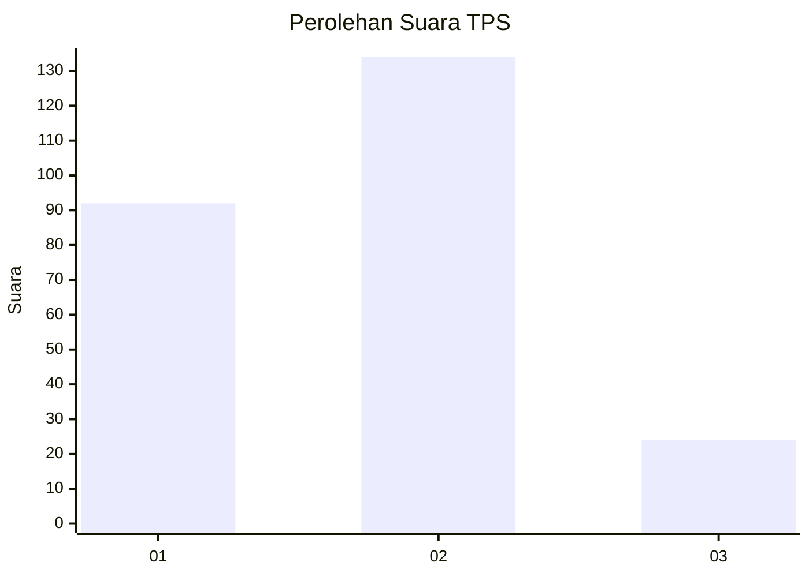

# Hasil

## Grafik

## Tabel

| No. | Nama Paslon    | Suara | Suara (raw) | Persentase |
|:--- |:-------------- | -----:| -----------:| ----------:|
| 1   | ANIES MUHAIMIN | 92    | [92][p-1]   | 36,80      |
| 2   | PRABOWO GIBRAN | 134   | [134][p-2]  | 53,60      |
| 3   | GANJAR MAHFUD  | 24    | [24][p-3]   | 9,60       |

[p-1]: https://github.com/gigit-pemilu/pemilu-2024-35-jawa-timur/blob/main/pilpres/hitung-suara/sub/35-jawa-timur/sub/28-pamekasan/sub/01-tlanakan/sub/2017-taro'an/sub/006-tps/sub/paslon-1.txt
[p-2]: https://github.com/gigit-pemilu/pemilu-2024-35-jawa-timur/blob/main/pilpres/hitung-suara/sub/35-jawa-timur/sub/28-pamekasan/sub/01-tlanakan/sub/2017-taro'an/sub/006-tps/sub/paslon-2.txt
[p-3]: https://github.com/gigit-pemilu/pemilu-2024-35-jawa-timur/blob/main/pilpres/hitung-suara/sub/35-jawa-timur/sub/28-pamekasan/sub/01-tlanakan/sub/2017-taro'an/sub/006-tps/sub/paslon-3.txt

## Foto C Plano

https://sirekap-obj-formc.kpu.go.id/bc7a/pemilu/ppwp/35/28/01/20/17/3528012017006-20240215-132741--5b6a8c70-3b03-4b48-8729-f1f098cac990.jpg

https://sirekap-obj-formc.kpu.go.id/bc7a/pemilu/ppwp/35/28/01/20/17/3528012017006-20240215-132915--c3c5999e-1adf-49b2-8310-0e9218176c44.jpg

https://sirekap-obj-formc.kpu.go.id/bc7a/pemilu/ppwp/35/28/01/20/17/3528012017006-20240215-133037--7dd193d6-5ee4-4175-9c71-b56de4f9ee46.jpg

## Metadata

| Key        | Value               |
| ---------- | ------------------- |
| Time Stamp | 2024-02-25 12:00:00 |

