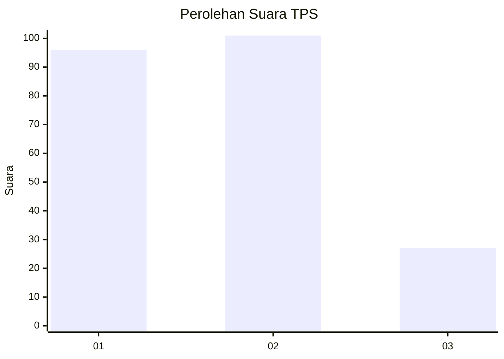
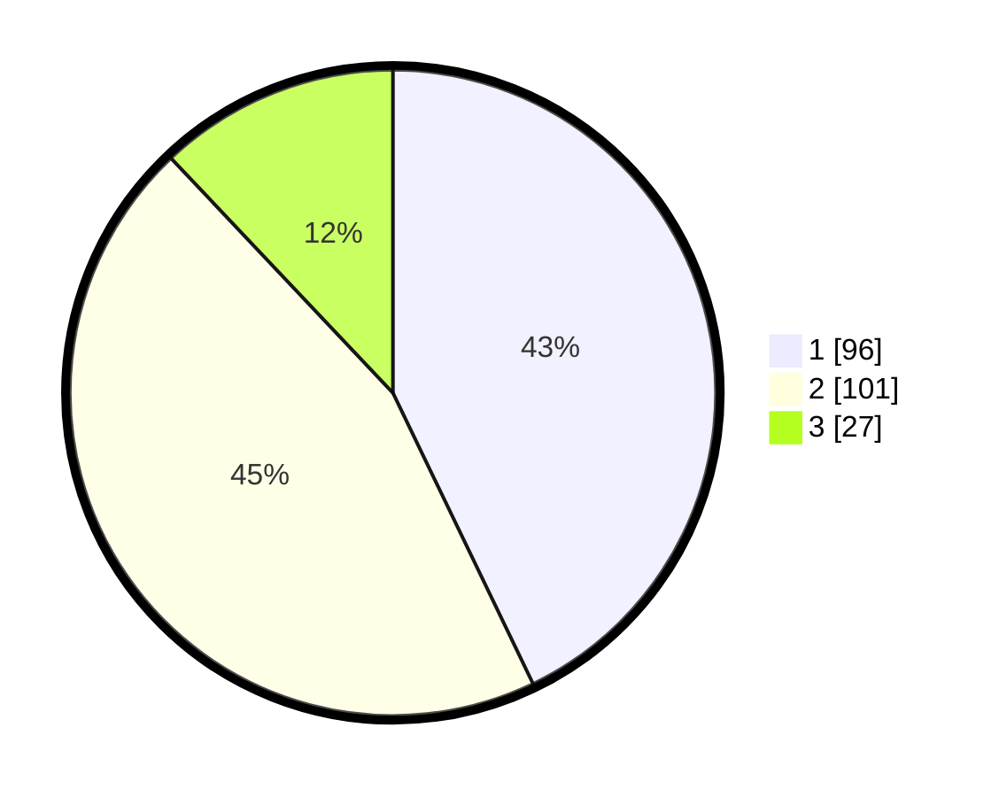

# Hasil

## Grafik

## Tabel

| No. | Nama Paslon    | Suara | Suara (raw) | Persentase |
|:--- |:-------------- | -----:| -----------:| ----------:|
| 1   | ANIES MUHAIMIN | 96    | [96][p-1]   | 42,86      |
| 2   | PRABOWO GIBRAN | 101   | [101][p-2]  | 45,09      |
| 3   | GANJAR MAHFUD  | 27    | [27][p-3]   | 12,05      |

[p-1]: https://github.com/gigit-pemilu/pemilu-2024/blob/main/pilpres/hitung-suara/sub/35-jawa-timur/sub/28-pamekasan/sub/02-pademawu/sub/1019-lawangan-daya/sub/001-tps/sub/paslon-1.txt
[p-2]: https://github.com/gigit-pemilu/pemilu-2024/blob/main/pilpres/hitung-suara/sub/35-jawa-timur/sub/28-pamekasan/sub/02-pademawu/sub/1019-lawangan-daya/sub/001-tps/sub/paslon-2.txt
[p-3]: https://github.com/gigit-pemilu/pemilu-2024/blob/main/pilpres/hitung-suara/sub/35-jawa-timur/sub/28-pamekasan/sub/02-pademawu/sub/1019-lawangan-daya/sub/001-tps/sub/paslon-3.txt

## Foto C Plano

https://sirekap-obj-formc.kpu.go.id/0baa/pemilu/ppwp/35/28/02/10/19/3528021019001-20240214-234913--1047f405-9465-402e-b85a-c96a05c9b1f5.jpg

https://sirekap-obj-formc.kpu.go.id/0baa/pemilu/ppwp/35/28/02/10/19/3528021019001-20240214-235043--e759284e-3906-4a10-b474-ff44658e6a0e.jpg

https://sirekap-obj-formc.kpu.go.id/0baa/pemilu/ppwp/35/28/02/10/19/3528021019001-20240214-235215--a7bf8d86-2fc6-4803-9c84-2ecd05b95f0a.jpg

## Metadata

| Key        | Value               |
| ---------- | ------------------- |
| Time Stamp | 2024-02-19 18:00:00 |

