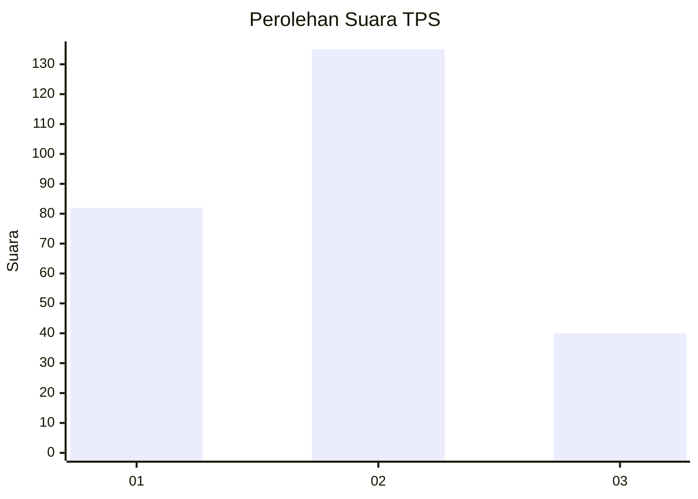
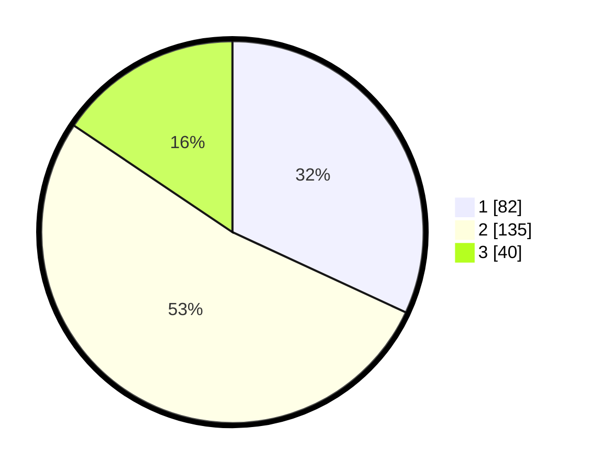

# Hasil

## Grafik

## Tabel

| No. | Nama Paslon    | Suara | Suara (raw) | Persentase |
|:--- |:-------------- | -----:| -----------:| ----------:|
| 1   | ANIES MUHAIMIN | 82    | [82][p-1]   | 31,91      |
| 2   | PRABOWO GIBRAN | 135   | [135][p-2]  | 52,53      |
| 3   | GANJAR MAHFUD  | 40    | [40][p-3]   | 15,56      |

[p-1]: https://github.com/gigit-pemilu/pemilu-2024-35-jawa-timur/blob/main/pilpres/hitung-suara/sub/35-jawa-timur/sub/28-pamekasan/sub/02-pademawu/sub/1019-lawangan-daya/sub/007-tps/sub/paslon-1.txt
[p-2]: https://github.com/gigit-pemilu/pemilu-2024-35-jawa-timur/blob/main/pilpres/hitung-suara/sub/35-jawa-timur/sub/28-pamekasan/sub/02-pademawu/sub/1019-lawangan-daya/sub/007-tps/sub/paslon-2.txt
[p-3]: https://github.com/gigit-pemilu/pemilu-2024-35-jawa-timur/blob/main/pilpres/hitung-suara/sub/35-jawa-timur/sub/28-pamekasan/sub/02-pademawu/sub/1019-lawangan-daya/sub/007-tps/sub/paslon-3.txt

## Foto C Plano

https://sirekap-obj-formc.kpu.go.id/beeb/pemilu/ppwp/35/28/02/10/19/3528021019007-20240215-011529--1f61a85d-68e0-44a3-9372-c75bc4d5ba79.jpg

https://sirekap-obj-formc.kpu.go.id/beeb/pemilu/ppwp/35/28/02/10/19/3528021019007-20240215-012549--11fbe38f-edd8-417e-a84f-05e025400f4b.jpg

https://sirekap-obj-formc.kpu.go.id/beeb/pemilu/ppwp/35/28/02/10/19/3528021019007-20240215-072540--c59a0fed-98e7-46c7-b976-eba160432dbd.jpg

## Metadata

| Key        | Value               |
| ---------- | ------------------- |
| Time Stamp | 2024-02-19 18:00:00 |

