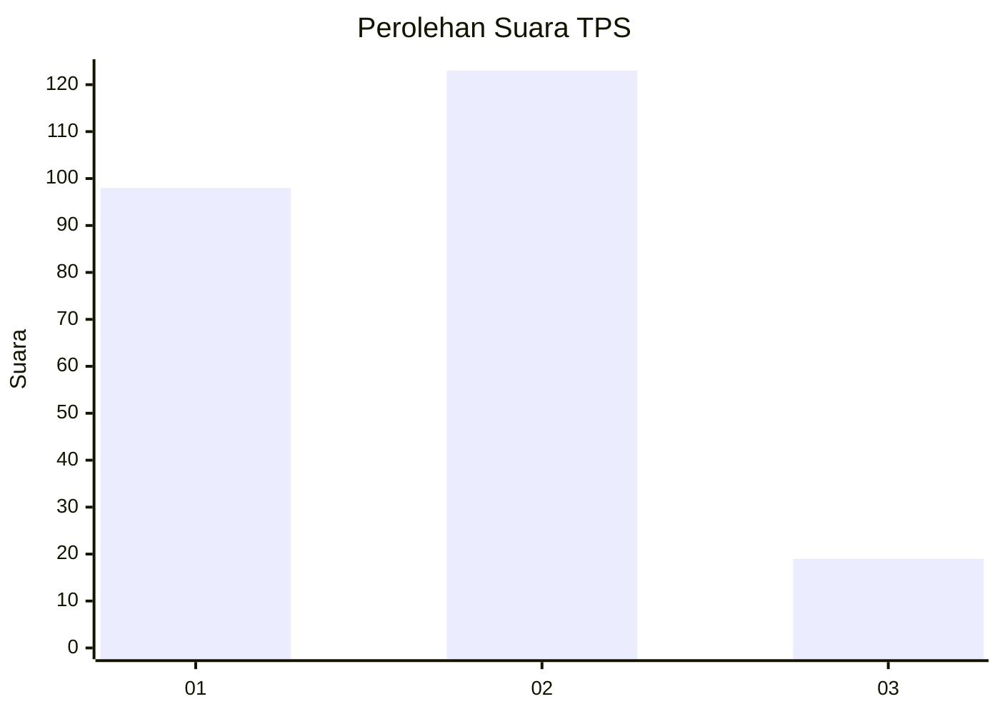
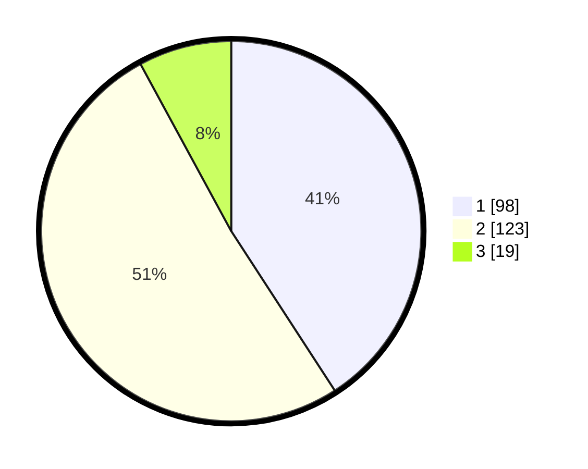

# Hasil

## Grafik

## Tabel

| No. | Nama Paslon    | Suara | Suara (raw) | Persentase |
|:--- |:-------------- | -----:| -----------:| ----------:|
| 1   | ANIES MUHAIMIN | 98    | [98][p-1]   | 40,83      |
| 2   | PRABOWO GIBRAN | 123   | [123][p-2]  | 51,25      |
| 3   | GANJAR MAHFUD  | 19    | [19][p-3]   | 7,92       |

[p-1]: https://github.com/gigit-pemilu/pemilu-2024/blob/main/pilpres/hitung-suara/sub/35-jawa-timur/sub/28-pamekasan/sub/02-pademawu/sub/1019-lawangan-daya/sub/010-tps/sub/paslon-1.txt
[p-2]: https://github.com/gigit-pemilu/pemilu-2024/blob/main/pilpres/hitung-suara/sub/35-jawa-timur/sub/28-pamekasan/sub/02-pademawu/sub/1019-lawangan-daya/sub/010-tps/sub/paslon-2.txt
[p-3]: https://github.com/gigit-pemilu/pemilu-2024/blob/main/pilpres/hitung-suara/sub/35-jawa-timur/sub/28-pamekasan/sub/02-pademawu/sub/1019-lawangan-daya/sub/010-tps/sub/paslon-3.txt

## Foto C Plano

https://sirekap-obj-formc.kpu.go.id/f8f3/pemilu/ppwp/35/28/02/10/19/3528021019010-20240214-233626--aaa53d0a-5695-4737-bfe6-756c1e489b18.jpg

https://sirekap-obj-formc.kpu.go.id/f8f3/pemilu/ppwp/35/28/02/10/19/3528021019010-20240214-234831--f1292218-d88f-444d-bf60-1bc86ad4e9a1.jpg

https://sirekap-obj-formc.kpu.go.id/f8f3/pemilu/ppwp/35/28/02/10/19/3528021019010-20240214-235208--2c8f6ba8-62ff-4b43-920b-6b8c695ef348.jpg

## Metadata

| Key        | Value               |
| ---------- | ------------------- |
| Time Stamp | 2024-02-15 20:00:44 |

