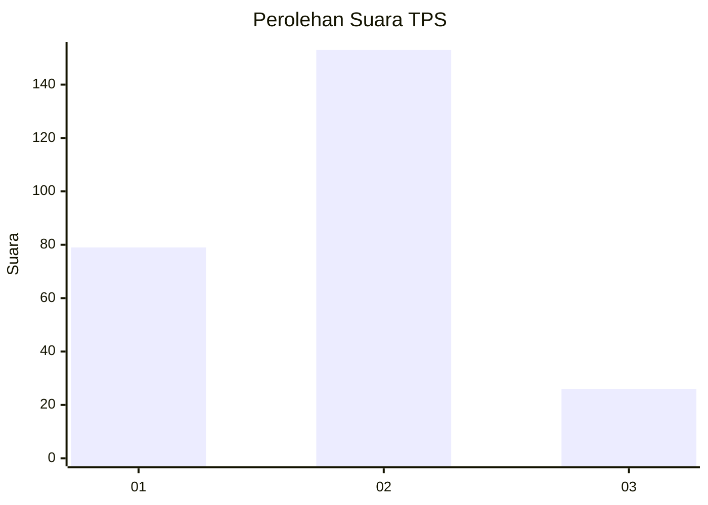
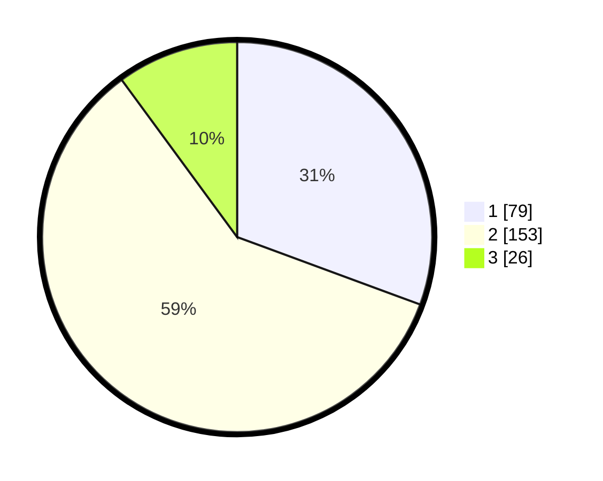

# Hasil

## Grafik

## Tabel

| No. | Nama Paslon    | Suara | Suara (raw) | Persentase |
|:--- |:-------------- | -----:| -----------:| ----------:|
| 1   | ANIES MUHAIMIN | 79    | [79][p-1]   | 30,62      |
| 2   | PRABOWO GIBRAN | 153   | [153][p-2]  | 59,30      |
| 3   | GANJAR MAHFUD  | 26    | [26][p-3]   | 10,08      |

[p-1]: https://github.com/gigit-pemilu/pemilu-2024-35-jawa-timur/blob/main/pilpres/hitung-suara/sub/35-jawa-timur/sub/28-pamekasan/sub/02-pademawu/sub/1019-lawangan-daya/sub/014-tps/sub/paslon-1.txt
[p-2]: https://github.com/gigit-pemilu/pemilu-2024-35-jawa-timur/blob/main/pilpres/hitung-suara/sub/35-jawa-timur/sub/28-pamekasan/sub/02-pademawu/sub/1019-lawangan-daya/sub/014-tps/sub/paslon-2.txt
[p-3]: https://github.com/gigit-pemilu/pemilu-2024-35-jawa-timur/blob/main/pilpres/hitung-suara/sub/35-jawa-timur/sub/28-pamekasan/sub/02-pademawu/sub/1019-lawangan-daya/sub/014-tps/sub/paslon-3.txt

## Foto C Plano

https://sirekap-obj-formc.kpu.go.id/60fa/pemilu/ppwp/35/28/02/10/19/3528021019014-20240215-071208--b51dbfcf-c7f8-4580-a322-d4debe567ceb.jpg

https://sirekap-obj-formc.kpu.go.id/60fa/pemilu/ppwp/35/28/02/10/19/3528021019014-20240215-024230--a0e5991a-73de-45ac-ac04-0575c807d1c9.jpg

https://sirekap-obj-formc.kpu.go.id/60fa/pemilu/ppwp/35/28/02/10/19/3528021019014-20240215-024512--0d400096-bd90-4a34-95c0-789e17713858.jpg

## Metadata

| Key        | Value               |
| ---------- | ------------------- |
| Time Stamp | 2024-02-15 20:00:44 |

