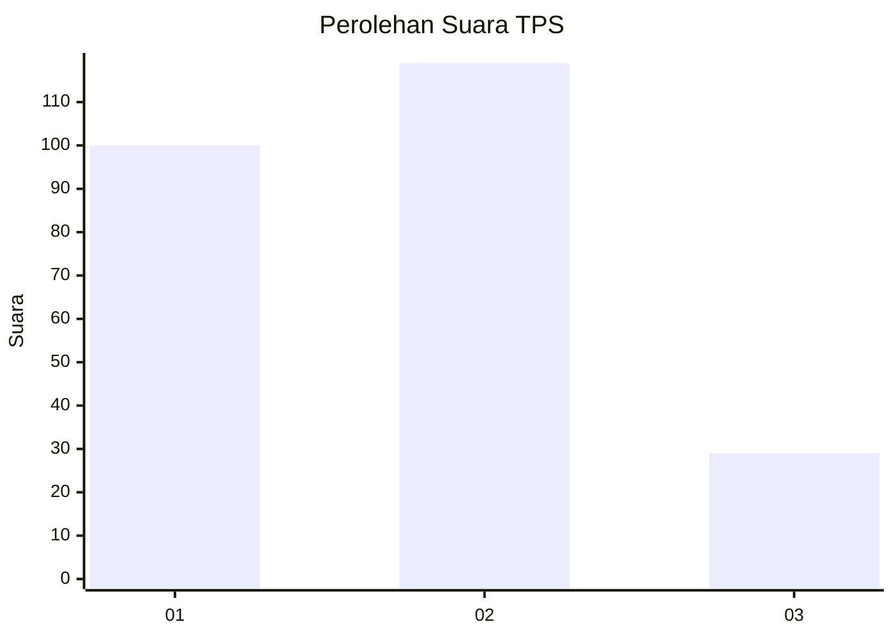
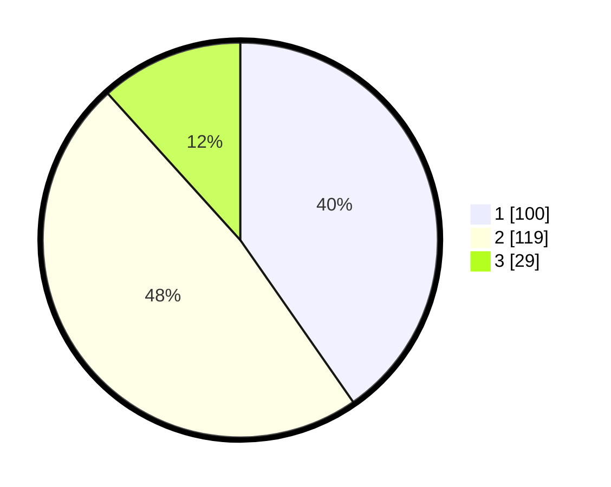

# Hasil

## Grafik

## Tabel

| No. | Nama Paslon    | Suara | Suara (raw) | Persentase |
|:--- |:-------------- | -----:| -----------:| ----------:|
| 1   | ANIES MUHAIMIN | 100   | [100][p-1]  | 40,32      |
| 2   | PRABOWO GIBRAN | 119   | [119][p-2]  | 47,98      |
| 3   | GANJAR MAHFUD  | 29    | [29][p-3]   | 11,69      |

[p-1]: https://github.com/gigit-pemilu/pemilu-2024-35-jawa-timur/blob/main/pilpres/hitung-suara/sub/35-jawa-timur/sub/28-pamekasan/sub/02-pademawu/sub/1019-lawangan-daya/sub/015-tps/sub/paslon-1.txt
[p-2]: https://github.com/gigit-pemilu/pemilu-2024-35-jawa-timur/blob/main/pilpres/hitung-suara/sub/35-jawa-timur/sub/28-pamekasan/sub/02-pademawu/sub/1019-lawangan-daya/sub/015-tps/sub/paslon-2.txt
[p-3]: https://github.com/gigit-pemilu/pemilu-2024-35-jawa-timur/blob/main/pilpres/hitung-suara/sub/35-jawa-timur/sub/28-pamekasan/sub/02-pademawu/sub/1019-lawangan-daya/sub/015-tps/sub/paslon-3.txt

## Foto C Plano

https://sirekap-obj-formc.kpu.go.id/0e21/pemilu/ppwp/35/28/02/10/19/3528021019015-20240215-103614--973fa95c-4889-4124-bd0c-0b804c476e92.jpg

https://sirekap-obj-formc.kpu.go.id/0e21/pemilu/ppwp/35/28/02/10/19/3528021019015-20240215-103842--d1e46b0b-5418-4809-9f21-f01523cdcea6.jpg

https://sirekap-obj-formc.kpu.go.id/0e21/pemilu/ppwp/35/28/02/10/19/3528021019015-20240215-104113--08e0663f-9124-47c4-8a7b-c5d61570ffb7.jpg

## Metadata

| Key        | Value               |
| ---------- | ------------------- |
| Time Stamp | 2024-02-19 18:00:00 |

