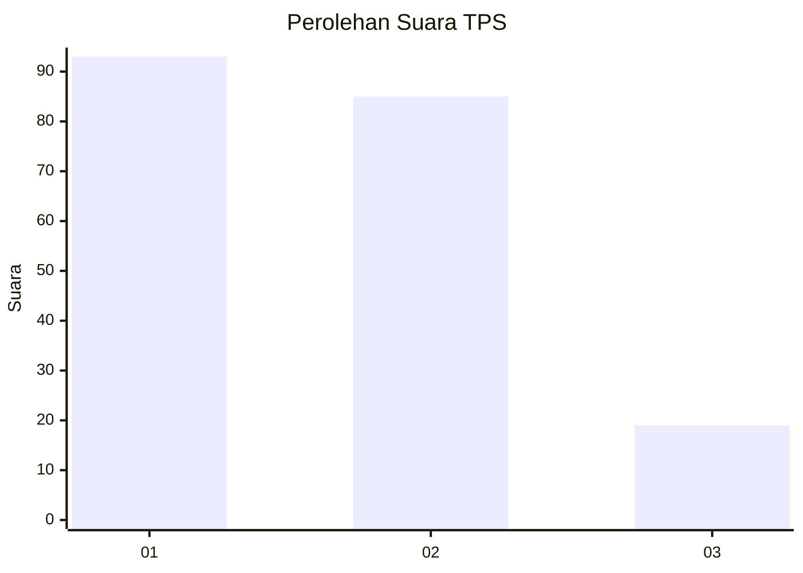
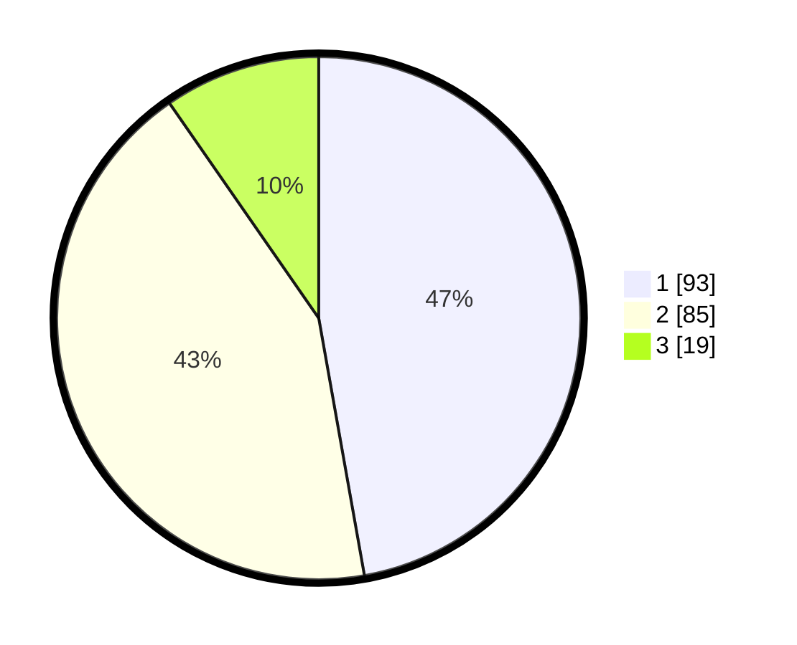

# Hasil

## Grafik

## Tabel

| No. | Nama Paslon    | Suara | Suara (raw) | Persentase |
|:--- |:-------------- | -----:| -----------:| ----------:|
| 1   | ANIES MUHAIMIN | 93    | [93][p-1]   | 47,21      |
| 2   | PRABOWO GIBRAN | 85    | [85][p-2]   | 43,15      |
| 3   | GANJAR MAHFUD  | 19    | [19][p-3]   | 9,64       |

[p-1]: https://github.com/gigit-pemilu/pemilu-2024/blob/main/pilpres/hitung-suara/sub/35-jawa-timur/sub/28-pamekasan/sub/02-pademawu/sub/1019-lawangan-daya/sub/016-tps/sub/paslon-1.txt
[p-2]: https://github.com/gigit-pemilu/pemilu-2024/blob/main/pilpres/hitung-suara/sub/35-jawa-timur/sub/28-pamekasan/sub/02-pademawu/sub/1019-lawangan-daya/sub/016-tps/sub/paslon-2.txt
[p-3]: https://github.com/gigit-pemilu/pemilu-2024/blob/main/pilpres/hitung-suara/sub/35-jawa-timur/sub/28-pamekasan/sub/02-pademawu/sub/1019-lawangan-daya/sub/016-tps/sub/paslon-3.txt

## Foto C Plano

https://sirekap-obj-formc.kpu.go.id/c029/pemilu/ppwp/35/28/02/10/19/3528021019016-20240214-231732--2c07a0f1-0292-4fea-9bd1-d6fbdd0c3aa6.jpg

https://sirekap-obj-formc.kpu.go.id/c029/pemilu/ppwp/35/28/02/10/19/3528021019016-20240214-231852--219e60f2-2e9b-4c7a-8e1d-878baa7fdbf5.jpg

https://sirekap-obj-formc.kpu.go.id/c029/pemilu/ppwp/35/28/02/10/19/3528021019016-20240214-232004--bf4ffaa3-f3dd-4d6f-9ea3-e1daafeead6e.jpg

## Metadata

| Key        | Value               |
| ---------- | ------------------- |
| Time Stamp | 2024-02-19 18:00:00 |

