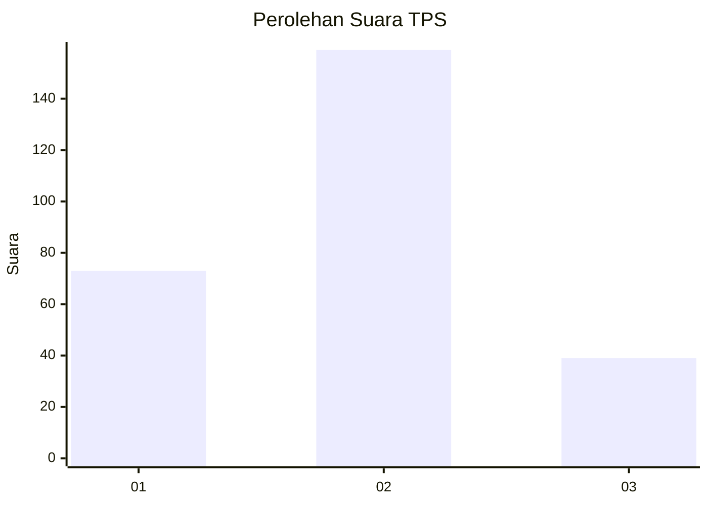
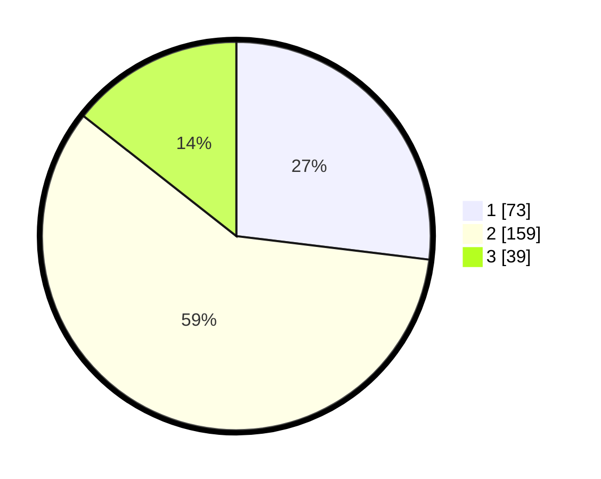

# Hasil

## Grafik

## Tabel

| No. | Nama Paslon    | Suara | Suara (raw) | Persentase |
|:--- |:-------------- | -----:| -----------:| ----------:|
| 1   | ANIES MUHAIMIN | 73    | [73][p-1]   | 26,94      |
| 2   | PRABOWO GIBRAN | 159   | [159][p-2]  | 58,67      |
| 3   | GANJAR MAHFUD  | 39    | [39][p-3]   | 14,39      |

[p-1]: https://github.com/gigit-pemilu/pemilu-2024-35-jawa-timur/blob/main/pilpres/hitung-suara/sub/35-jawa-timur/sub/28-pamekasan/sub/02-pademawu/sub/2001-tanjung/sub/007-tps/sub/paslon-1.txt
[p-2]: https://github.com/gigit-pemilu/pemilu-2024-35-jawa-timur/blob/main/pilpres/hitung-suara/sub/35-jawa-timur/sub/28-pamekasan/sub/02-pademawu/sub/2001-tanjung/sub/007-tps/sub/paslon-2.txt
[p-3]: https://github.com/gigit-pemilu/pemilu-2024-35-jawa-timur/blob/main/pilpres/hitung-suara/sub/35-jawa-timur/sub/28-pamekasan/sub/02-pademawu/sub/2001-tanjung/sub/007-tps/sub/paslon-3.txt

## Foto C Plano

https://sirekap-obj-formc.kpu.go.id/f523/pemilu/ppwp/35/28/02/20/01/3528022001007-20240215-034725--94f5b187-c005-4ebc-bc25-b0faaa902c07.jpg

https://sirekap-obj-formc.kpu.go.id/f523/pemilu/ppwp/35/28/02/20/01/3528022001007-20240214-222704--a44c3e42-d2c8-499b-9727-e8644aae9411.jpg

https://sirekap-obj-formc.kpu.go.id/f523/pemilu/ppwp/35/28/02/20/01/3528022001007-20240216-134046--01fdf0c2-5260-424c-9b0b-b1288ab41432.jpg

## Metadata

| Key        | Value               |
| ---------- | ------------------- |
| Time Stamp | 2024-02-16 14:00:34 |

