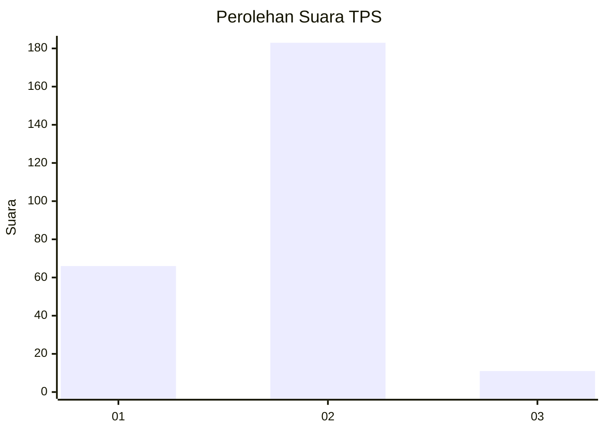
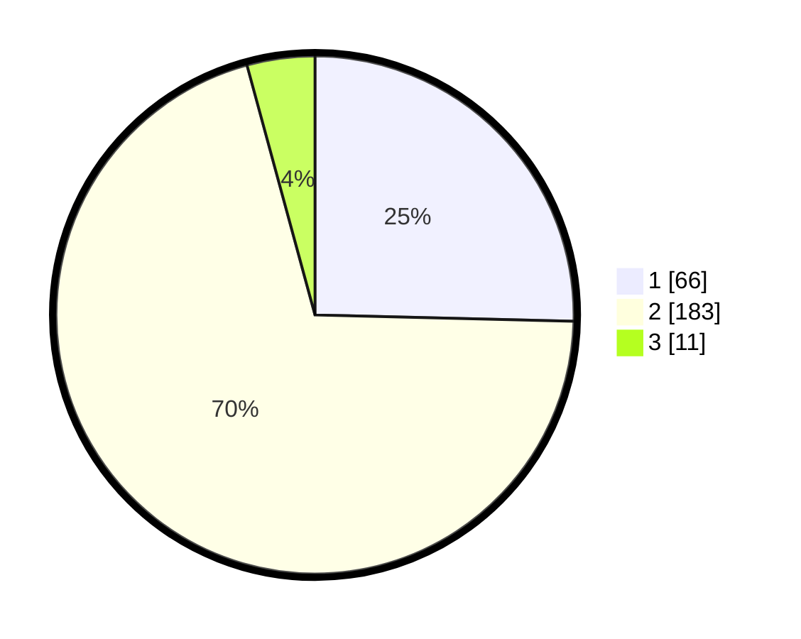

# Hasil

## Grafik

## Tabel

| No. | Nama Paslon    | Suara | Suara (raw) | Persentase |
|:--- |:-------------- | -----:| -----------:| ----------:|
| 1   | ANIES MUHAIMIN | 66    | [66][p-1]   | 25,38      |
| 2   | PRABOWO GIBRAN | 183   | [183][p-2]  | 70,38      |
| 3   | GANJAR MAHFUD  | 11    | [11][p-3]   | 4,23       |

[p-1]: https://github.com/gigit-pemilu/pemilu-2024-35-jawa-timur/blob/main/pilpres/hitung-suara/sub/35-jawa-timur/sub/28-pamekasan/sub/02-pademawu/sub/2001-tanjung/sub/015-tps/sub/paslon-1.txt
[p-2]: https://github.com/gigit-pemilu/pemilu-2024-35-jawa-timur/blob/main/pilpres/hitung-suara/sub/35-jawa-timur/sub/28-pamekasan/sub/02-pademawu/sub/2001-tanjung/sub/015-tps/sub/paslon-2.txt
[p-3]: https://github.com/gigit-pemilu/pemilu-2024-35-jawa-timur/blob/main/pilpres/hitung-suara/sub/35-jawa-timur/sub/28-pamekasan/sub/02-pademawu/sub/2001-tanjung/sub/015-tps/sub/paslon-3.txt

## Foto C Plano

https://sirekap-obj-formc.kpu.go.id/9af6/pemilu/ppwp/35/28/02/20/01/3528022001015-20240215-083017--ad34fafe-32ad-46f3-a155-c066cbc68240.jpg

https://sirekap-obj-formc.kpu.go.id/9af6/pemilu/ppwp/35/28/02/20/01/3528022001015-20240215-020410--14fc3ec5-ef42-42dc-8659-49e1752162c6.jpg

https://sirekap-obj-formc.kpu.go.id/9af6/pemilu/ppwp/35/28/02/20/01/3528022001015-20240215-083535--8a1212d6-5d3d-4ad6-ae0f-186f2a71d368.jpg

## Metadata

| Key        | Value               |
| ---------- | ------------------- |
| Time Stamp | 2024-02-19 06:16:00 |

