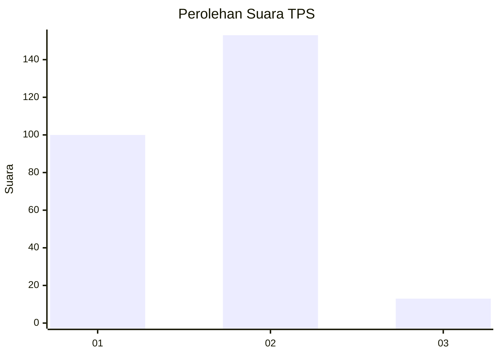
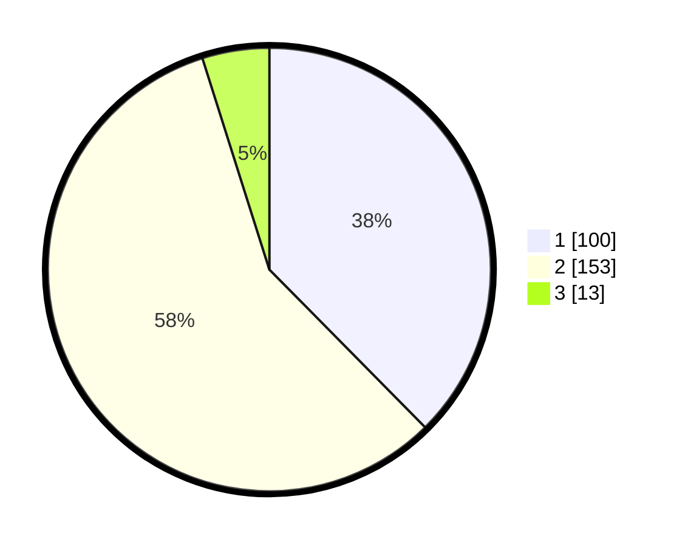

# Hasil

## Grafik

## Tabel

| No. | Nama Paslon    | Suara | Suara (raw) | Persentase |
|:--- |:-------------- | -----:| -----------:| ----------:|
| 1   | ANIES MUHAIMIN | 100   | [100][p-1]  | 37,59      |
| 2   | PRABOWO GIBRAN | 153   | [153][p-2]  | 57,52      |
| 3   | GANJAR MAHFUD  | 13    | [13][p-3]   | 4,89       |

[p-1]: https://github.com/gigit-pemilu/pemilu-2024-35-jawa-timur/blob/main/pilpres/hitung-suara/sub/35-jawa-timur/sub/28-pamekasan/sub/02-pademawu/sub/2001-tanjung/sub/017-tps/sub/paslon-1.txt
[p-2]: https://github.com/gigit-pemilu/pemilu-2024-35-jawa-timur/blob/main/pilpres/hitung-suara/sub/35-jawa-timur/sub/28-pamekasan/sub/02-pademawu/sub/2001-tanjung/sub/017-tps/sub/paslon-2.txt
[p-3]: https://github.com/gigit-pemilu/pemilu-2024-35-jawa-timur/blob/main/pilpres/hitung-suara/sub/35-jawa-timur/sub/28-pamekasan/sub/02-pademawu/sub/2001-tanjung/sub/017-tps/sub/paslon-3.txt

## Foto C Plano

https://sirekap-obj-formc.kpu.go.id/8e32/pemilu/ppwp/35/28/02/20/01/3528022001017-20240214-222908--a36aa410-db59-4031-9724-8111bea3239e.jpg

https://sirekap-obj-formc.kpu.go.id/8e32/pemilu/ppwp/35/28/02/20/01/3528022001017-20240214-223035--dab12d82-2fd5-4f9d-9526-65009b7c0251.jpg

https://sirekap-obj-formc.kpu.go.id/8e32/pemilu/ppwp/35/28/02/20/01/3528022001017-20240214-223216--fdc6a010-5c86-4b2b-b9c4-d9a26911d6a5.jpg

## Metadata

| Key        | Value               |
| ---------- | ------------------- |
| Time Stamp | 2024-02-15 21:01:18 |

