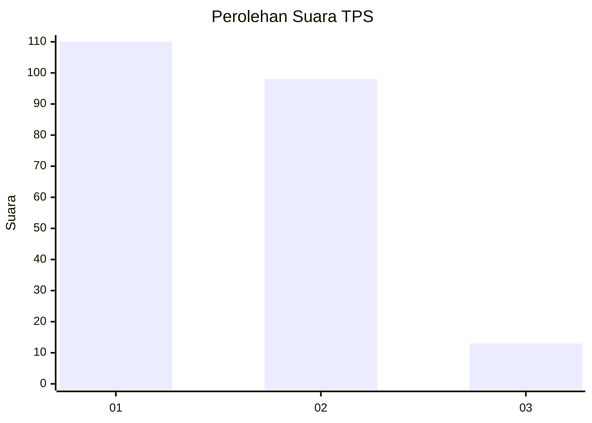
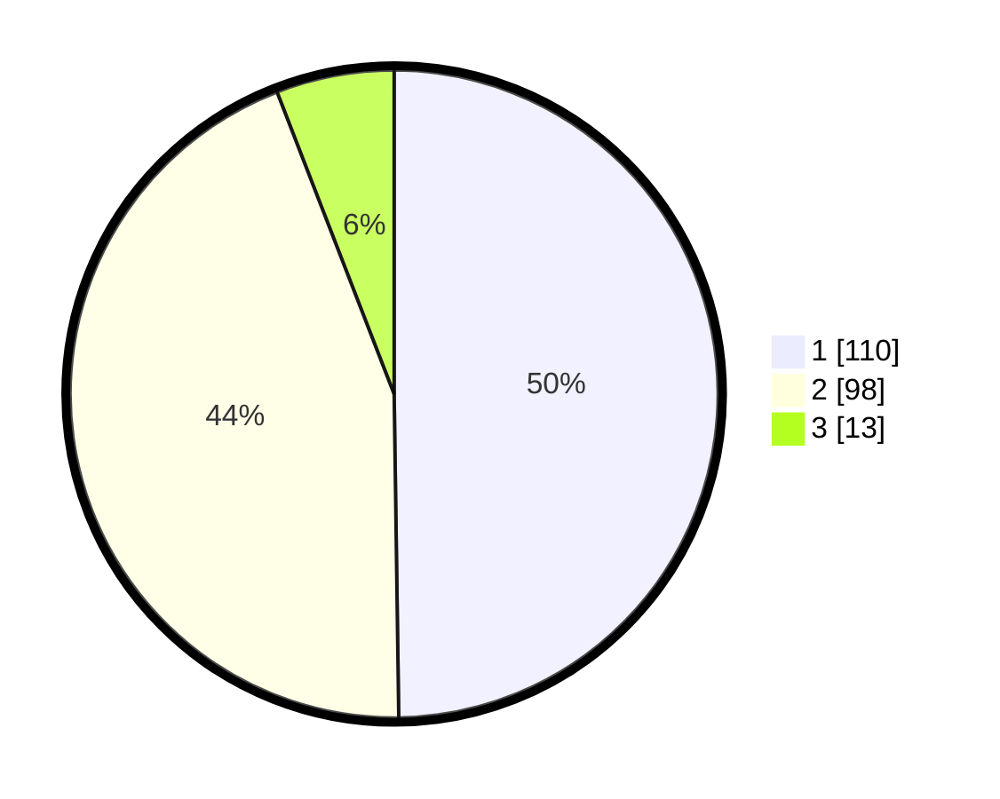

# Hasil

## Grafik

## Tabel

| No. | Nama Paslon    | Suara | Suara (raw) | Persentase |
|:--- |:-------------- | -----:| -----------:| ----------:|
| 1   | ANIES MUHAIMIN | 110   | [110][p-1]  | 49,77      |
| 2   | PRABOWO GIBRAN | 98    | [98][p-2]   | 44,34      |
| 3   | GANJAR MAHFUD  | 13    | [13][p-3]   | 5,88       |

[p-1]: https://github.com/gigit-pemilu/pemilu-2024-35-jawa-timur/blob/main/pilpres/hitung-suara/sub/35-jawa-timur/sub/28-pamekasan/sub/02-pademawu/sub/2002-padelegan/sub/004-tps/sub/paslon-1.txt
[p-2]: https://github.com/gigit-pemilu/pemilu-2024-35-jawa-timur/blob/main/pilpres/hitung-suara/sub/35-jawa-timur/sub/28-pamekasan/sub/02-pademawu/sub/2002-padelegan/sub/004-tps/sub/paslon-2.txt
[p-3]: https://github.com/gigit-pemilu/pemilu-2024-35-jawa-timur/blob/main/pilpres/hitung-suara/sub/35-jawa-timur/sub/28-pamekasan/sub/02-pademawu/sub/2002-padelegan/sub/004-tps/sub/paslon-3.txt

## Foto C Plano

https://sirekap-obj-formc.kpu.go.id/233a/pemilu/ppwp/35/28/02/20/02/3528022002004-20240215-155941--ba35c547-20e1-4133-8621-9bb107707e98.jpg

https://sirekap-obj-formc.kpu.go.id/233a/pemilu/ppwp/35/28/02/20/02/3528022002004-20240215-160029--79f80761-a26c-48e7-8a37-ae250fc5c6b6.jpg

https://sirekap-obj-formc.kpu.go.id/233a/pemilu/ppwp/35/28/02/20/02/3528022002004-20240215-160120--64d444e0-c020-433c-b212-2fbf6f3ddffc.jpg

## Metadata

| Key        | Value               |
| ---------- | ------------------- |
| Time Stamp | 2024-02-24 22:31:28 |

