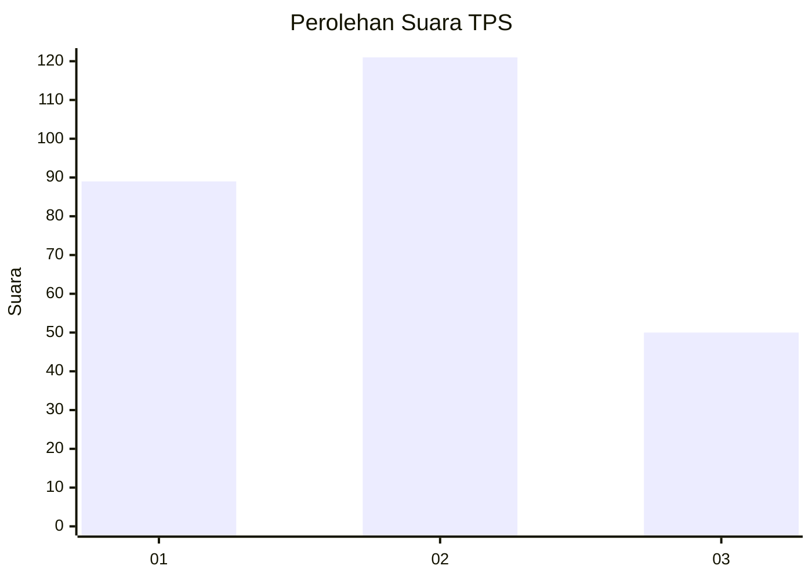
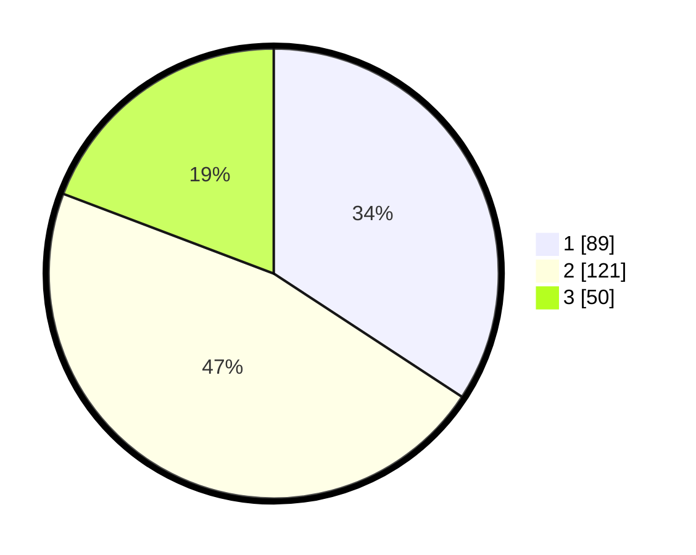

# Hasil

## Grafik

## Tabel

| No. | Nama Paslon    | Suara | Suara (raw) | Persentase |
|:--- |:-------------- | -----:| -----------:| ----------:|
| 1   | ANIES MUHAIMIN | 89    | [89][p-1]   | 34,23      |
| 2   | PRABOWO GIBRAN | 121   | [121][p-2]  | 46,54      |
| 3   | GANJAR MAHFUD  | 50    | [50][p-3]   | 19,23      |

[p-1]: https://github.com/gigit-pemilu/pemilu-2024-35-jawa-timur/blob/main/pilpres/hitung-suara/sub/35-jawa-timur/sub/28-pamekasan/sub/02-pademawu/sub/2002-padelegan/sub/009-tps/sub/paslon-1.txt
[p-2]: https://github.com/gigit-pemilu/pemilu-2024-35-jawa-timur/blob/main/pilpres/hitung-suara/sub/35-jawa-timur/sub/28-pamekasan/sub/02-pademawu/sub/2002-padelegan/sub/009-tps/sub/paslon-2.txt
[p-3]: https://github.com/gigit-pemilu/pemilu-2024-35-jawa-timur/blob/main/pilpres/hitung-suara/sub/35-jawa-timur/sub/28-pamekasan/sub/02-pademawu/sub/2002-padelegan/sub/009-tps/sub/paslon-3.txt

## Foto C Plano

https://sirekap-obj-formc.kpu.go.id/0a85/pemilu/ppwp/35/28/02/20/02/3528022002009-20240214-222547--90330748-bac3-4e67-9e23-b9854e48a828.jpg

https://sirekap-obj-formc.kpu.go.id/0a85/pemilu/ppwp/35/28/02/20/02/3528022002009-20240214-222644--e9caec77-acd6-4d17-8fbc-6e1b3088c76c.jpg

https://sirekap-obj-formc.kpu.go.id/0a85/pemilu/ppwp/35/28/02/20/02/3528022002009-20240214-222755--4167c9e9-630c-4d88-9b3e-ebc2978f3fac.jpg

## Metadata

| Key        | Value               |
| ---------- | ------------------- |
| Time Stamp | 2024-02-24 22:31:28 |

