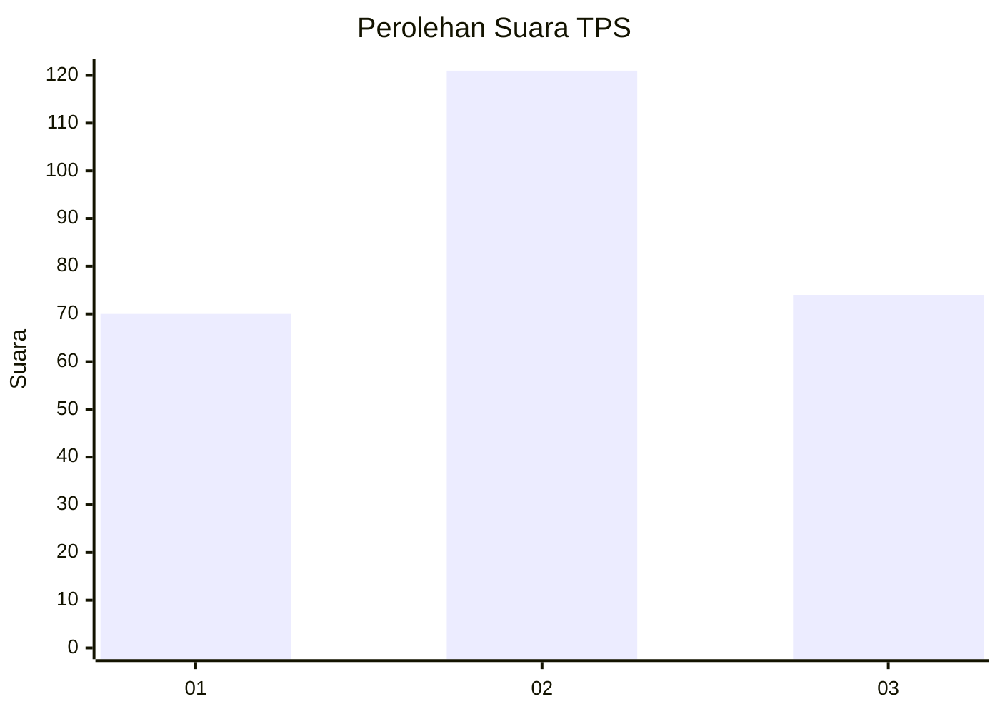
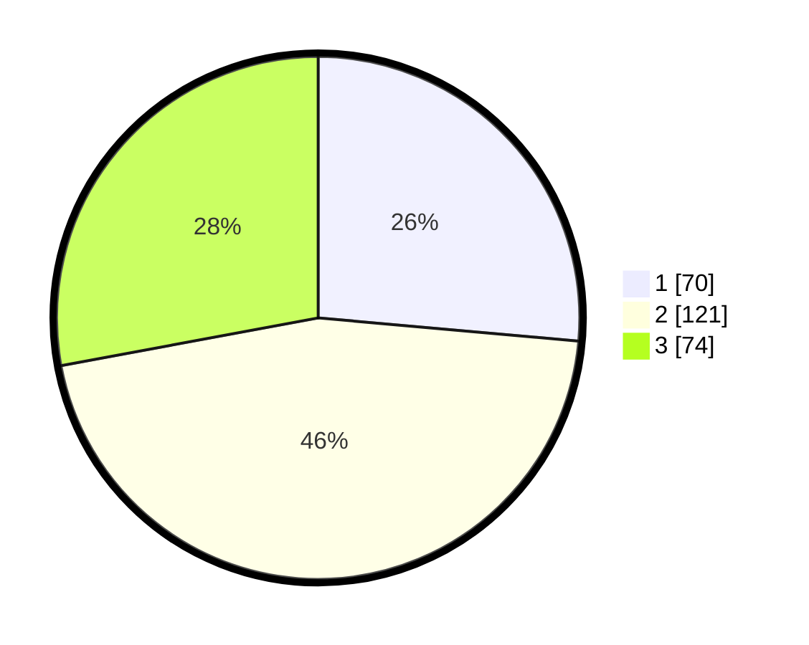

# Hasil

## Grafik

## Tabel

| No. | Nama Paslon    | Suara | Suara (raw) | Persentase |
|:--- |:-------------- | -----:| -----------:| ----------:|
| 1   | ANIES MUHAIMIN | 70    | [70][p-1]   | 26,42      |
| 2   | PRABOWO GIBRAN | 121   | [121][p-2]  | 45,66      |
| 3   | GANJAR MAHFUD  | 74    | [74][p-3]   | 27,92      |

[p-1]: https://github.com/gigit-pemilu/pemilu-2024-35-jawa-timur/blob/main/pilpres/hitung-suara/sub/35-jawa-timur/sub/28-pamekasan/sub/02-pademawu/sub/2004-pagagan/sub/001-tps/sub/paslon-1.txt
[p-2]: https://github.com/gigit-pemilu/pemilu-2024-35-jawa-timur/blob/main/pilpres/hitung-suara/sub/35-jawa-timur/sub/28-pamekasan/sub/02-pademawu/sub/2004-pagagan/sub/001-tps/sub/paslon-2.txt
[p-3]: https://github.com/gigit-pemilu/pemilu-2024-35-jawa-timur/blob/main/pilpres/hitung-suara/sub/35-jawa-timur/sub/28-pamekasan/sub/02-pademawu/sub/2004-pagagan/sub/001-tps/sub/paslon-3.txt

## Foto C Plano

https://sirekap-obj-formc.kpu.go.id/40c7/pemilu/ppwp/35/28/02/20/04/3528022004001-20240214-210202--828cf37c-9cf0-403a-9651-4ecb2fa40b41.jpg

https://sirekap-obj-formc.kpu.go.id/40c7/pemilu/ppwp/35/28/02/20/04/3528022004001-20240214-210320--4a07510e-5184-49ac-ae8a-0a1fb1ac3852.jpg

https://sirekap-obj-formc.kpu.go.id/40c7/pemilu/ppwp/35/28/02/20/04/3528022004001-20240214-210429--ab0fcfd1-b144-4532-994e-e1241138b4f1.jpg

## Metadata

| Key        | Value               |
| ---------- | ------------------- |
| Time Stamp | 2024-02-24 22:31:28 |

