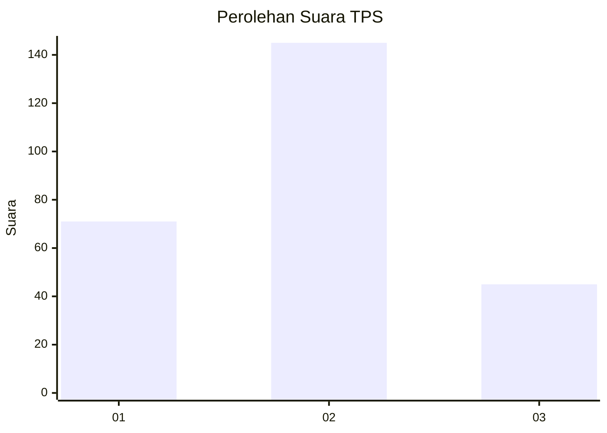
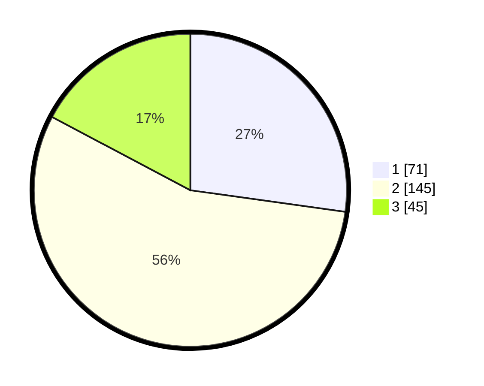

# Hasil

## Grafik

## Tabel

| No. | Nama Paslon    | Suara | Suara (raw) | Persentase |
|:--- |:-------------- | -----:| -----------:| ----------:|
| 1   | ANIES MUHAIMIN | 71    | [71][p-1]   | 27,20      |
| 2   | PRABOWO GIBRAN | 145   | [145][p-2]  | 55,56      |
| 3   | GANJAR MAHFUD  | 45    | [45][p-3]   | 17,24      |

[p-1]: https://github.com/gigit-pemilu/pemilu-2024-35-jawa-timur/blob/main/pilpres/hitung-suara/sub/35-jawa-timur/sub/28-pamekasan/sub/02-pademawu/sub/2004-pagagan/sub/002-tps/sub/paslon-1.txt
[p-2]: https://github.com/gigit-pemilu/pemilu-2024-35-jawa-timur/blob/main/pilpres/hitung-suara/sub/35-jawa-timur/sub/28-pamekasan/sub/02-pademawu/sub/2004-pagagan/sub/002-tps/sub/paslon-2.txt
[p-3]: https://github.com/gigit-pemilu/pemilu-2024-35-jawa-timur/blob/main/pilpres/hitung-suara/sub/35-jawa-timur/sub/28-pamekasan/sub/02-pademawu/sub/2004-pagagan/sub/002-tps/sub/paslon-3.txt

## Foto C Plano

https://sirekap-obj-formc.kpu.go.id/f08d/pemilu/ppwp/35/28/02/20/04/3528022004002-20240214-233115--586aeed7-be5d-4314-ba9a-a7a450129859.jpg

https://sirekap-obj-formc.kpu.go.id/f08d/pemilu/ppwp/35/28/02/20/04/3528022004002-20240214-233300--04012a28-c24e-4e67-83fb-14f2fa6c02ce.jpg

https://sirekap-obj-formc.kpu.go.id/f08d/pemilu/ppwp/35/28/02/20/04/3528022004002-20240214-233400--bd94597b-81d1-4ad1-abde-f30261397552.jpg

## Metadata

| Key        | Value               |
| ---------- | ------------------- |
| Time Stamp | 2024-02-25 15:00:00 |

