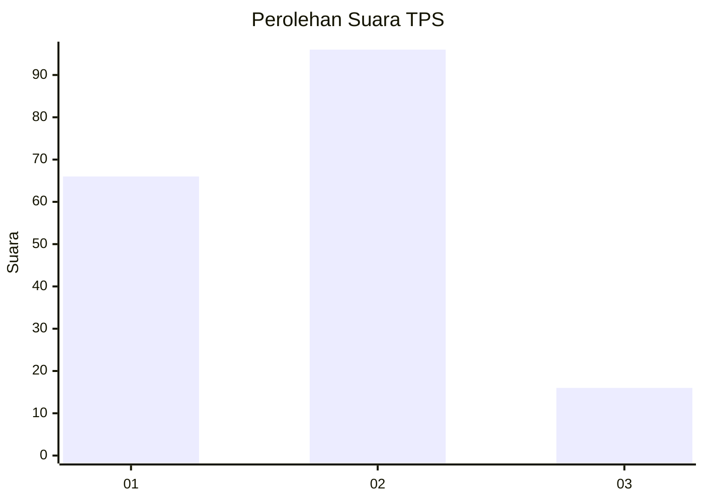

# Hasil

## Grafik

## Tabel

| No. | Nama Paslon    | Suara | Suara (raw) | Persentase |
|:--- |:-------------- | -----:| -----------:| ----------:|
| 1   | ANIES MUHAIMIN | 66    | [66][p-1]   | 37,08      |
| 2   | PRABOWO GIBRAN | 96    | [96][p-2]   | 53,93      |
| 3   | GANJAR MAHFUD  | 16    | [16][p-3]   | 8,99       |

[p-1]: https://github.com/gigit-pemilu/pemilu-2024/blob/main/pilpres/hitung-suara/sub/35-jawa-timur/sub/28-pamekasan/sub/02-pademawu/sub/2004-pagagan/sub/005-tps/sub/paslon-1.txt
[p-2]: https://github.com/gigit-pemilu/pemilu-2024/blob/main/pilpres/hitung-suara/sub/35-jawa-timur/sub/28-pamekasan/sub/02-pademawu/sub/2004-pagagan/sub/005-tps/sub/paslon-2.txt
[p-3]: https://github.com/gigit-pemilu/pemilu-2024/blob/main/pilpres/hitung-suara/sub/35-jawa-timur/sub/28-pamekasan/sub/02-pademawu/sub/2004-pagagan/sub/005-tps/sub/paslon-3.txt

## Foto C Plano

https://sirekap-obj-formc.kpu.go.id/b3f5/pemilu/ppwp/35/28/02/20/04/3528022004005-20240214-210609--e5c0cb06-fdf4-49b6-9c0e-9815d063c67e.jpg

https://sirekap-obj-formc.kpu.go.id/b3f5/pemilu/ppwp/35/28/02/20/04/3528022004005-20240214-210704--05ad7ddb-6a29-463d-93c5-983822871641.jpg

https://sirekap-obj-formc.kpu.go.id/b3f5/pemilu/ppwp/35/28/02/20/04/3528022004005-20240214-210757--52671dae-a433-4480-8f3c-6a923d1ed29a.jpg

## Metadata

| Key        | Value               |
| ---------- | ------------------- |
| Time Stamp | 2024-02-25 13:00:00 |

