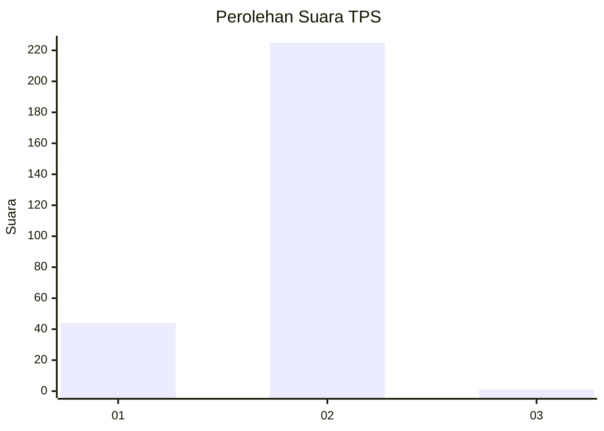
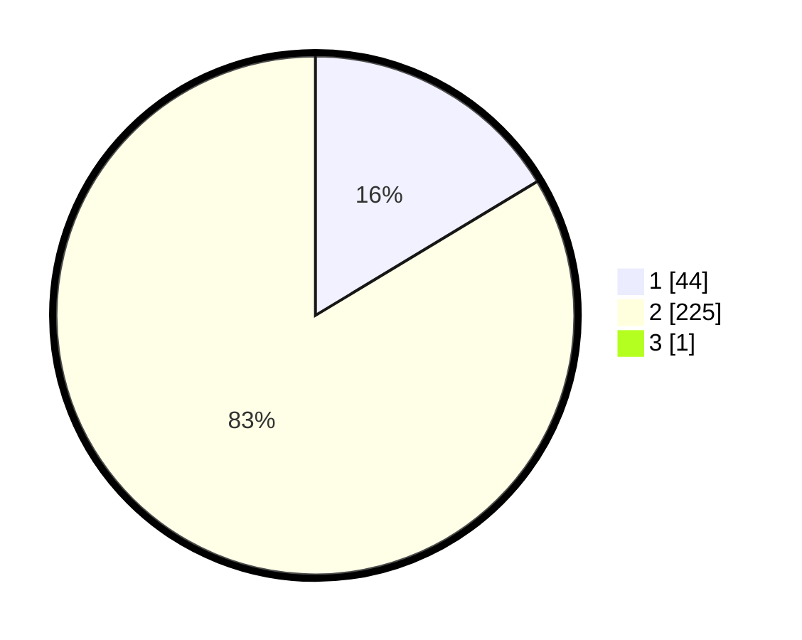

# Hasil

## Grafik

## Tabel

| No. | Nama Paslon    | Suara | Suara (raw) | Persentase |
|:--- |:-------------- | -----:| -----------:| ----------:|
| 1   | ANIES MUHAIMIN | 44    | [44][p-1]   | 16,30      |
| 2   | PRABOWO GIBRAN | 225   | [225][p-2]  | 83,33      |
| 3   | GANJAR MAHFUD  | 1     | [1][p-3]    | 0,37       |

[p-1]: https://github.com/gigit-pemilu/pemilu-2024/blob/main/pilpres/hitung-suara/sub/35-jawa-timur/sub/28-pamekasan/sub/02-pademawu/sub/2005-jarin/sub/003-tps/sub/paslon-1.txt
[p-2]: https://github.com/gigit-pemilu/pemilu-2024/blob/main/pilpres/hitung-suara/sub/35-jawa-timur/sub/28-pamekasan/sub/02-pademawu/sub/2005-jarin/sub/003-tps/sub/paslon-2.txt
[p-3]: https://github.com/gigit-pemilu/pemilu-2024/blob/main/pilpres/hitung-suara/sub/35-jawa-timur/sub/28-pamekasan/sub/02-pademawu/sub/2005-jarin/sub/003-tps/sub/paslon-3.txt

## Foto C Plano

https://sirekap-obj-formc.kpu.go.id/82b9/pemilu/ppwp/35/28/02/20/05/3528022005003-20240214-140929--96b4d156-0801-4a68-a7ca-320b5d9de12c.jpg

https://sirekap-obj-formc.kpu.go.id/82b9/pemilu/ppwp/35/28/02/20/05/3528022005003-20240214-141047--bfa93980-f55e-4635-9759-fc2d8c3c7945.jpg

https://sirekap-obj-formc.kpu.go.id/82b9/pemilu/ppwp/35/28/02/20/05/3528022005003-20240214-141127--211f414a-5b92-422d-be40-1f43470c436d.jpg

## Metadata

| Key        | Value               |
| ---------- | ------------------- |
| Time Stamp | 2024-02-15 20:00:44 |

