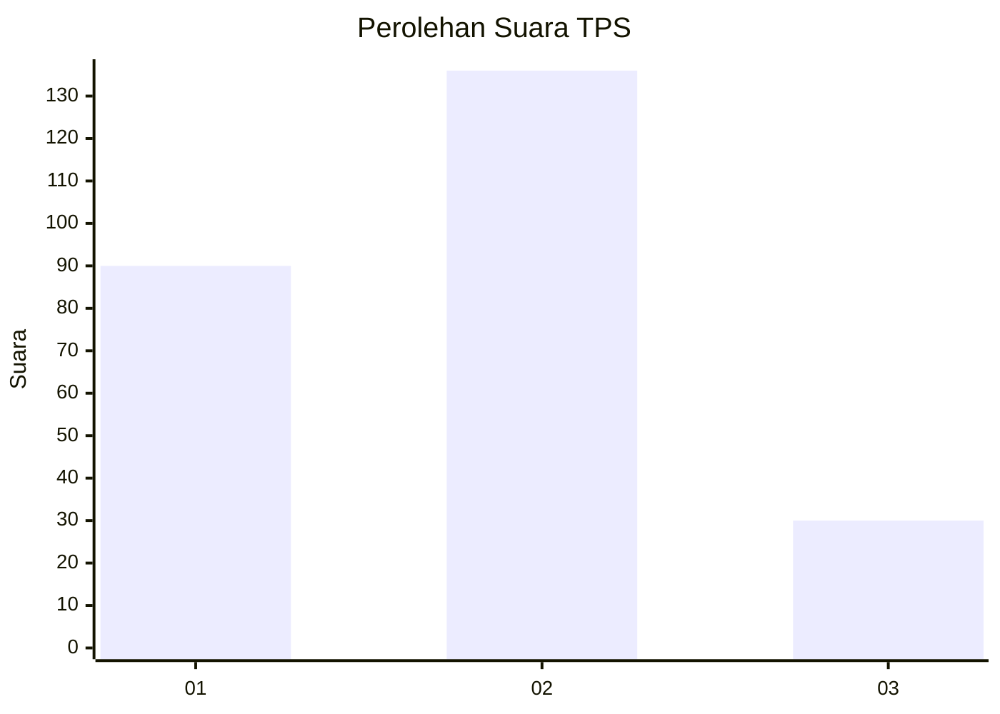
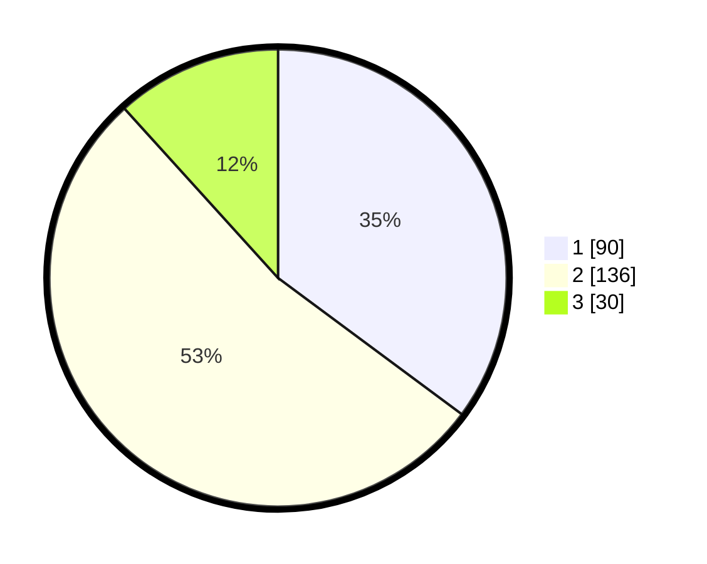

# Hasil

## Grafik

## Tabel

| No. | Nama Paslon    | Suara | Suara (raw) | Persentase |
|:--- |:-------------- | -----:| -----------:| ----------:|
| 1   | ANIES MUHAIMIN | 90    | [90][p-1]   | 35,16      |
| 2   | PRABOWO GIBRAN | 136   | [136][p-2]  | 53,13      |
| 3   | GANJAR MAHFUD  | 30    | [30][p-3]   | 11,72      |

[p-1]: https://github.com/gigit-pemilu/pemilu-2024/blob/main/pilpres/hitung-suara/sub/35-jawa-timur/sub/28-pamekasan/sub/02-pademawu/sub/2006-baddurih/sub/001-tps/sub/paslon-1.txt
[p-2]: https://github.com/gigit-pemilu/pemilu-2024/blob/main/pilpres/hitung-suara/sub/35-jawa-timur/sub/28-pamekasan/sub/02-pademawu/sub/2006-baddurih/sub/001-tps/sub/paslon-2.txt
[p-3]: https://github.com/gigit-pemilu/pemilu-2024/blob/main/pilpres/hitung-suara/sub/35-jawa-timur/sub/28-pamekasan/sub/02-pademawu/sub/2006-baddurih/sub/001-tps/sub/paslon-3.txt

## Foto C Plano

https://sirekap-obj-formc.kpu.go.id/88c4/pemilu/ppwp/35/28/02/20/06/3528022006001-20240214-212254--b5561b9b-df8b-4462-b865-13e62ed00d73.jpg

https://sirekap-obj-formc.kpu.go.id/88c4/pemilu/ppwp/35/28/02/20/06/3528022006001-20240214-220400--b844a763-80b0-48d5-9d11-d31ed94de59a.jpg

https://sirekap-obj-formc.kpu.go.id/88c4/pemilu/ppwp/35/28/02/20/06/3528022006001-20240214-220447--e9148418-3065-4b2a-a336-92ac2f06ba00.jpg

## Metadata

| Key        | Value               |
| ---------- | ------------------- |
| Time Stamp | 2024-02-15 20:00:44 |

