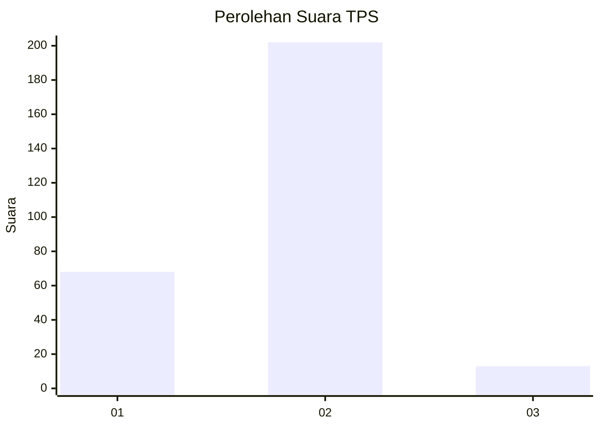
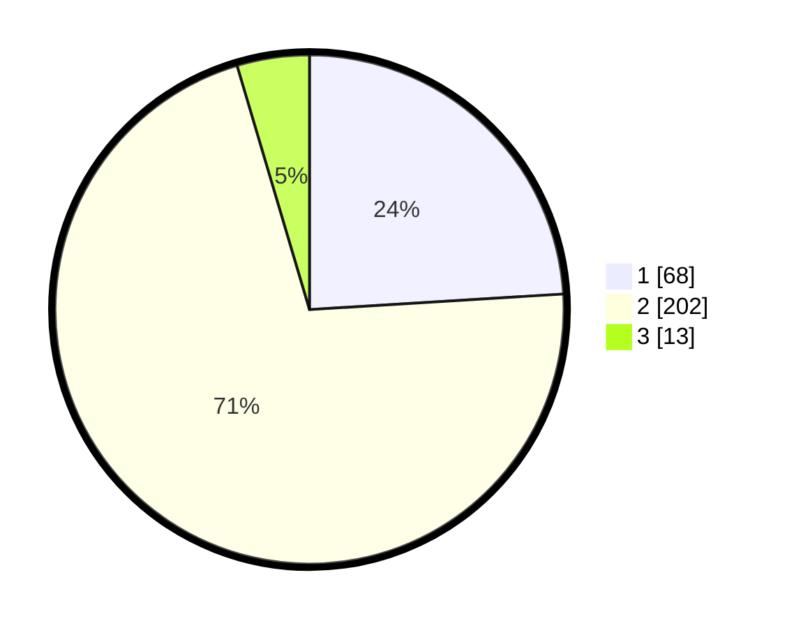

# Hasil

## Grafik

## Tabel

| No. | Nama Paslon    | Suara | Suara (raw) | Persentase |
|:--- |:-------------- | -----:| -----------:| ----------:|
| 1   | ANIES MUHAIMIN | 68    | [68][p-1]   | 24,03      |
| 2   | PRABOWO GIBRAN | 202   | [202][p-2]  | 71,38      |
| 3   | GANJAR MAHFUD  | 13    | [13][p-3]   | 4,59       |

[p-1]: https://github.com/gigit-pemilu/pemilu-2024-35-jawa-timur/blob/main/pilpres/hitung-suara/sub/35-jawa-timur/sub/28-pamekasan/sub/02-pademawu/sub/2006-baddurih/sub/004-tps/sub/paslon-1.txt
[p-2]: https://github.com/gigit-pemilu/pemilu-2024-35-jawa-timur/blob/main/pilpres/hitung-suara/sub/35-jawa-timur/sub/28-pamekasan/sub/02-pademawu/sub/2006-baddurih/sub/004-tps/sub/paslon-2.txt
[p-3]: https://github.com/gigit-pemilu/pemilu-2024-35-jawa-timur/blob/main/pilpres/hitung-suara/sub/35-jawa-timur/sub/28-pamekasan/sub/02-pademawu/sub/2006-baddurih/sub/004-tps/sub/paslon-3.txt

## Foto C Plano

https://sirekap-obj-formc.kpu.go.id/6c75/pemilu/ppwp/35/28/02/20/06/3528022006004-20240214-223433--512955b8-8642-474d-94d7-bf0a4390ad2f.jpg

https://sirekap-obj-formc.kpu.go.id/6c75/pemilu/ppwp/35/28/02/20/06/3528022006004-20240214-223554--3fa90520-7817-4f6a-b3d6-4e2d6e38f3a5.jpg

https://sirekap-obj-formc.kpu.go.id/6c75/pemilu/ppwp/35/28/02/20/06/3528022006004-20240214-223714--75ca4ad3-4a3c-49e7-af51-2875a7b5a2e2.jpg

## Metadata

| Key        | Value               |
| ---------- | ------------------- |
| Time Stamp | 2024-02-24 22:31:28 |

