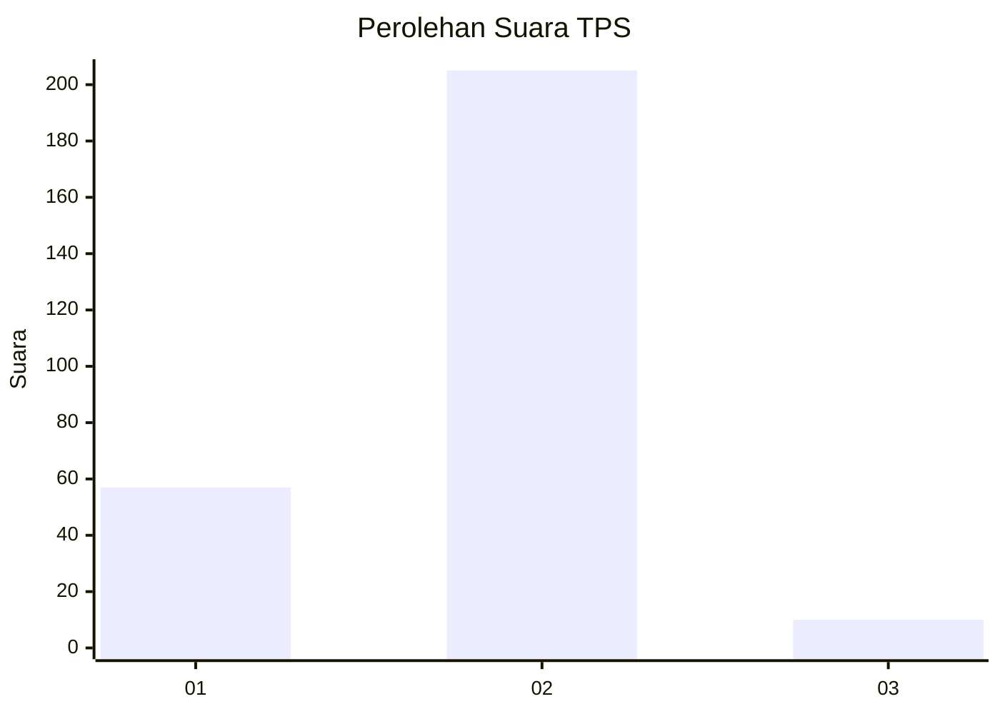

# Hasil

## Grafik

## Tabel

| No. | Nama Paslon    | Suara | Suara (raw) | Persentase |
|:--- |:-------------- | -----:| -----------:| ----------:|
| 1   | ANIES MUHAIMIN | 57    | [57][p-1]   | 20,96      |
| 2   | PRABOWO GIBRAN | 205   | [205][p-2]  | 75,37      |
| 3   | GANJAR MAHFUD  | 10    | [10][p-3]   | 3,68       |

[p-1]: https://github.com/gigit-pemilu/pemilu-2024-35-jawa-timur/blob/main/pilpres/hitung-suara/sub/35-jawa-timur/sub/28-pamekasan/sub/02-pademawu/sub/2006-baddurih/sub/006-tps/sub/paslon-1.txt
[p-2]: https://github.com/gigit-pemilu/pemilu-2024-35-jawa-timur/blob/main/pilpres/hitung-suara/sub/35-jawa-timur/sub/28-pamekasan/sub/02-pademawu/sub/2006-baddurih/sub/006-tps/sub/paslon-2.txt
[p-3]: https://github.com/gigit-pemilu/pemilu-2024-35-jawa-timur/blob/main/pilpres/hitung-suara/sub/35-jawa-timur/sub/28-pamekasan/sub/02-pademawu/sub/2006-baddurih/sub/006-tps/sub/paslon-3.txt

## Foto C Plano

https://sirekap-obj-formc.kpu.go.id/adff/pemilu/ppwp/35/28/02/20/06/3528022006006-20240214-141520--c36f3e6b-ac60-43af-9647-78bd73fd6231.jpg

https://sirekap-obj-formc.kpu.go.id/adff/pemilu/ppwp/35/28/02/20/06/3528022006006-20240214-141828--44e824f6-1754-4e2a-9b92-7fa0045c513d.jpg

## Metadata

| Key        | Value               |
| ---------- | ------------------- |
| Time Stamp | 2024-02-15 20:00:44 |

