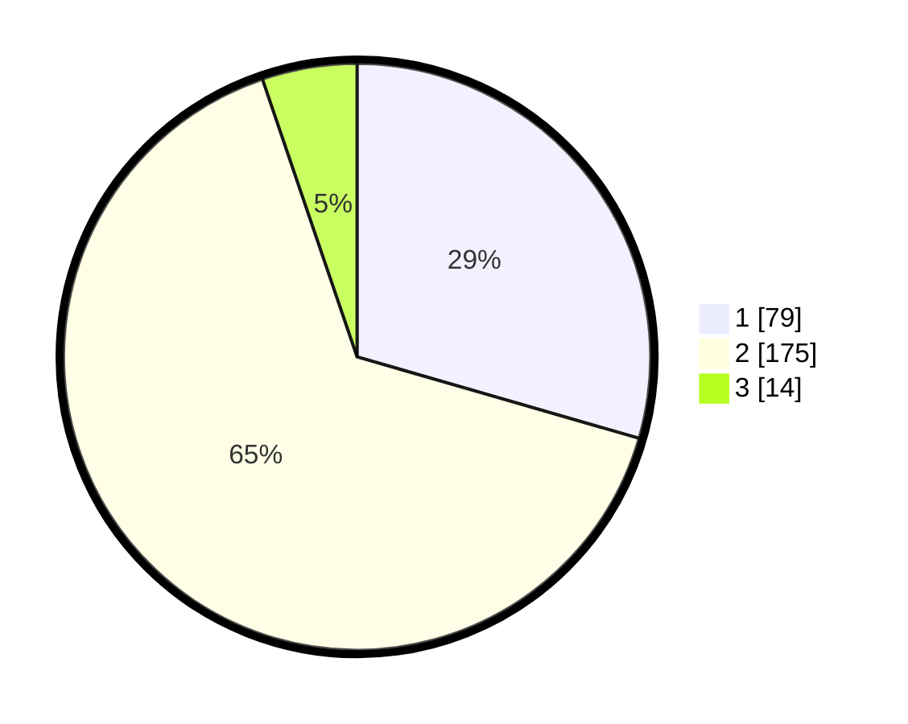

# Hasil

## Grafik

## Tabel

| No. | Nama Paslon    | Suara | Suara (raw) | Persentase |
|:--- |:-------------- | -----:| -----------:| ----------:|
| 1   | ANIES MUHAIMIN | 79    | [79][p-1]   | 29,48      |
| 2   | PRABOWO GIBRAN | 175   | [175][p-2]  | 65,30      |
| 3   | GANJAR MAHFUD  | 14    | [14][p-3]   | 5,22       |

[p-1]: https://github.com/gigit-pemilu/pemilu-2024-35-jawa-timur/blob/main/pilpres/hitung-suara/sub/35-jawa-timur/sub/28-pamekasan/sub/02-pademawu/sub/2009-prekbun/sub/001-tps/sub/paslon-1.txt
[p-2]: https://github.com/gigit-pemilu/pemilu-2024-35-jawa-timur/blob/main/pilpres/hitung-suara/sub/35-jawa-timur/sub/28-pamekasan/sub/02-pademawu/sub/2009-prekbun/sub/001-tps/sub/paslon-2.txt
[p-3]: https://github.com/gigit-pemilu/pemilu-2024-35-jawa-timur/blob/main/pilpres/hitung-suara/sub/35-jawa-timur/sub/28-pamekasan/sub/02-pademawu/sub/2009-prekbun/sub/001-tps/sub/paslon-3.txt

## Foto C Plano

https://sirekap-obj-formc.kpu.go.id/e818/pemilu/ppwp/35/28/02/20/09/3528022009001-20240215-105220--c500f6fb-de1e-47fe-854b-33a754b01eb3.jpg

https://sirekap-obj-formc.kpu.go.id/e818/pemilu/ppwp/35/28/02/20/09/3528022009001-20240215-105431--63ada6d8-3084-4efa-a6c5-9546a2cfc630.jpg

https://sirekap-obj-formc.kpu.go.id/e818/pemilu/ppwp/35/28/02/20/09/3528022009001-20240215-105549--1b70496d-d4ac-46e9-bd70-c505d3012aa7.jpg

## Metadata

| Key        | Value               |
| ---------- | ------------------- |
| Time Stamp | 2024-02-25 17:00:00 |

