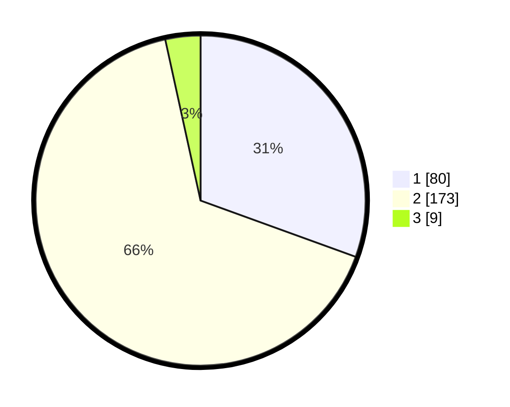

# Hasil

## Grafik

## Tabel

| No. | Nama Paslon    | Suara | Suara (raw) | Persentase |
|:--- |:-------------- | -----:| -----------:| ----------:|
| 1   | ANIES MUHAIMIN | 80    | [80][p-1]   | 30,53      |
| 2   | PRABOWO GIBRAN | 173   | [173][p-2]  | 66,03      |
| 3   | GANJAR MAHFUD  | 9     | [9][p-3]    | 3,44       |

[p-1]: https://github.com/gigit-pemilu/pemilu-2024/blob/main/pilpres/hitung-suara/sub/35-jawa-timur/sub/28-pamekasan/sub/02-pademawu/sub/2009-prekbun/sub/002-tps/sub/paslon-1.txt
[p-2]: https://github.com/gigit-pemilu/pemilu-2024/blob/main/pilpres/hitung-suara/sub/35-jawa-timur/sub/28-pamekasan/sub/02-pademawu/sub/2009-prekbun/sub/002-tps/sub/paslon-2.txt
[p-3]: https://github.com/gigit-pemilu/pemilu-2024/blob/main/pilpres/hitung-suara/sub/35-jawa-timur/sub/28-pamekasan/sub/02-pademawu/sub/2009-prekbun/sub/002-tps/sub/paslon-3.txt

## Foto C Plano

https://sirekap-obj-formc.kpu.go.id/dc94/pemilu/ppwp/35/28/02/20/09/3528022009002-20240215-111345--411a957f-cbdc-4bf4-ac50-6fcca973cf44.jpg

https://sirekap-obj-formc.kpu.go.id/dc94/pemilu/ppwp/35/28/02/20/09/3528022009002-20240215-111758--e531d860-9fb6-4867-afef-f7abfda0fa79.jpg

https://sirekap-obj-formc.kpu.go.id/dc94/pemilu/ppwp/35/28/02/20/09/3528022009002-20240215-111527--de0d9432-5ca6-4b18-8906-e580d3bd2cb6.jpg

## Metadata

| Key        | Value               |
| ---------- | ------------------- |
| Time Stamp | 2024-02-15 20:00:44 |

