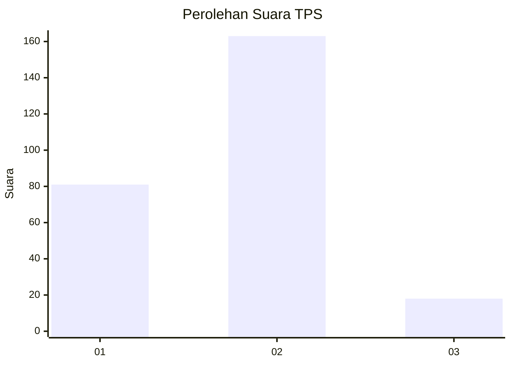
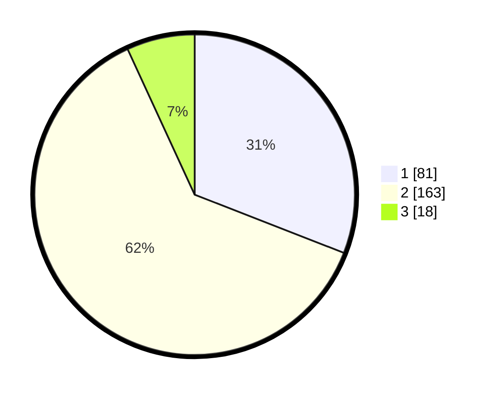

# Hasil

## Grafik

## Tabel

| No. | Nama Paslon    | Suara | Suara (raw) | Persentase |
|:--- |:-------------- | -----:| -----------:| ----------:|
| 1   | ANIES MUHAIMIN | 81    | [81][p-1]   | 30,92      |
| 2   | PRABOWO GIBRAN | 163   | [163][p-2]  | 62,21      |
| 3   | GANJAR MAHFUD  | 18    | [18][p-3]   | 6,87       |

[p-1]: https://github.com/gigit-pemilu/pemilu-2024/blob/main/pilpres/hitung-suara/sub/35-jawa-timur/sub/28-pamekasan/sub/02-pademawu/sub/2009-prekbun/sub/003-tps/sub/paslon-1.txt
[p-2]: https://github.com/gigit-pemilu/pemilu-2024/blob/main/pilpres/hitung-suara/sub/35-jawa-timur/sub/28-pamekasan/sub/02-pademawu/sub/2009-prekbun/sub/003-tps/sub/paslon-2.txt
[p-3]: https://github.com/gigit-pemilu/pemilu-2024/blob/main/pilpres/hitung-suara/sub/35-jawa-timur/sub/28-pamekasan/sub/02-pademawu/sub/2009-prekbun/sub/003-tps/sub/paslon-3.txt

## Foto C Plano

https://sirekap-obj-formc.kpu.go.id/1ef8/pemilu/ppwp/35/28/02/20/09/3528022009003-20240215-102812--c6ba435c-4dd2-469e-89e1-41ac3b47049c.jpg

https://sirekap-obj-formc.kpu.go.id/1ef8/pemilu/ppwp/35/28/02/20/09/3528022009003-20240215-133945--f7b91b28-c222-4a41-969f-2f9cc50fd8f9.jpg

https://sirekap-obj-formc.kpu.go.id/1ef8/pemilu/ppwp/35/28/02/20/09/3528022009003-20240215-103214--2bd05f1a-7d2f-416a-a8f5-695e37725157.jpg

## Metadata

| Key        | Value               |
| ---------- | ------------------- |
| Time Stamp | 2024-02-15 19:00:26 |

