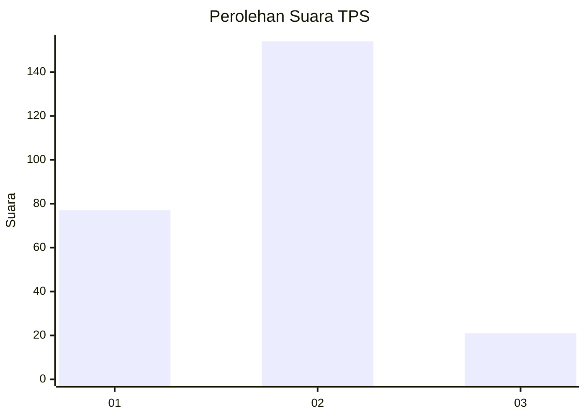
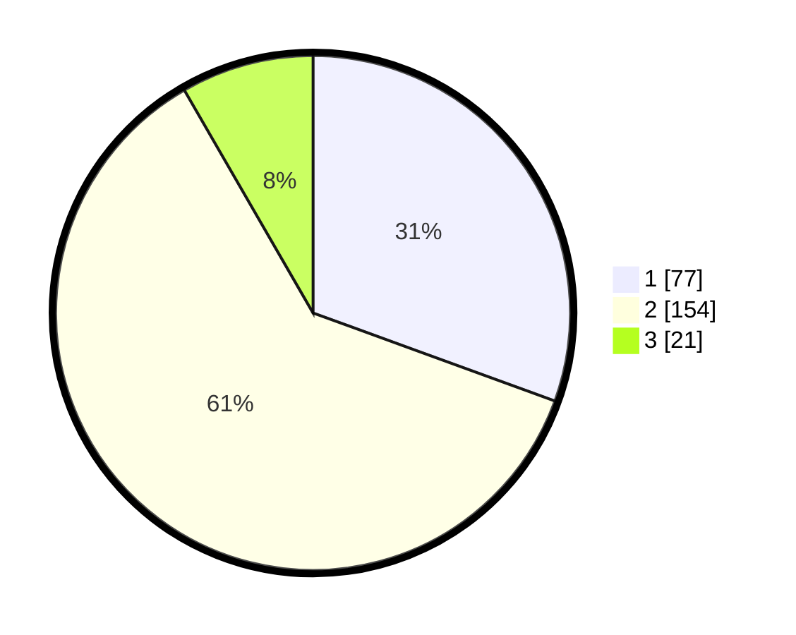

# Hasil

## Grafik

## Tabel

| No. | Nama Paslon    | Suara | Suara (raw) | Persentase |
|:--- |:-------------- | -----:| -----------:| ----------:|
| 1   | ANIES MUHAIMIN | 77    | [77][p-1]   | 30,56      |
| 2   | PRABOWO GIBRAN | 154   | [154][p-2]  | 61,11      |
| 3   | GANJAR MAHFUD  | 21    | [21][p-3]   | 8,33       |

[p-1]: https://github.com/gigit-pemilu/pemilu-2024-35-jawa-timur/blob/main/pilpres/hitung-suara/sub/35-jawa-timur/sub/28-pamekasan/sub/02-pademawu/sub/2010-durbuk/sub/004-tps/sub/paslon-1.txt
[p-2]: https://github.com/gigit-pemilu/pemilu-2024-35-jawa-timur/blob/main/pilpres/hitung-suara/sub/35-jawa-timur/sub/28-pamekasan/sub/02-pademawu/sub/2010-durbuk/sub/004-tps/sub/paslon-2.txt
[p-3]: https://github.com/gigit-pemilu/pemilu-2024-35-jawa-timur/blob/main/pilpres/hitung-suara/sub/35-jawa-timur/sub/28-pamekasan/sub/02-pademawu/sub/2010-durbuk/sub/004-tps/sub/paslon-3.txt

## Foto C Plano

https://sirekap-obj-formc.kpu.go.id/c97d/pemilu/ppwp/35/28/02/20/10/3528022010004-20240214-214400--f18d53dc-b8ca-41d8-a15c-407d28924e99.jpg

https://sirekap-obj-formc.kpu.go.id/c97d/pemilu/ppwp/35/28/02/20/10/3528022010004-20240214-194514--59ab427a-45ea-4518-b60a-f4935b714ba9.jpg

https://sirekap-obj-formc.kpu.go.id/c97d/pemilu/ppwp/35/28/02/20/10/3528022010004-20240214-194635--ce0fe070-f63c-44da-864a-2b31493b7303.jpg

## Metadata

| Key        | Value               |
| ---------- | ------------------- |
| Time Stamp | 2024-02-15 02:10:27 |

