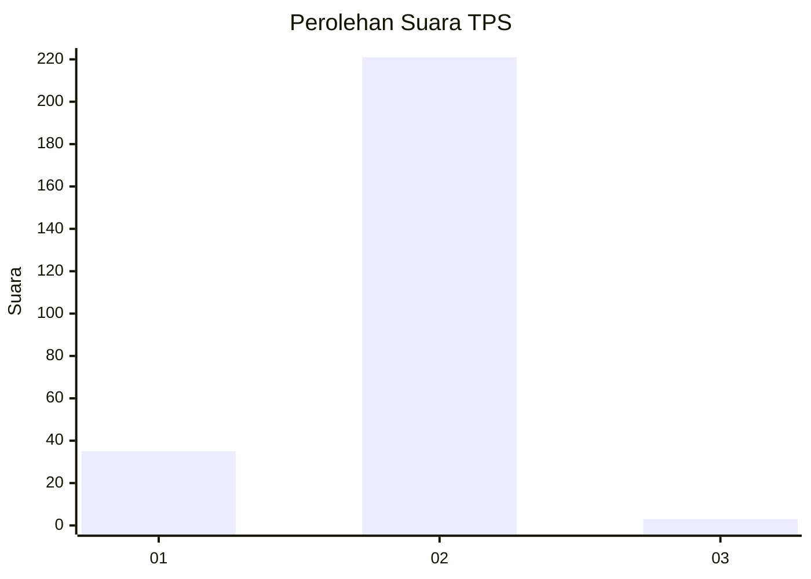
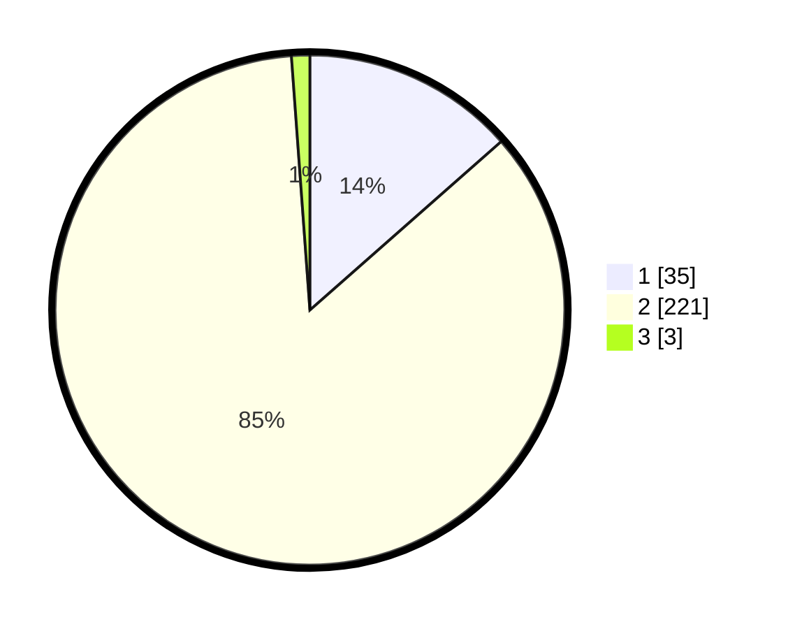

# Hasil

## Grafik

## Tabel

| No. | Nama Paslon    | Suara | Suara (raw) | Persentase |
|:--- |:-------------- | -----:| -----------:| ----------:|
| 1   | ANIES MUHAIMIN | 35    | [35][p-1]   | 13,51      |
| 2   | PRABOWO GIBRAN | 221   | [221][p-2]  | 85,33      |
| 3   | GANJAR MAHFUD  | 3     | [3][p-3]    | 1,16       |

[p-1]: https://github.com/gigit-pemilu/pemilu-2024/blob/main/pilpres/hitung-suara/sub/35-jawa-timur/sub/28-pamekasan/sub/02-pademawu/sub/2010-durbuk/sub/005-tps/sub/paslon-1.txt
[p-2]: https://github.com/gigit-pemilu/pemilu-2024/blob/main/pilpres/hitung-suara/sub/35-jawa-timur/sub/28-pamekasan/sub/02-pademawu/sub/2010-durbuk/sub/005-tps/sub/paslon-2.txt
[p-3]: https://github.com/gigit-pemilu/pemilu-2024/blob/main/pilpres/hitung-suara/sub/35-jawa-timur/sub/28-pamekasan/sub/02-pademawu/sub/2010-durbuk/sub/005-tps/sub/paslon-3.txt

## Foto C Plano

https://sirekap-obj-formc.kpu.go.id/1424/pemilu/ppwp/35/28/02/20/10/3528022010005-20240215-011627--c198b8de-e78c-476c-9067-5492951c5777.jpg

https://sirekap-obj-formc.kpu.go.id/1424/pemilu/ppwp/35/28/02/20/10/3528022010005-20240215-011925--f33e3860-912e-4e95-b922-c707602212e4.jpg

https://sirekap-obj-formc.kpu.go.id/1424/pemilu/ppwp/35/28/02/20/10/3528022010005-20240215-012045--b122ad1c-40ea-482a-a497-45526df062be.jpg

## Metadata

| Key        | Value               |
| ---------- | ------------------- |
| Time Stamp | 2024-02-15 20:00:44 |

