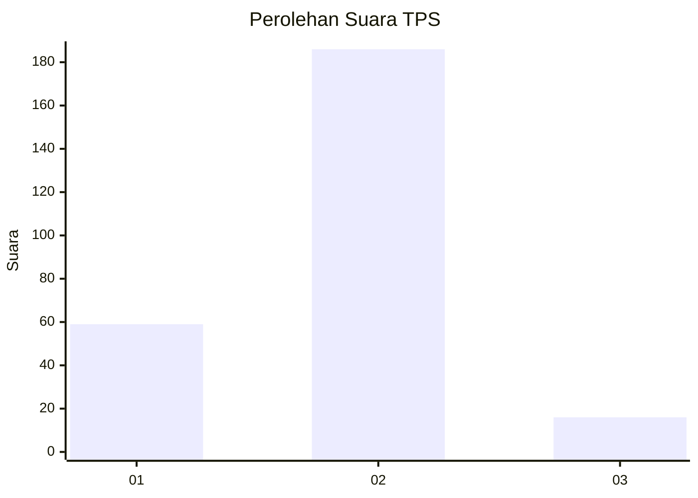

# Hasil

## Grafik

## Tabel

| No. | Nama Paslon    | Suara | Suara (raw) | Persentase |
|:--- |:-------------- | -----:| -----------:| ----------:|
| 1   | ANIES MUHAIMIN | 59    | [59][p-1]   | 22,61      |
| 2   | PRABOWO GIBRAN | 186   | [186][p-2]  | 71,26      |
| 3   | GANJAR MAHFUD  | 16    | [16][p-3]   | 6,13       |

[p-1]: https://github.com/gigit-pemilu/pemilu-2024/blob/main/pilpres/hitung-suara/sub/35-jawa-timur/sub/28-pamekasan/sub/02-pademawu/sub/2010-durbuk/sub/007-tps/sub/paslon-1.txt
[p-2]: https://github.com/gigit-pemilu/pemilu-2024/blob/main/pilpres/hitung-suara/sub/35-jawa-timur/sub/28-pamekasan/sub/02-pademawu/sub/2010-durbuk/sub/007-tps/sub/paslon-2.txt
[p-3]: https://github.com/gigit-pemilu/pemilu-2024/blob/main/pilpres/hitung-suara/sub/35-jawa-timur/sub/28-pamekasan/sub/02-pademawu/sub/2010-durbuk/sub/007-tps/sub/paslon-3.txt

## Foto C Plano

https://sirekap-obj-formc.kpu.go.id/f272/pemilu/ppwp/35/28/02/20/10/3528022010007-20240215-000910--7d683283-9fac-4d9b-9203-48e49a9f7317.jpg

https://sirekap-obj-formc.kpu.go.id/f272/pemilu/ppwp/35/28/02/20/10/3528022010007-20240215-001051--145f9bb0-f37f-4519-9da8-43f79ce27712.jpg

https://sirekap-obj-formc.kpu.go.id/f272/pemilu/ppwp/35/28/02/20/10/3528022010007-20240215-001236--e8611d05-0323-4e64-b6f5-330199d803be.jpg

## Metadata

| Key        | Value               |
| ---------- | ------------------- |
| Time Stamp | 2024-02-15 20:00:44 |

