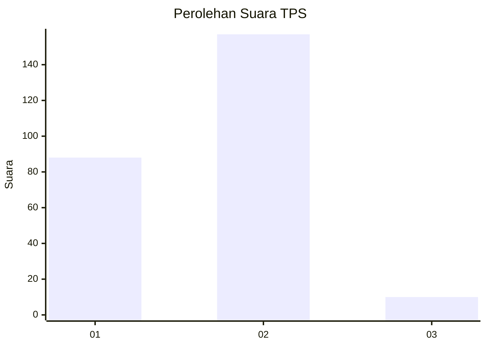
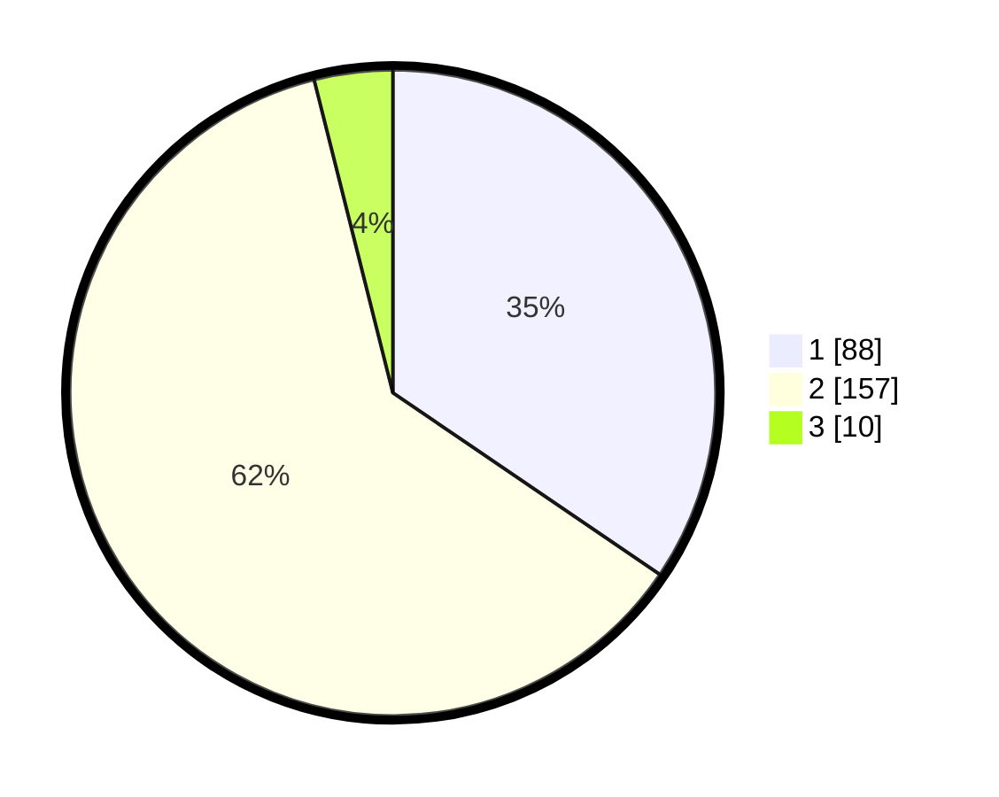

# Hasil

## Grafik

## Tabel

| No. | Nama Paslon    | Suara | Suara (raw) | Persentase |
|:--- |:-------------- | -----:| -----------:| ----------:|
| 1   | ANIES MUHAIMIN | 88    | [88][p-1]   | 34,51      |
| 2   | PRABOWO GIBRAN | 157   | [157][p-2]  | 61,57      |
| 3   | GANJAR MAHFUD  | 10    | [10][p-3]   | 3,92       |

[p-1]: https://github.com/gigit-pemilu/pemilu-2024-35-jawa-timur/blob/main/pilpres/hitung-suara/sub/35-jawa-timur/sub/28-pamekasan/sub/02-pademawu/sub/2011-pademawu-barat/sub/003-tps/sub/paslon-1.txt
[p-2]: https://github.com/gigit-pemilu/pemilu-2024-35-jawa-timur/blob/main/pilpres/hitung-suara/sub/35-jawa-timur/sub/28-pamekasan/sub/02-pademawu/sub/2011-pademawu-barat/sub/003-tps/sub/paslon-2.txt
[p-3]: https://github.com/gigit-pemilu/pemilu-2024-35-jawa-timur/blob/main/pilpres/hitung-suara/sub/35-jawa-timur/sub/28-pamekasan/sub/02-pademawu/sub/2011-pademawu-barat/sub/003-tps/sub/paslon-3.txt

## Foto C Plano

https://sirekap-obj-formc.kpu.go.id/d4dc/pemilu/ppwp/35/28/02/20/11/3528022011003-20240214-202542--ac49f676-60af-42b0-a9a7-cc0c3ce134cc.jpg

https://sirekap-obj-formc.kpu.go.id/d4dc/pemilu/ppwp/35/28/02/20/11/3528022011003-20240214-202704--f961737b-bc0d-4df6-aa4e-592e57f0072e.jpg

https://sirekap-obj-formc.kpu.go.id/d4dc/pemilu/ppwp/35/28/02/20/11/3528022011003-20240214-202756--c89fe431-d5f1-4bfc-afbb-cebdb2bf2770.jpg

## Metadata

| Key        | Value               |
| ---------- | ------------------- |
| Time Stamp | 2024-02-25 20:00:00 |

