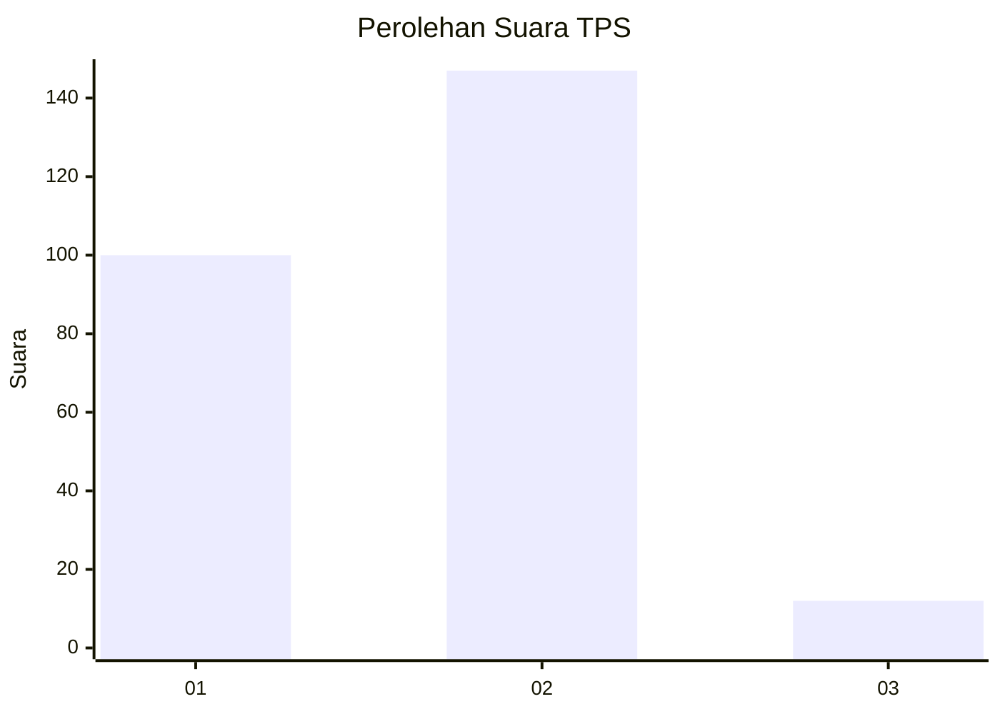
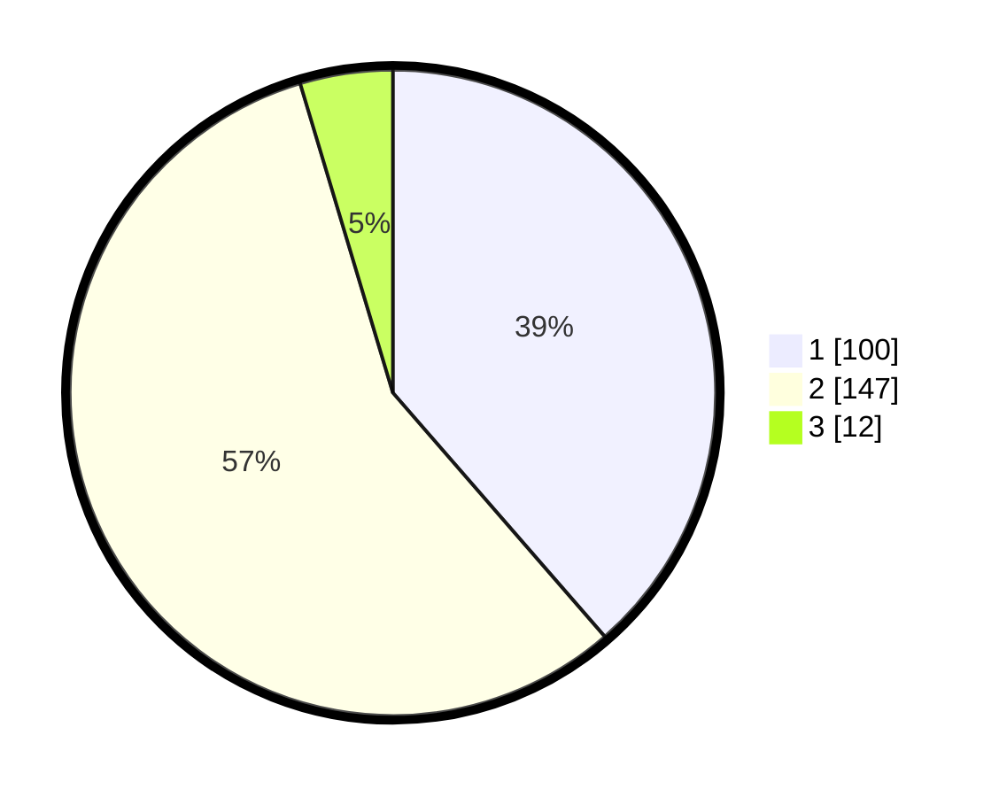

# Hasil

## Grafik

## Tabel

| No. | Nama Paslon    | Suara | Suara (raw) | Persentase |
|:--- |:-------------- | -----:| -----------:| ----------:|
| 1   | ANIES MUHAIMIN | 100   | [100][p-1]  | 38,61      |
| 2   | PRABOWO GIBRAN | 147   | [147][p-2]  | 56,76      |
| 3   | GANJAR MAHFUD  | 12    | [12][p-3]   | 4,63       |

[p-1]: https://github.com/gigit-pemilu/pemilu-2024-35-jawa-timur/blob/main/pilpres/hitung-suara/sub/35-jawa-timur/sub/28-pamekasan/sub/02-pademawu/sub/2011-pademawu-barat/sub/010-tps/sub/paslon-1.txt
[p-2]: https://github.com/gigit-pemilu/pemilu-2024-35-jawa-timur/blob/main/pilpres/hitung-suara/sub/35-jawa-timur/sub/28-pamekasan/sub/02-pademawu/sub/2011-pademawu-barat/sub/010-tps/sub/paslon-2.txt
[p-3]: https://github.com/gigit-pemilu/pemilu-2024-35-jawa-timur/blob/main/pilpres/hitung-suara/sub/35-jawa-timur/sub/28-pamekasan/sub/02-pademawu/sub/2011-pademawu-barat/sub/010-tps/sub/paslon-3.txt

## Foto C Plano

https://sirekap-obj-formc.kpu.go.id/58d8/pemilu/ppwp/35/28/02/20/11/3528022011010-20240214-234312--c7da4825-9089-4669-9d47-a5257f9d7386.jpg

https://sirekap-obj-formc.kpu.go.id/58d8/pemilu/ppwp/35/28/02/20/11/3528022011010-20240214-234410--e9e23856-21a5-4eea-99fe-4e3c2c87ead5.jpg

https://sirekap-obj-formc.kpu.go.id/58d8/pemilu/ppwp/35/28/02/20/11/3528022011010-20240214-234455--d4335106-6324-45da-9f96-13f2b9fd8145.jpg

## Metadata

| Key        | Value               |
| ---------- | ------------------- |
| Time Stamp | 2024-02-15 20:00:44 |

