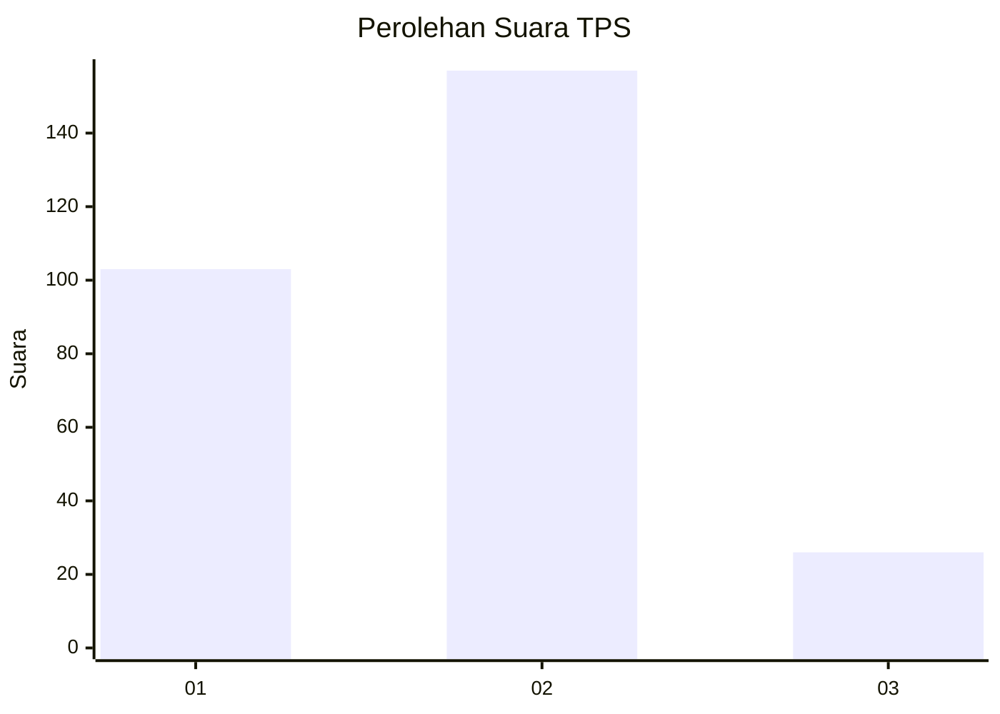

# Hasil

## Grafik

## Tabel

| No. | Nama Paslon    | Suara | Suara (raw) | Persentase |
|:--- |:-------------- | -----:| -----------:| ----------:|
| 1   | ANIES MUHAIMIN | 103   | [103][p-1]  | 36,01      |
| 2   | PRABOWO GIBRAN | 157   | [157][p-2]  | 54,90      |
| 3   | GANJAR MAHFUD  | 26    | [26][p-3]   | 9,09       |

[p-1]: https://github.com/gigit-pemilu/pemilu-2024/blob/main/pilpres/hitung-suara/sub/35-jawa-timur/sub/28-pamekasan/sub/02-pademawu/sub/2011-pademawu-barat/sub/016-tps/sub/paslon-1.txt
[p-2]: https://github.com/gigit-pemilu/pemilu-2024/blob/main/pilpres/hitung-suara/sub/35-jawa-timur/sub/28-pamekasan/sub/02-pademawu/sub/2011-pademawu-barat/sub/016-tps/sub/paslon-2.txt
[p-3]: https://github.com/gigit-pemilu/pemilu-2024/blob/main/pilpres/hitung-suara/sub/35-jawa-timur/sub/28-pamekasan/sub/02-pademawu/sub/2011-pademawu-barat/sub/016-tps/sub/paslon-3.txt

## Foto C Plano

https://sirekap-obj-formc.kpu.go.id/e17b/pemilu/ppwp/35/28/02/20/11/3528022011016-20240214-194820--7245a023-e788-4bbf-9e1a-4220e10d691b.jpg

https://sirekap-obj-formc.kpu.go.id/e17b/pemilu/ppwp/35/28/02/20/11/3528022011016-20240214-194613--a4ad7983-8eee-4d1c-bcc2-d8cac898f077.jpg

https://sirekap-obj-formc.kpu.go.id/e17b/pemilu/ppwp/35/28/02/20/11/3528022011016-20240214-195112--5b00e8c2-940e-4b7b-a2b0-0348b9538228.jpg

## Metadata

| Key        | Value               |
| ---------- | ------------------- |
| Time Stamp | 2024-02-24 22:31:28 |

