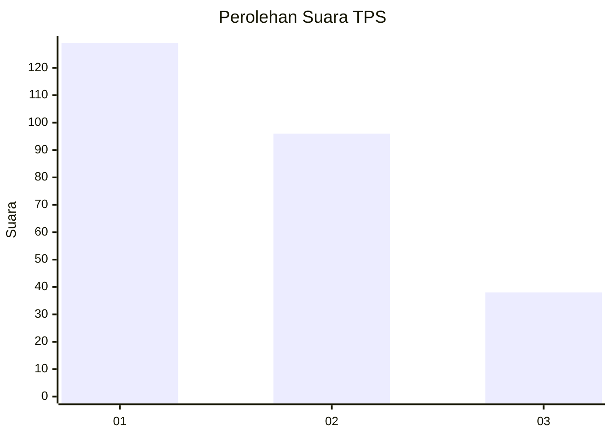
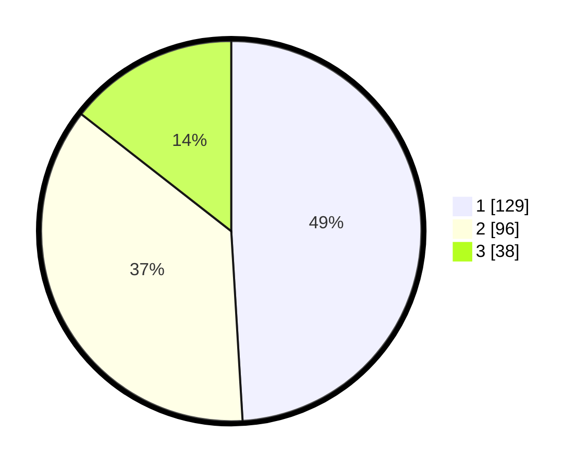

# Hasil

## Grafik

## Tabel

| No. | Nama Paslon    | Suara | Suara (raw) | Persentase |
|:--- |:-------------- | -----:| -----------:| ----------:|
| 1   | ANIES MUHAIMIN | 129   | [129][p-1]  | 49,05      |
| 2   | PRABOWO GIBRAN | 96    | [96][p-2]   | 36,50      |
| 3   | GANJAR MAHFUD  | 38    | [38][p-3]   | 14,45      |

[p-1]: https://github.com/gigit-pemilu/pemilu-2024-35-jawa-timur/blob/main/pilpres/hitung-suara/sub/35-jawa-timur/sub/28-pamekasan/sub/02-pademawu/sub/2014-dasok/sub/003-tps/sub/paslon-1.txt
[p-2]: https://github.com/gigit-pemilu/pemilu-2024-35-jawa-timur/blob/main/pilpres/hitung-suara/sub/35-jawa-timur/sub/28-pamekasan/sub/02-pademawu/sub/2014-dasok/sub/003-tps/sub/paslon-2.txt
[p-3]: https://github.com/gigit-pemilu/pemilu-2024-35-jawa-timur/blob/main/pilpres/hitung-suara/sub/35-jawa-timur/sub/28-pamekasan/sub/02-pademawu/sub/2014-dasok/sub/003-tps/sub/paslon-3.txt

## Foto C Plano

https://sirekap-obj-formc.kpu.go.id/7c67/pemilu/ppwp/35/28/02/20/14/3528022014003-20240214-232727--05d285d1-7fc1-4af7-a9d2-f1fc8d213f66.jpg

https://sirekap-obj-formc.kpu.go.id/7c67/pemilu/ppwp/35/28/02/20/14/3528022014003-20240214-233058--f2715a4f-82cf-4590-b696-8c0d1dd4c461.jpg

https://sirekap-obj-formc.kpu.go.id/7c67/pemilu/ppwp/35/28/02/20/14/3528022014003-20240214-233039--82df7fa0-8073-4d75-8fba-c0d10a7dffae.jpg

## Metadata

| Key        | Value               |
| ---------- | ------------------- |
| Time Stamp | 2024-02-25 00:00:00 |

