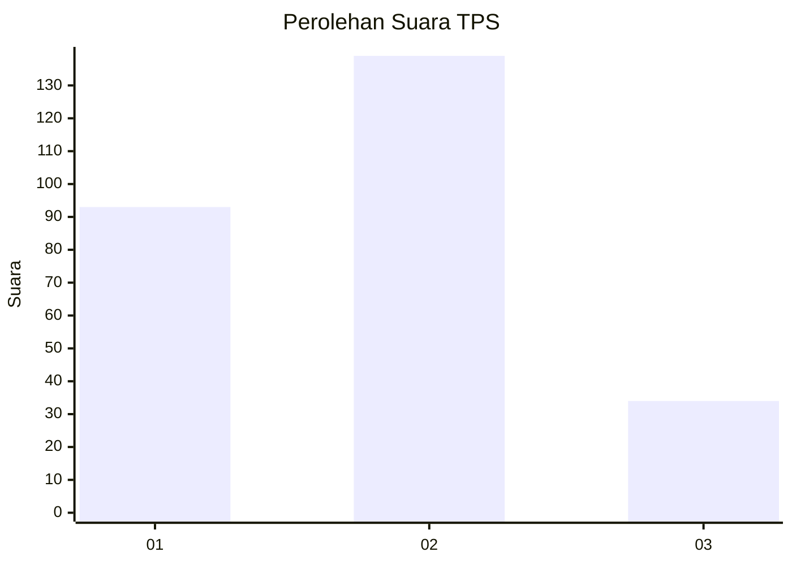
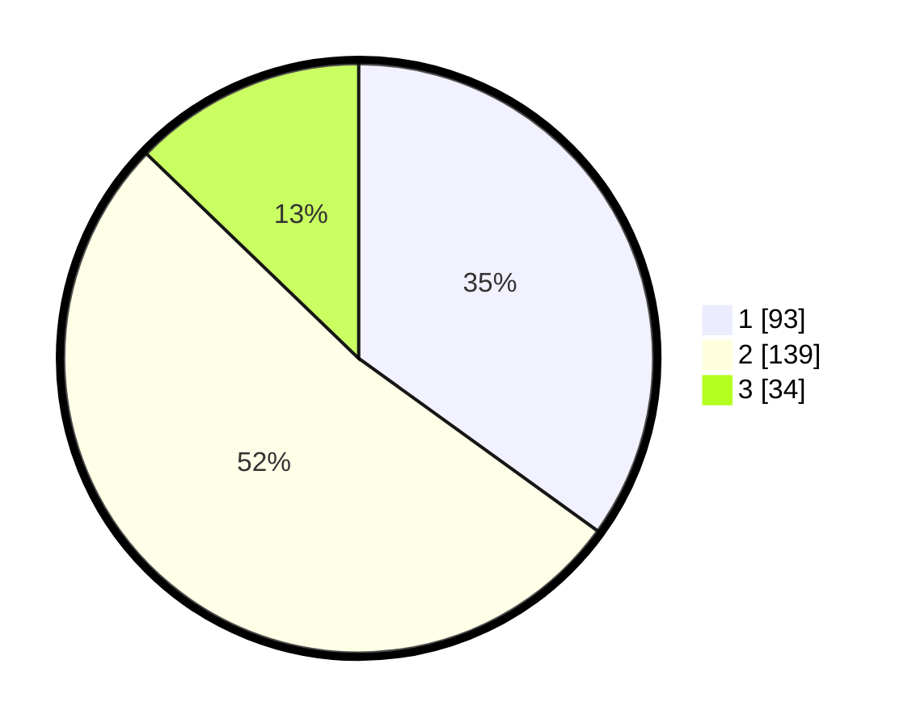

# Hasil

## Grafik

## Tabel

| No. | Nama Paslon    | Suara | Suara (raw) | Persentase |
|:--- |:-------------- | -----:| -----------:| ----------:|
| 1   | ANIES MUHAIMIN | 93    | [93][p-1]   | 34,96      |
| 2   | PRABOWO GIBRAN | 139   | [139][p-2]  | 52,26      |
| 3   | GANJAR MAHFUD  | 34    | [34][p-3]   | 12,78      |

[p-1]: https://github.com/gigit-pemilu/pemilu-2024-35-jawa-timur/blob/main/pilpres/hitung-suara/sub/35-jawa-timur/sub/28-pamekasan/sub/02-pademawu/sub/2014-dasok/sub/004-tps/sub/paslon-1.txt
[p-2]: https://github.com/gigit-pemilu/pemilu-2024-35-jawa-timur/blob/main/pilpres/hitung-suara/sub/35-jawa-timur/sub/28-pamekasan/sub/02-pademawu/sub/2014-dasok/sub/004-tps/sub/paslon-2.txt
[p-3]: https://github.com/gigit-pemilu/pemilu-2024-35-jawa-timur/blob/main/pilpres/hitung-suara/sub/35-jawa-timur/sub/28-pamekasan/sub/02-pademawu/sub/2014-dasok/sub/004-tps/sub/paslon-3.txt

## Foto C Plano

https://sirekap-obj-formc.kpu.go.id/1e74/pemilu/ppwp/35/28/02/20/14/3528022014004-20240214-230903--8b00721a-775b-4b5f-825c-c72f7c807257.jpg

https://sirekap-obj-formc.kpu.go.id/1e74/pemilu/ppwp/35/28/02/20/14/3528022014004-20240214-231700--4522aba2-dc04-4272-ba2e-def9af03b0ba.jpg

https://sirekap-obj-formc.kpu.go.id/1e74/pemilu/ppwp/35/28/02/20/14/3528022014004-20240214-232233--442af9b7-46ee-480b-93c4-d4ad51eee6e9.jpg

## Metadata

| Key        | Value               |
| ---------- | ------------------- |
| Time Stamp | 2024-02-15 20:30:46 |

