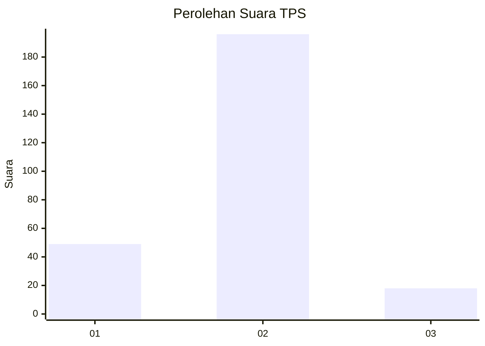
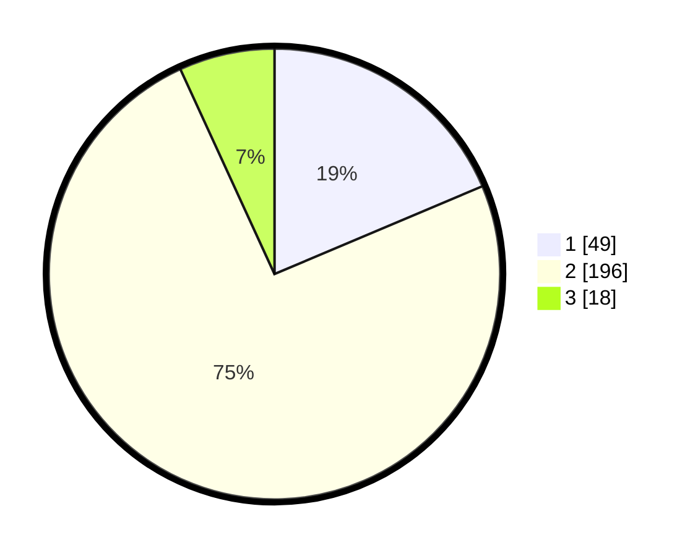

# Hasil

## Grafik

## Tabel

| No. | Nama Paslon    | Suara | Suara (raw) | Persentase |
|:--- |:-------------- | -----:| -----------:| ----------:|
| 1   | ANIES MUHAIMIN | 49    | [49][p-1]   | 18,63      |
| 2   | PRABOWO GIBRAN | 196   | [196][p-2]  | 74,52      |
| 3   | GANJAR MAHFUD  | 18    | [18][p-3]   | 6,84       |

[p-1]: https://github.com/gigit-pemilu/pemilu-2024/blob/main/pilpres/hitung-suara/sub/35-jawa-timur/sub/28-pamekasan/sub/02-pademawu/sub/2014-dasok/sub/005-tps/sub/paslon-1.txt
[p-2]: https://github.com/gigit-pemilu/pemilu-2024/blob/main/pilpres/hitung-suara/sub/35-jawa-timur/sub/28-pamekasan/sub/02-pademawu/sub/2014-dasok/sub/005-tps/sub/paslon-2.txt
[p-3]: https://github.com/gigit-pemilu/pemilu-2024/blob/main/pilpres/hitung-suara/sub/35-jawa-timur/sub/28-pamekasan/sub/02-pademawu/sub/2014-dasok/sub/005-tps/sub/paslon-3.txt

## Foto C Plano

https://sirekap-obj-formc.kpu.go.id/1f03/pemilu/ppwp/35/28/02/20/14/3528022014005-20240215-081346--5bfaee5a-bceb-419c-8a27-0a3dae6536e3.jpg

https://sirekap-obj-formc.kpu.go.id/1f03/pemilu/ppwp/35/28/02/20/14/3528022014005-20240215-081455--29c659c5-9064-428e-8525-66187e78423b.jpg

https://sirekap-obj-formc.kpu.go.id/1f03/pemilu/ppwp/35/28/02/20/14/3528022014005-20240215-081603--fe96ca3d-e552-4d36-8b9a-433cd82c0f60.jpg

## Metadata

| Key        | Value               |
| ---------- | ------------------- |
| Time Stamp | 2024-02-15 20:30:46 |

