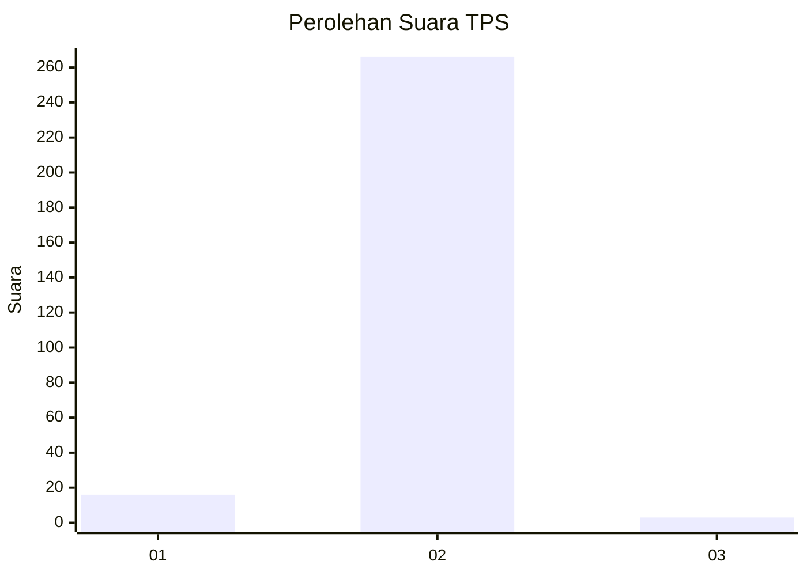
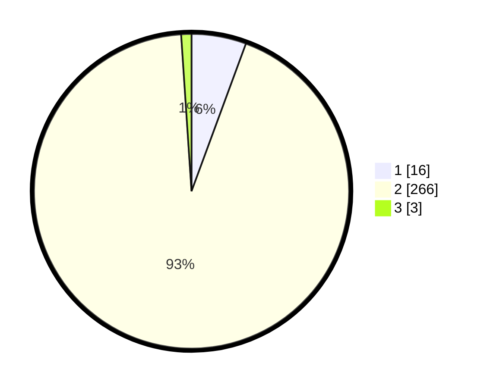

# Hasil

## Grafik

## Tabel

| No. | Nama Paslon    | Suara | Suara (raw) | Persentase |
|:--- |:-------------- | -----:| -----------:| ----------:|
| 1   | ANIES MUHAIMIN | 16    | [16][p-1]   | 5,61       |
| 2   | PRABOWO GIBRAN | 266   | [266][p-2]  | 93,33      |
| 3   | GANJAR MAHFUD  | 3     | [3][p-3]    | 1,05       |

[p-1]: https://github.com/gigit-pemilu/pemilu-2024/blob/main/pilpres/hitung-suara/sub/35-jawa-timur/sub/28-pamekasan/sub/02-pademawu/sub/2014-dasok/sub/007-tps/sub/paslon-1.txt
[p-2]: https://github.com/gigit-pemilu/pemilu-2024/blob/main/pilpres/hitung-suara/sub/35-jawa-timur/sub/28-pamekasan/sub/02-pademawu/sub/2014-dasok/sub/007-tps/sub/paslon-2.txt
[p-3]: https://github.com/gigit-pemilu/pemilu-2024/blob/main/pilpres/hitung-suara/sub/35-jawa-timur/sub/28-pamekasan/sub/02-pademawu/sub/2014-dasok/sub/007-tps/sub/paslon-3.txt

## Foto C Plano

https://sirekap-obj-formc.kpu.go.id/d1bd/pemilu/ppwp/35/28/02/20/14/3528022014007-20240215-091708--5e83d054-b321-41b1-af20-349578d486dc.jpg

https://sirekap-obj-formc.kpu.go.id/d1bd/pemilu/ppwp/35/28/02/20/14/3528022014007-20240215-091852--cc090e53-d87b-4dff-9caa-b28ae6daa260.jpg

https://sirekap-obj-formc.kpu.go.id/d1bd/pemilu/ppwp/35/28/02/20/14/3528022014007-20240215-091929--195337be-92cb-4115-8ad3-d1336953d178.jpg

## Metadata

| Key        | Value               |
| ---------- | ------------------- |
| Time Stamp | 2024-02-16 10:00:28 |

