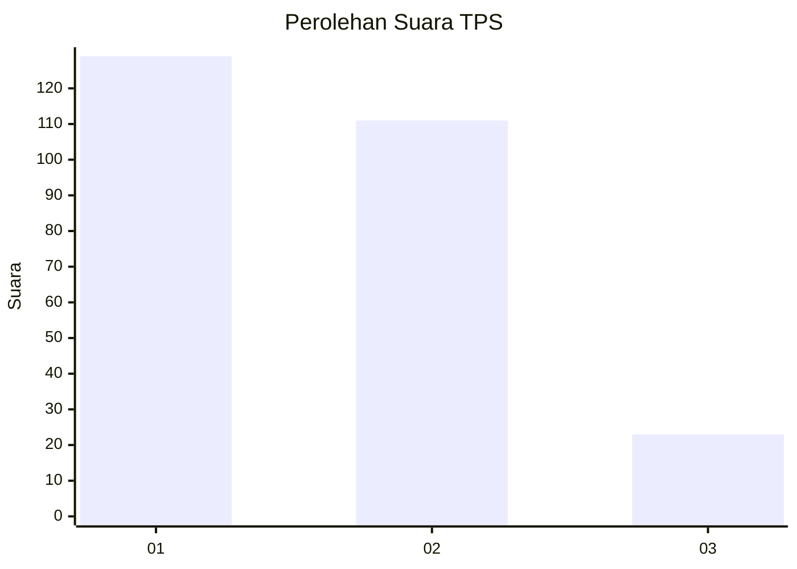
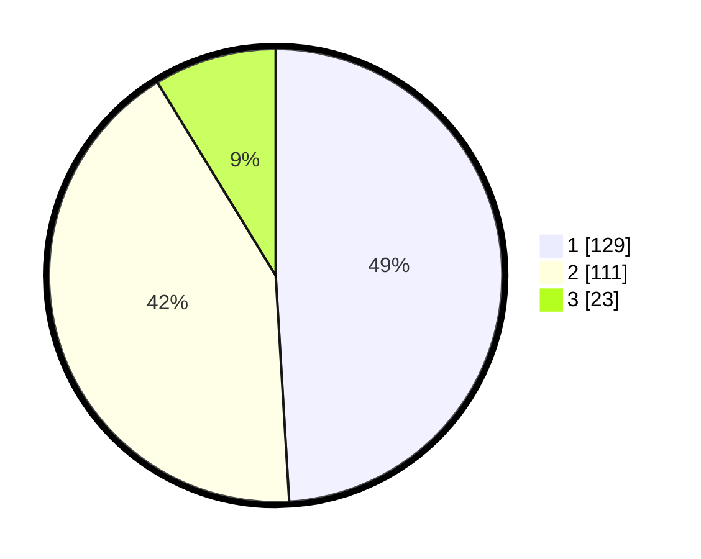

# Hasil

## Grafik

## Tabel

| No. | Nama Paslon    | Suara | Suara (raw) | Persentase |
|:--- |:-------------- | -----:| -----------:| ----------:|
| 1   | ANIES MUHAIMIN | 129   | [129][p-1]  | 49,05      |
| 2   | PRABOWO GIBRAN | 111   | [111][p-2]  | 42,21      |
| 3   | GANJAR MAHFUD  | 23    | [23][p-3]   | 8,75       |

[p-1]: https://github.com/gigit-pemilu/pemilu-2024/blob/main/pilpres/hitung-suara/sub/35-jawa-timur/sub/28-pamekasan/sub/02-pademawu/sub/2014-dasok/sub/008-tps/sub/paslon-1.txt
[p-2]: https://github.com/gigit-pemilu/pemilu-2024/blob/main/pilpres/hitung-suara/sub/35-jawa-timur/sub/28-pamekasan/sub/02-pademawu/sub/2014-dasok/sub/008-tps/sub/paslon-2.txt
[p-3]: https://github.com/gigit-pemilu/pemilu-2024/blob/main/pilpres/hitung-suara/sub/35-jawa-timur/sub/28-pamekasan/sub/02-pademawu/sub/2014-dasok/sub/008-tps/sub/paslon-3.txt

## Foto C Plano

https://sirekap-obj-formc.kpu.go.id/4625/pemilu/ppwp/35/28/02/20/14/3528022014008-20240214-230407--f15ebe7c-d405-4bfc-8337-e9b05b9aa44a.jpg

https://sirekap-obj-formc.kpu.go.id/4625/pemilu/ppwp/35/28/02/20/14/3528022014008-20240215-005301--2df1a895-7940-438f-9a2e-9c66eb9d822c.jpg

https://sirekap-obj-formc.kpu.go.id/4625/pemilu/ppwp/35/28/02/20/14/3528022014008-20240215-081609--f7dc6460-705e-42b8-ae3d-99335abb18cd.jpg

## Metadata

| Key        | Value               |
| ---------- | ------------------- |
| Time Stamp | 2024-02-25 16:00:00 |

