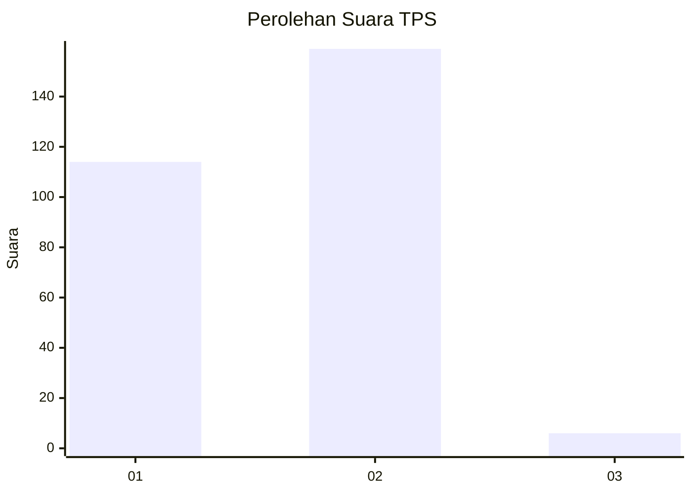
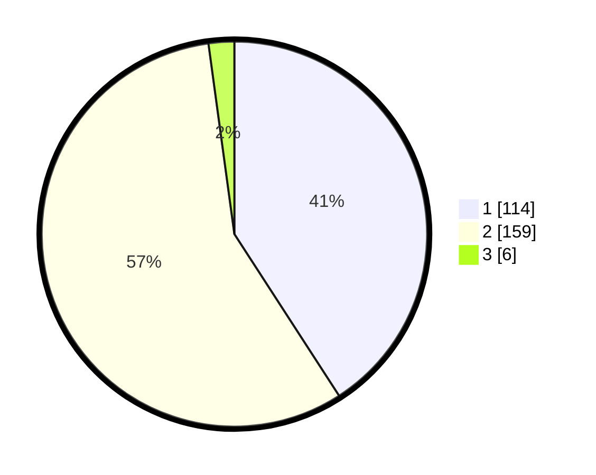

# Hasil

## Grafik

## Tabel

| No. | Nama Paslon    | Suara | Suara (raw) | Persentase |
|:--- |:-------------- | -----:| -----------:| ----------:|
| 1   | ANIES MUHAIMIN | 114   | [114][p-1]  | 40,86      |
| 2   | PRABOWO GIBRAN | 159   | [159][p-2]  | 56,99      |
| 3   | GANJAR MAHFUD  | 6     | [6][p-3]    | 2,15       |

[p-1]: https://github.com/gigit-pemilu/pemilu-2024/blob/main/pilpres/hitung-suara/sub/35-jawa-timur/sub/28-pamekasan/sub/02-pademawu/sub/2014-dasok/sub/009-tps/sub/paslon-1.txt
[p-2]: https://github.com/gigit-pemilu/pemilu-2024/blob/main/pilpres/hitung-suara/sub/35-jawa-timur/sub/28-pamekasan/sub/02-pademawu/sub/2014-dasok/sub/009-tps/sub/paslon-2.txt
[p-3]: https://github.com/gigit-pemilu/pemilu-2024/blob/main/pilpres/hitung-suara/sub/35-jawa-timur/sub/28-pamekasan/sub/02-pademawu/sub/2014-dasok/sub/009-tps/sub/paslon-3.txt

## Foto C Plano

https://sirekap-obj-formc.kpu.go.id/b1e6/pemilu/ppwp/35/28/02/20/14/3528022014009-20240214-225759--0b45fc6a-c564-4130-9ffd-4764a81dc3fd.jpg

https://sirekap-obj-formc.kpu.go.id/b1e6/pemilu/ppwp/35/28/02/20/14/3528022014009-20240214-225816--3a010edf-4286-47c2-a420-7e4885433cc1.jpg

https://sirekap-obj-formc.kpu.go.id/b1e6/pemilu/ppwp/35/28/02/20/14/3528022014009-20240214-225851--7358e4ad-9c2d-4aca-9fd2-a8157587c7bd.jpg

## Metadata

| Key        | Value               |
| ---------- | ------------------- |
| Time Stamp | 2024-02-15 19:30:26 |

