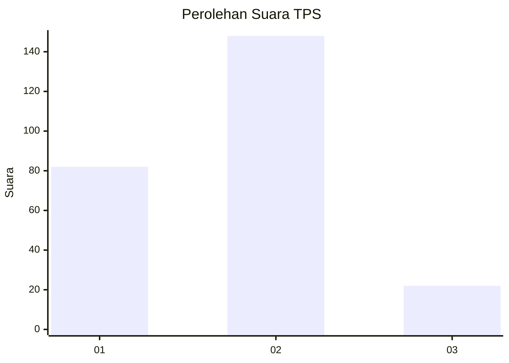
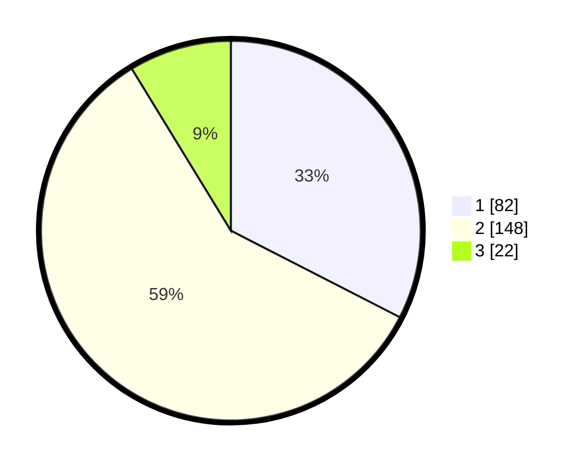

# Hasil

## Grafik

## Tabel

| No. | Nama Paslon    | Suara | Suara (raw) | Persentase |
|:--- |:-------------- | -----:| -----------:| ----------:|
| 1   | ANIES MUHAIMIN | 82    | [82][p-1]   | 32,54      |
| 2   | PRABOWO GIBRAN | 148   | [148][p-2]  | 58,73      |
| 3   | GANJAR MAHFUD  | 22    | [22][p-3]   | 8,73       |

[p-1]: https://github.com/gigit-pemilu/pemilu-2024-35-jawa-timur/blob/main/pilpres/hitung-suara/sub/35-jawa-timur/sub/28-pamekasan/sub/02-pademawu/sub/2015-murtajih/sub/001-tps/sub/paslon-1.txt
[p-2]: https://github.com/gigit-pemilu/pemilu-2024-35-jawa-timur/blob/main/pilpres/hitung-suara/sub/35-jawa-timur/sub/28-pamekasan/sub/02-pademawu/sub/2015-murtajih/sub/001-tps/sub/paslon-2.txt
[p-3]: https://github.com/gigit-pemilu/pemilu-2024-35-jawa-timur/blob/main/pilpres/hitung-suara/sub/35-jawa-timur/sub/28-pamekasan/sub/02-pademawu/sub/2015-murtajih/sub/001-tps/sub/paslon-3.txt

## Foto C Plano

https://sirekap-obj-formc.kpu.go.id/cf1e/pemilu/ppwp/35/28/02/20/15/3528022015001-20240214-230944--278ea052-7aaa-4fe0-84ab-5ebd9492f72e.jpg

https://sirekap-obj-formc.kpu.go.id/cf1e/pemilu/ppwp/35/28/02/20/15/3528022015001-20240214-231119--c93904d4-f67f-41bc-9a26-237aea3cad9c.jpg

https://sirekap-obj-formc.kpu.go.id/cf1e/pemilu/ppwp/35/28/02/20/15/3528022015001-20240214-231231--1dd0a5d6-986a-441f-ab69-aecb730660ca.jpg

## Metadata

| Key        | Value               |
| ---------- | ------------------- |
| Time Stamp | 2024-02-15 20:30:46 |

