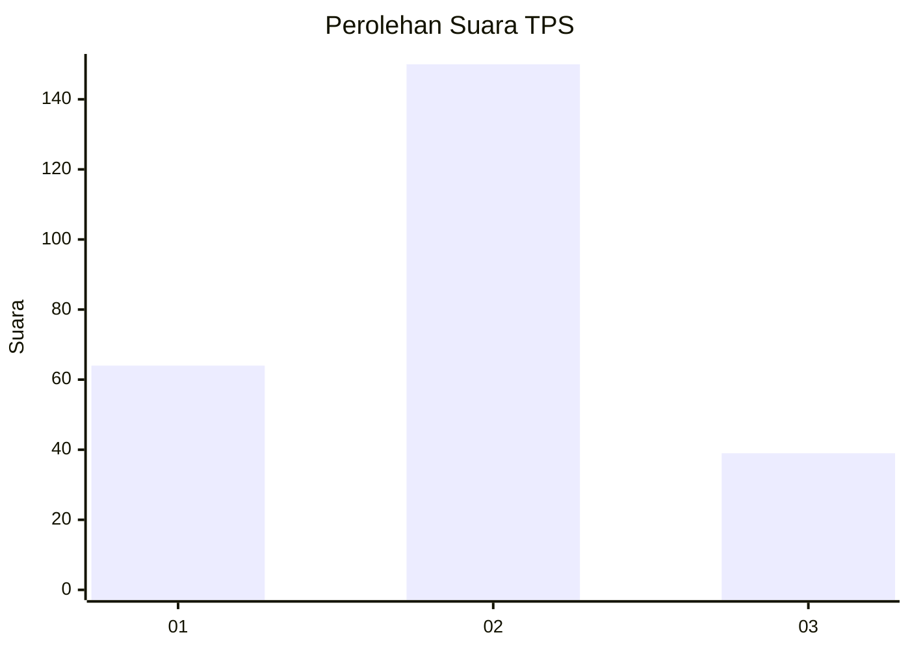

# Hasil

## Grafik

## Tabel

| No. | Nama Paslon    | Suara | Suara (raw) | Persentase |
|:--- |:-------------- | -----:| -----------:| ----------:|
| 1   | ANIES MUHAIMIN | 64    | [64][p-1]   | 25,30      |
| 2   | PRABOWO GIBRAN | 150   | [150][p-2]  | 59,29      |
| 3   | GANJAR MAHFUD  | 39    | [39][p-3]   | 15,42      |

[p-1]: https://github.com/gigit-pemilu/pemilu-2024/blob/main/pilpres/hitung-suara/sub/35-jawa-timur/sub/28-pamekasan/sub/02-pademawu/sub/2015-murtajih/sub/003-tps/sub/paslon-1.txt
[p-2]: https://github.com/gigit-pemilu/pemilu-2024/blob/main/pilpres/hitung-suara/sub/35-jawa-timur/sub/28-pamekasan/sub/02-pademawu/sub/2015-murtajih/sub/003-tps/sub/paslon-2.txt
[p-3]: https://github.com/gigit-pemilu/pemilu-2024/blob/main/pilpres/hitung-suara/sub/35-jawa-timur/sub/28-pamekasan/sub/02-pademawu/sub/2015-murtajih/sub/003-tps/sub/paslon-3.txt

## Foto C Plano

https://sirekap-obj-formc.kpu.go.id/9d99/pemilu/ppwp/35/28/02/20/15/3528022015003-20240214-184459--96911b3d-536b-4f46-9504-3028aef0023c.jpg

https://sirekap-obj-formc.kpu.go.id/9d99/pemilu/ppwp/35/28/02/20/15/3528022015003-20240214-184717--f98428d6-6479-4e1e-a95c-0f4e2ef3eac4.jpg

https://sirekap-obj-formc.kpu.go.id/9d99/pemilu/ppwp/35/28/02/20/15/3528022015003-20240214-184854--d9575e36-087b-49d7-9a29-b1f558b9568c.jpg

## Metadata

| Key        | Value               |
| ---------- | ------------------- |
| Time Stamp | 2024-02-15 20:30:46 |

