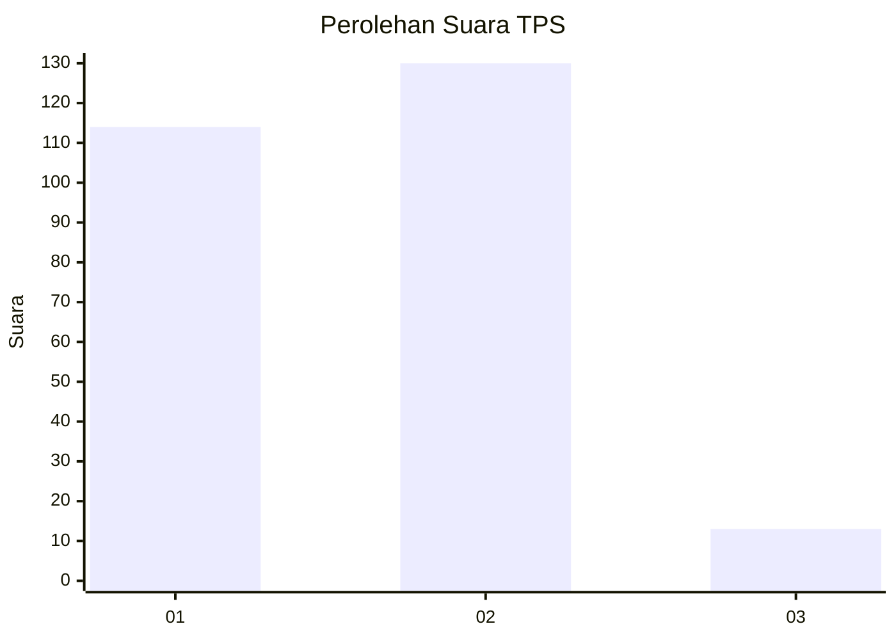
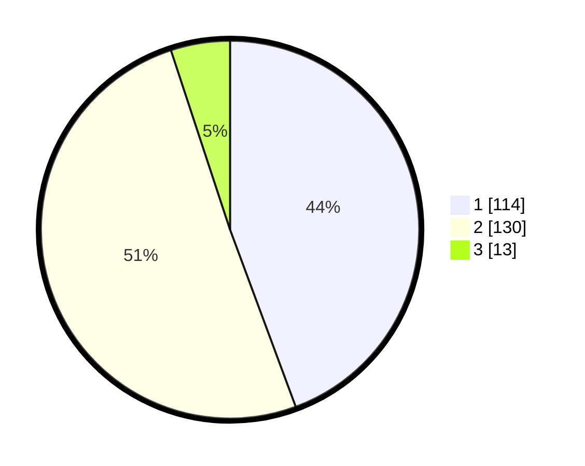

# Hasil

## Grafik

## Tabel

| No. | Nama Paslon    | Suara | Suara (raw) | Persentase |
|:--- |:-------------- | -----:| -----------:| ----------:|
| 1   | ANIES MUHAIMIN | 114   | [114][p-1]  | 44,36      |
| 2   | PRABOWO GIBRAN | 130   | [130][p-2]  | 50,58      |
| 3   | GANJAR MAHFUD  | 13    | [13][p-3]   | 5,06       |

[p-1]: https://github.com/gigit-pemilu/pemilu-2024/blob/main/pilpres/hitung-suara/sub/35-jawa-timur/sub/28-pamekasan/sub/02-pademawu/sub/2015-murtajih/sub/006-tps/sub/paslon-1.txt
[p-2]: https://github.com/gigit-pemilu/pemilu-2024/blob/main/pilpres/hitung-suara/sub/35-jawa-timur/sub/28-pamekasan/sub/02-pademawu/sub/2015-murtajih/sub/006-tps/sub/paslon-2.txt
[p-3]: https://github.com/gigit-pemilu/pemilu-2024/blob/main/pilpres/hitung-suara/sub/35-jawa-timur/sub/28-pamekasan/sub/02-pademawu/sub/2015-murtajih/sub/006-tps/sub/paslon-3.txt

## Foto C Plano

https://sirekap-obj-formc.kpu.go.id/eb5a/pemilu/ppwp/35/28/02/20/15/3528022015006-20240215-081813--8ed4a47b-9d90-4575-8ce3-3844a8971d15.jpg

https://sirekap-obj-formc.kpu.go.id/eb5a/pemilu/ppwp/35/28/02/20/15/3528022015006-20240215-081928--be564c15-2914-4dd1-97a7-a1f182bb341b.jpg

https://sirekap-obj-formc.kpu.go.id/eb5a/pemilu/ppwp/35/28/02/20/15/3528022015006-20240215-082057--826dd3f8-880f-458b-aac3-6a00e331c112.jpg

## Metadata

| Key        | Value               |
| ---------- | ------------------- |
| Time Stamp | 2024-02-15 20:30:46 |

