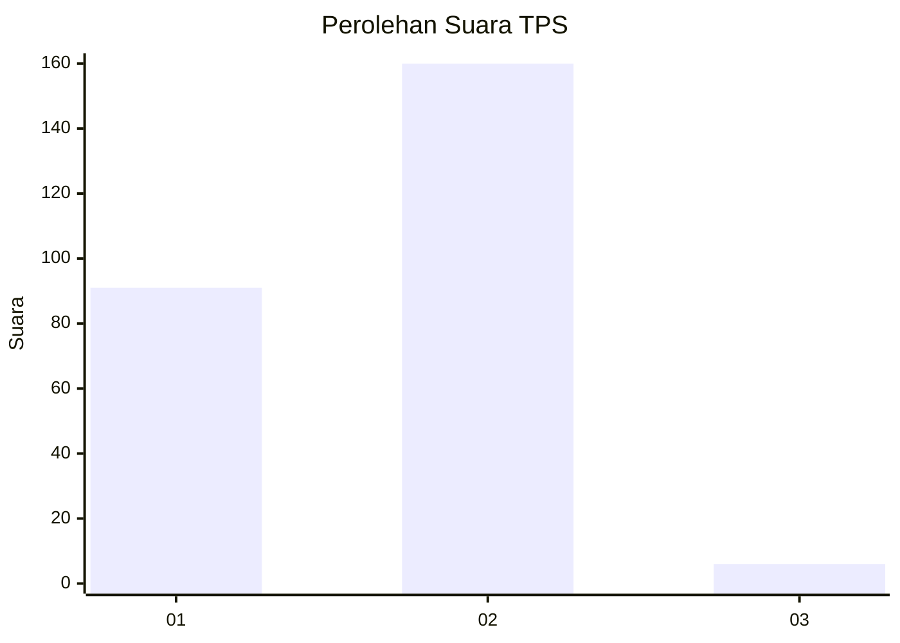
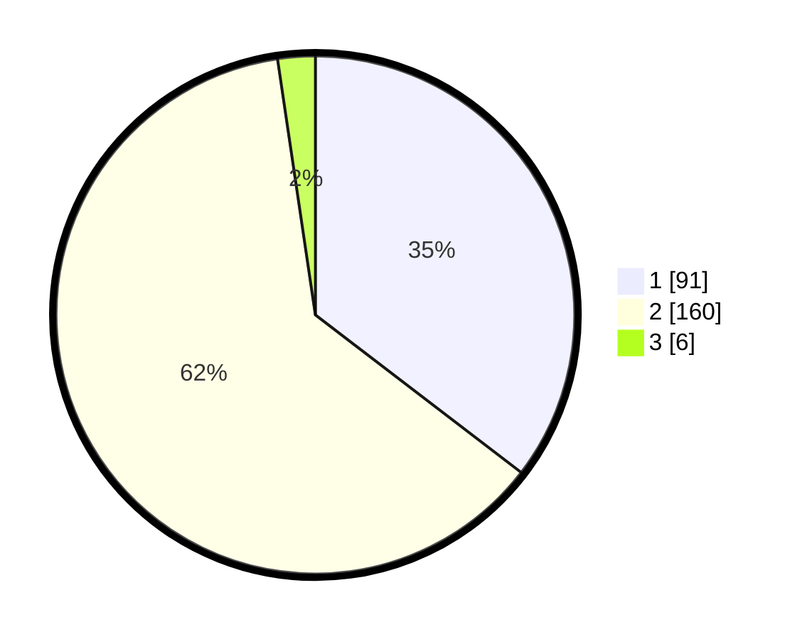

# Hasil

## Grafik

## Tabel

| No. | Nama Paslon    | Suara | Suara (raw) | Persentase |
|:--- |:-------------- | -----:| -----------:| ----------:|
| 1   | ANIES MUHAIMIN | 91    | [91][p-1]   | 35,41      |
| 2   | PRABOWO GIBRAN | 160   | [160][p-2]  | 62,26      |
| 3   | GANJAR MAHFUD  | 6     | [6][p-3]    | 2,33       |

[p-1]: https://github.com/gigit-pemilu/pemilu-2024/blob/main/pilpres/hitung-suara/sub/35-jawa-timur/sub/28-pamekasan/sub/02-pademawu/sub/2015-murtajih/sub/008-tps/sub/paslon-1.txt
[p-2]: https://github.com/gigit-pemilu/pemilu-2024/blob/main/pilpres/hitung-suara/sub/35-jawa-timur/sub/28-pamekasan/sub/02-pademawu/sub/2015-murtajih/sub/008-tps/sub/paslon-2.txt
[p-3]: https://github.com/gigit-pemilu/pemilu-2024/blob/main/pilpres/hitung-suara/sub/35-jawa-timur/sub/28-pamekasan/sub/02-pademawu/sub/2015-murtajih/sub/008-tps/sub/paslon-3.txt

## Foto C Plano

https://sirekap-obj-formc.kpu.go.id/1354/pemilu/ppwp/35/28/02/20/15/3528022015008-20240217-132702--358a1be3-25b1-4d9e-89f9-7b9264301101.jpg

https://sirekap-obj-formc.kpu.go.id/1354/pemilu/ppwp/35/28/02/20/15/3528022015008-20240214-231629--a7f2aded-4d99-436b-9bed-8742ef0bedc5.jpg

https://sirekap-obj-formc.kpu.go.id/1354/pemilu/ppwp/35/28/02/20/15/3528022015008-20240214-231749--f8811aa5-934e-48e2-8c87-2afd9b6be462.jpg

## Metadata

| Key        | Value               |
| ---------- | ------------------- |
| Time Stamp | 2024-02-17 13:37:34 |

