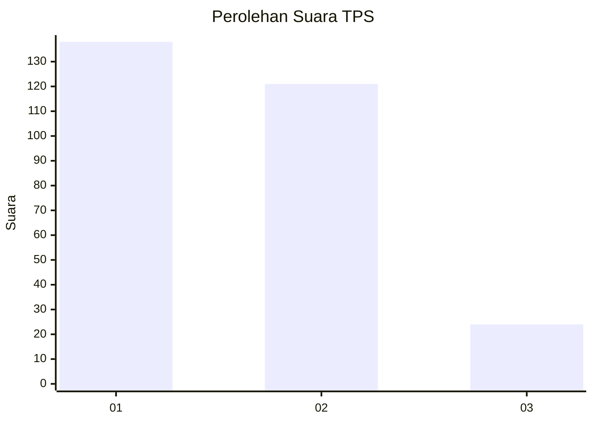
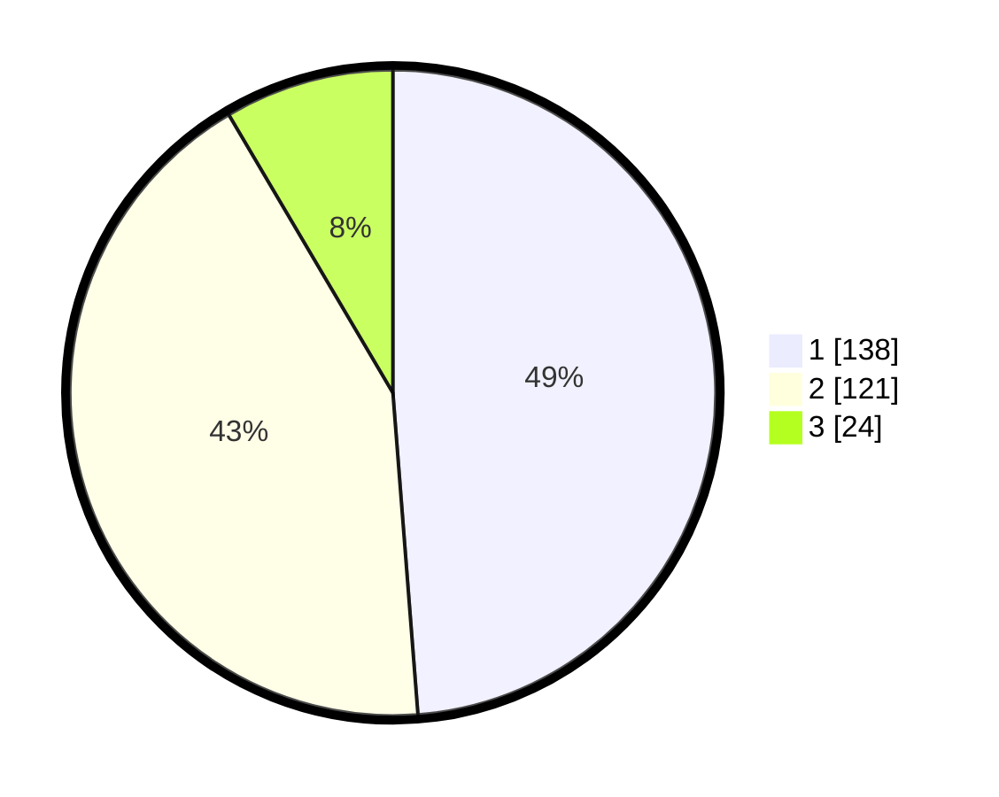

# Hasil

## Grafik

## Tabel

| No. | Nama Paslon    | Suara | Suara (raw) | Persentase |
|:--- |:-------------- | -----:| -----------:| ----------:|
| 1   | ANIES MUHAIMIN | 138   | [138][p-1]  | 48,76      |
| 2   | PRABOWO GIBRAN | 121   | [121][p-2]  | 42,76      |
| 3   | GANJAR MAHFUD  | 24    | [24][p-3]   | 8,48       |

[p-1]: https://github.com/gigit-pemilu/pemilu-2024-35-jawa-timur/blob/main/pilpres/hitung-suara/sub/35-jawa-timur/sub/28-pamekasan/sub/02-pademawu/sub/2015-murtajih/sub/012-tps/sub/paslon-1.txt
[p-2]: https://github.com/gigit-pemilu/pemilu-2024-35-jawa-timur/blob/main/pilpres/hitung-suara/sub/35-jawa-timur/sub/28-pamekasan/sub/02-pademawu/sub/2015-murtajih/sub/012-tps/sub/paslon-2.txt
[p-3]: https://github.com/gigit-pemilu/pemilu-2024-35-jawa-timur/blob/main/pilpres/hitung-suara/sub/35-jawa-timur/sub/28-pamekasan/sub/02-pademawu/sub/2015-murtajih/sub/012-tps/sub/paslon-3.txt

## Foto C Plano

https://sirekap-obj-formc.kpu.go.id/8eed/pemilu/ppwp/35/28/02/20/15/3528022015012-20240214-234433--e7a06ac7-efab-4026-8f3d-adf6ce6fc218.jpg

https://sirekap-obj-formc.kpu.go.id/8eed/pemilu/ppwp/35/28/02/20/15/3528022015012-20240214-234531--d3c97a62-5446-4e06-bb82-58e241b85dc2.jpg

https://sirekap-obj-formc.kpu.go.id/8eed/pemilu/ppwp/35/28/02/20/15/3528022015012-20240214-234734--889fc25d-8315-459a-9d27-a14c259b3580.jpg

## Metadata

| Key        | Value               |
| ---------- | ------------------- |
| Time Stamp | 2024-02-15 21:01:18 |

