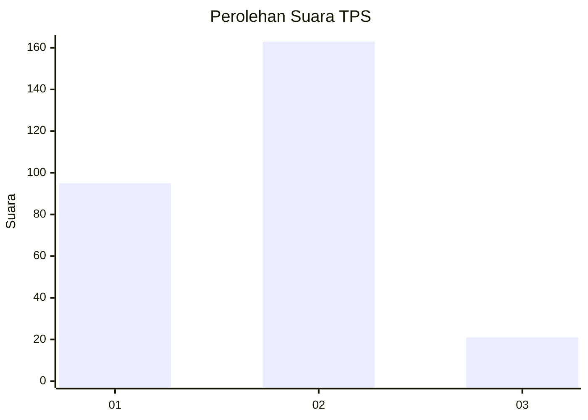
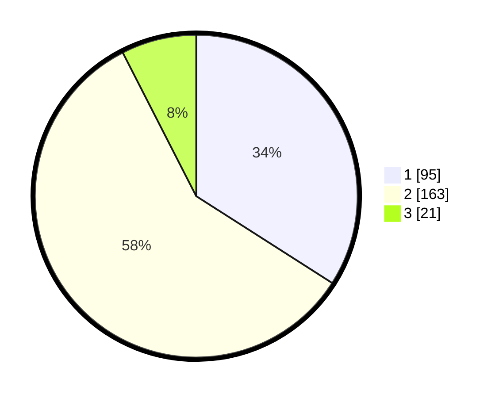

# Hasil

## Grafik

## Tabel

| No. | Nama Paslon    | Suara | Suara (raw) | Persentase |
|:--- |:-------------- | -----:| -----------:| ----------:|
| 1   | ANIES MUHAIMIN | 95    | [95][p-1]   | 34,05      |
| 2   | PRABOWO GIBRAN | 163   | [163][p-2]  | 58,42      |
| 3   | GANJAR MAHFUD  | 21    | [21][p-3]   | 7,53       |

[p-1]: https://github.com/gigit-pemilu/pemilu-2024/blob/main/pilpres/hitung-suara/sub/35-jawa-timur/sub/28-pamekasan/sub/02-pademawu/sub/2015-murtajih/sub/013-tps/sub/paslon-1.txt
[p-2]: https://github.com/gigit-pemilu/pemilu-2024/blob/main/pilpres/hitung-suara/sub/35-jawa-timur/sub/28-pamekasan/sub/02-pademawu/sub/2015-murtajih/sub/013-tps/sub/paslon-2.txt
[p-3]: https://github.com/gigit-pemilu/pemilu-2024/blob/main/pilpres/hitung-suara/sub/35-jawa-timur/sub/28-pamekasan/sub/02-pademawu/sub/2015-murtajih/sub/013-tps/sub/paslon-3.txt

## Foto C Plano

https://sirekap-obj-formc.kpu.go.id/9a41/pemilu/ppwp/35/28/02/20/15/3528022015013-20240214-234830--5485ca43-9304-4214-9ca6-0901f8148948.jpg

https://sirekap-obj-formc.kpu.go.id/9a41/pemilu/ppwp/35/28/02/20/15/3528022015013-20240214-234934--fac5470f-ef7f-4466-a20c-a372d563805e.jpg

https://sirekap-obj-formc.kpu.go.id/9a41/pemilu/ppwp/35/28/02/20/15/3528022015013-20240214-235021--660d2158-5a35-4b29-ad0a-500322db292c.jpg

## Metadata

| Key        | Value               |
| ---------- | ------------------- |
| Time Stamp | 2024-02-15 20:30:46 |

