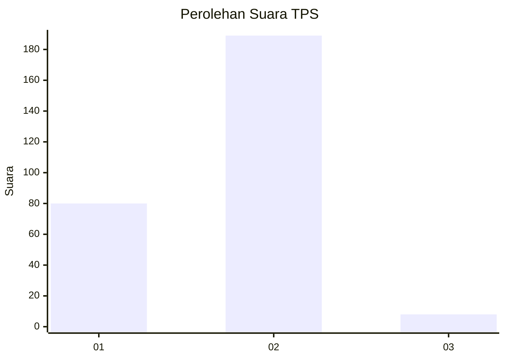
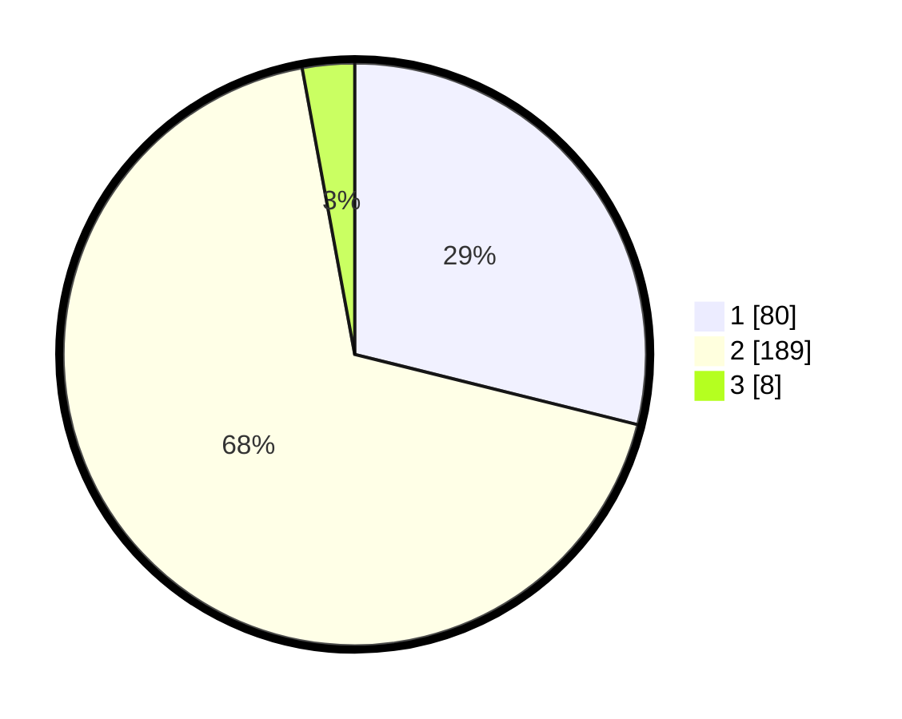

# Hasil

## Grafik

## Tabel

| No. | Nama Paslon    | Suara | Suara (raw) | Persentase |
|:--- |:-------------- | -----:| -----------:| ----------:|
| 1   | ANIES MUHAIMIN | 80    | [80][p-1]   | 28,88      |
| 2   | PRABOWO GIBRAN | 189   | [189][p-2]  | 68,23      |
| 3   | GANJAR MAHFUD  | 8     | [8][p-3]    | 2,89       |

[p-1]: https://github.com/gigit-pemilu/pemilu-2024/blob/main/pilpres/hitung-suara/sub/35-jawa-timur/sub/28-pamekasan/sub/02-pademawu/sub/2015-murtajih/sub/017-tps/sub/paslon-1.txt
[p-2]: https://github.com/gigit-pemilu/pemilu-2024/blob/main/pilpres/hitung-suara/sub/35-jawa-timur/sub/28-pamekasan/sub/02-pademawu/sub/2015-murtajih/sub/017-tps/sub/paslon-2.txt
[p-3]: https://github.com/gigit-pemilu/pemilu-2024/blob/main/pilpres/hitung-suara/sub/35-jawa-timur/sub/28-pamekasan/sub/02-pademawu/sub/2015-murtajih/sub/017-tps/sub/paslon-3.txt

## Foto C Plano

https://sirekap-obj-formc.kpu.go.id/6415/pemilu/ppwp/35/28/02/20/15/3528022015017-20240215-004021--03bb9ed8-a14d-41f0-aa5f-f35ece6cbd7f.jpg

https://sirekap-obj-formc.kpu.go.id/6415/pemilu/ppwp/35/28/02/20/15/3528022015017-20240215-004300--1f62f7be-e040-4ed1-a231-e43a5ca6ceee.jpg

https://sirekap-obj-formc.kpu.go.id/6415/pemilu/ppwp/35/28/02/20/15/3528022015017-20240215-004455--18b273b7-b190-4140-ae0e-675eec79f983.jpg

## Metadata

| Key        | Value               |
| ---------- | ------------------- |
| Time Stamp | 2024-02-24 22:31:28 |

