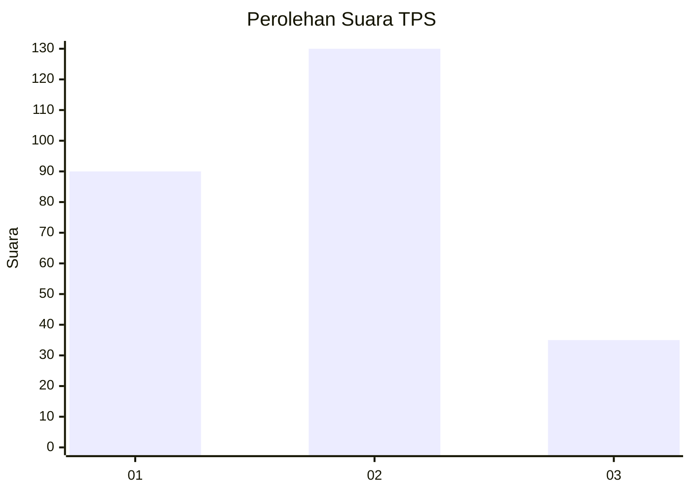
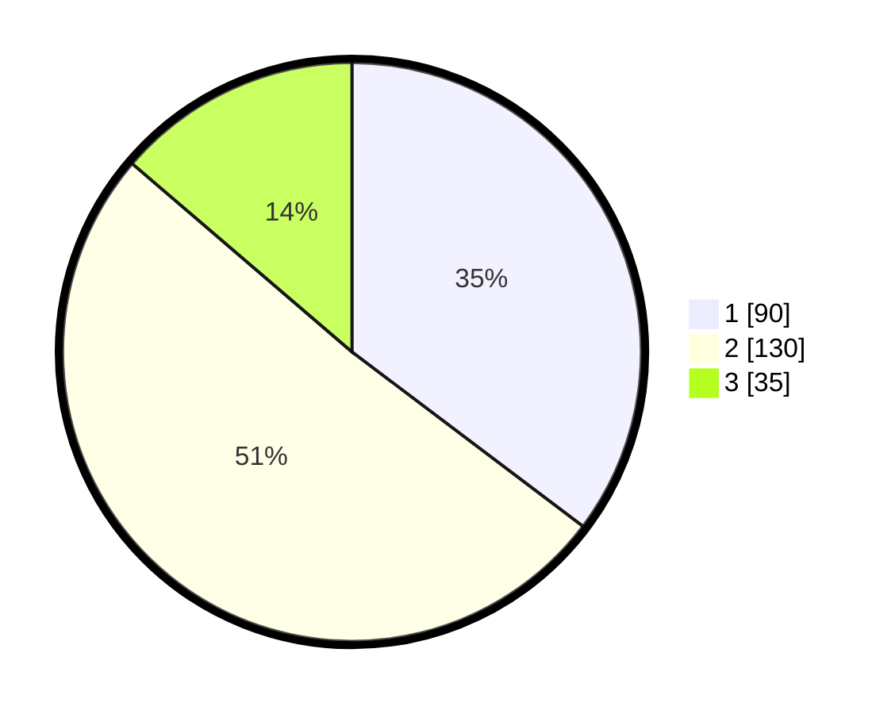

# Hasil

## Grafik

## Tabel

| No. | Nama Paslon    | Suara | Suara (raw) | Persentase |
|:--- |:-------------- | -----:| -----------:| ----------:|
| 1   | ANIES MUHAIMIN | 90    | [90][p-1]   | 35,29      |
| 2   | PRABOWO GIBRAN | 130   | [130][p-2]  | 50,98      |
| 3   | GANJAR MAHFUD  | 35    | [35][p-3]   | 13,73      |

[p-1]: https://github.com/gigit-pemilu/pemilu-2024-35-jawa-timur/blob/main/pilpres/hitung-suara/sub/35-jawa-timur/sub/28-pamekasan/sub/02-pademawu/sub/2016-sumedangan/sub/003-tps/sub/paslon-1.txt
[p-2]: https://github.com/gigit-pemilu/pemilu-2024-35-jawa-timur/blob/main/pilpres/hitung-suara/sub/35-jawa-timur/sub/28-pamekasan/sub/02-pademawu/sub/2016-sumedangan/sub/003-tps/sub/paslon-2.txt
[p-3]: https://github.com/gigit-pemilu/pemilu-2024-35-jawa-timur/blob/main/pilpres/hitung-suara/sub/35-jawa-timur/sub/28-pamekasan/sub/02-pademawu/sub/2016-sumedangan/sub/003-tps/sub/paslon-3.txt

## Foto C Plano

https://sirekap-obj-formc.kpu.go.id/4f7e/pemilu/ppwp/35/28/02/20/16/3528022016003-20240215-215618--5559c8f7-a207-43e7-999c-7030d2bb9de9.jpg

https://sirekap-obj-formc.kpu.go.id/4f7e/pemilu/ppwp/35/28/02/20/16/3528022016003-20240215-215622--4903453f-33eb-4782-b473-498b2860ea25.jpg

https://sirekap-obj-formc.kpu.go.id/4f7e/pemilu/ppwp/35/28/02/20/16/3528022016003-20240215-215625--0fb54828-5c65-4539-82fc-7dcfad708923.jpg

## Metadata

| Key        | Value               |
| ---------- | ------------------- |
| Time Stamp | 2024-02-19 06:16:00 |

