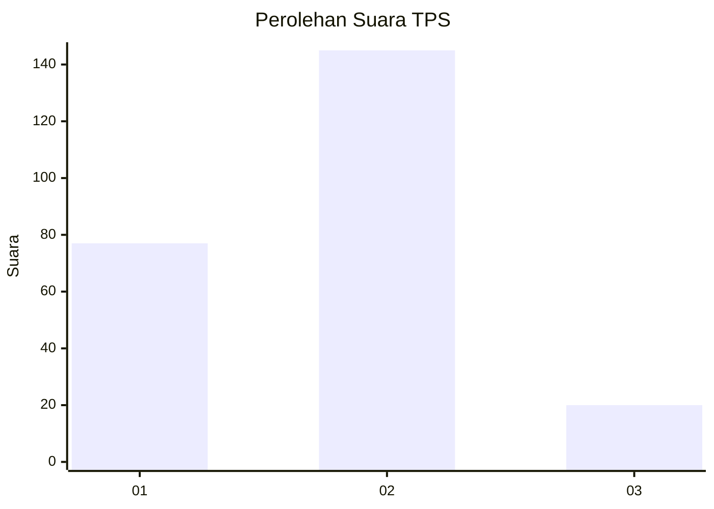
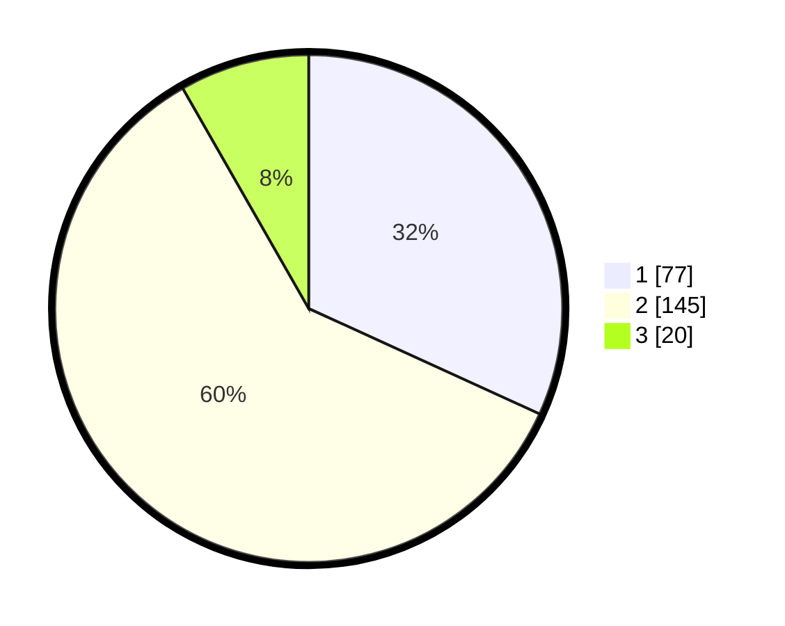

# Hasil

## Grafik

## Tabel

| No. | Nama Paslon    | Suara | Suara (raw) | Persentase |
|:--- |:-------------- | -----:| -----------:| ----------:|
| 1   | ANIES MUHAIMIN | 77    | [77][p-1]   | 31,82      |
| 2   | PRABOWO GIBRAN | 145   | [145][p-2]  | 59,92      |
| 3   | GANJAR MAHFUD  | 20    | [20][p-3]   | 8,26       |

[p-1]: https://github.com/gigit-pemilu/pemilu-2024/blob/main/pilpres/hitung-suara/sub/35-jawa-timur/sub/28-pamekasan/sub/02-pademawu/sub/2017-lemper/sub/001-tps/sub/paslon-1.txt
[p-2]: https://github.com/gigit-pemilu/pemilu-2024/blob/main/pilpres/hitung-suara/sub/35-jawa-timur/sub/28-pamekasan/sub/02-pademawu/sub/2017-lemper/sub/001-tps/sub/paslon-2.txt
[p-3]: https://github.com/gigit-pemilu/pemilu-2024/blob/main/pilpres/hitung-suara/sub/35-jawa-timur/sub/28-pamekasan/sub/02-pademawu/sub/2017-lemper/sub/001-tps/sub/paslon-3.txt

## Foto C Plano

https://sirekap-obj-formc.kpu.go.id/d304/pemilu/ppwp/35/28/02/20/17/3528022017001-20240215-082204--e14c64ba-da45-4f9d-9c72-126561775293.jpg

https://sirekap-obj-formc.kpu.go.id/d304/pemilu/ppwp/35/28/02/20/17/3528022017001-20240215-082233--735ae198-a0a6-480c-98e7-cc0fc47940a3.jpg

https://sirekap-obj-formc.kpu.go.id/d304/pemilu/ppwp/35/28/02/20/17/3528022017001-20240215-082303--48ec9c5f-30bf-4184-9176-99b4da509fe2.jpg

## Metadata

| Key        | Value               |
| ---------- | ------------------- |
| Time Stamp | 2024-02-25 21:00:00 |

