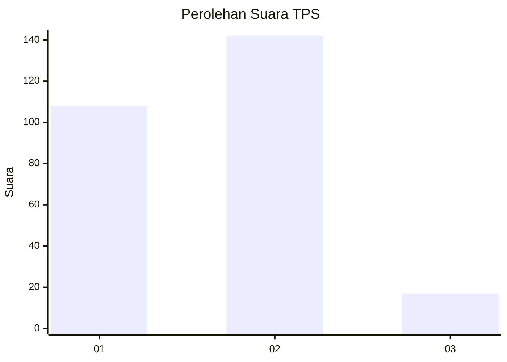

# Hasil

## Grafik

## Tabel

| No. | Nama Paslon    | Suara | Suara (raw) | Persentase |
|:--- |:-------------- | -----:| -----------:| ----------:|
| 1   | ANIES MUHAIMIN | 108   | [108][p-1]  | 40,45      |
| 2   | PRABOWO GIBRAN | 142   | [142][p-2]  | 53,18      |
| 3   | GANJAR MAHFUD  | 17    | [17][p-3]   | 6,37       |

[p-1]: https://github.com/gigit-pemilu/pemilu-2024/blob/main/pilpres/hitung-suara/sub/35-jawa-timur/sub/28-pamekasan/sub/02-pademawu/sub/2020-sentol/sub/003-tps/sub/paslon-1.txt
[p-2]: https://github.com/gigit-pemilu/pemilu-2024/blob/main/pilpres/hitung-suara/sub/35-jawa-timur/sub/28-pamekasan/sub/02-pademawu/sub/2020-sentol/sub/003-tps/sub/paslon-2.txt
[p-3]: https://github.com/gigit-pemilu/pemilu-2024/blob/main/pilpres/hitung-suara/sub/35-jawa-timur/sub/28-pamekasan/sub/02-pademawu/sub/2020-sentol/sub/003-tps/sub/paslon-3.txt

## Foto C Plano

https://sirekap-obj-formc.kpu.go.id/223c/pemilu/ppwp/35/28/02/20/20/3528022020003-20240215-002418--9aea8b18-25bf-44b0-a83b-1e764d9783d6.jpg

https://sirekap-obj-formc.kpu.go.id/223c/pemilu/ppwp/35/28/02/20/20/3528022020003-20240215-002652--56e001ad-af60-42ea-985a-855d2bfc072d.jpg

https://sirekap-obj-formc.kpu.go.id/223c/pemilu/ppwp/35/28/02/20/20/3528022020003-20240215-002917--6d38c8f2-9163-4def-9946-8fe0a930f6de.jpg

## Metadata

| Key        | Value               |
| ---------- | ------------------- |
| Time Stamp | 2024-02-15 19:00:26 |

