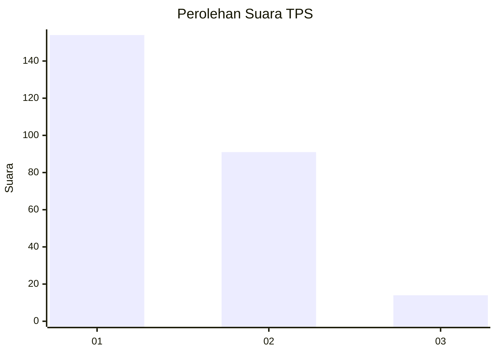
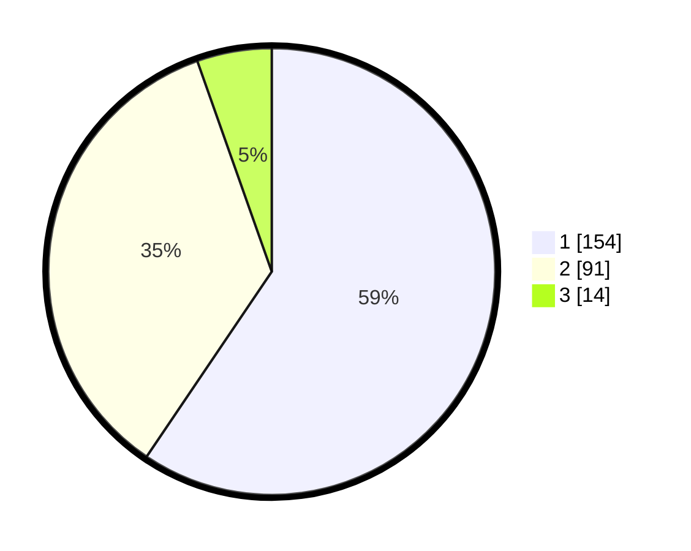

# Hasil

## Grafik

## Tabel

| No. | Nama Paslon    | Suara | Suara (raw) | Persentase |
|:--- |:-------------- | -----:| -----------:| ----------:|
| 1   | ANIES MUHAIMIN | 154   | [154][p-1]  | 59,46      |
| 2   | PRABOWO GIBRAN | 91    | [91][p-2]   | 35,14      |
| 3   | GANJAR MAHFUD  | 14    | [14][p-3]   | 5,41       |

[p-1]: https://github.com/gigit-pemilu/pemilu-2024/blob/main/pilpres/hitung-suara/sub/35-jawa-timur/sub/28-pamekasan/sub/02-pademawu/sub/2020-sentol/sub/005-tps/sub/paslon-1.txt
[p-2]: https://github.com/gigit-pemilu/pemilu-2024/blob/main/pilpres/hitung-suara/sub/35-jawa-timur/sub/28-pamekasan/sub/02-pademawu/sub/2020-sentol/sub/005-tps/sub/paslon-2.txt
[p-3]: https://github.com/gigit-pemilu/pemilu-2024/blob/main/pilpres/hitung-suara/sub/35-jawa-timur/sub/28-pamekasan/sub/02-pademawu/sub/2020-sentol/sub/005-tps/sub/paslon-3.txt

## Foto C Plano

https://sirekap-obj-formc.kpu.go.id/516f/pemilu/ppwp/35/28/02/20/20/3528022020005-20240215-074027--11d68836-3769-4fec-90fb-eed86229fec8.jpg

https://sirekap-obj-formc.kpu.go.id/516f/pemilu/ppwp/35/28/02/20/20/3528022020005-20240215-074202--2c7822b4-35bd-4cd6-99b0-9aa6fea9f71d.jpg

https://sirekap-obj-formc.kpu.go.id/516f/pemilu/ppwp/35/28/02/20/20/3528022020005-20240215-074331--a6d850e9-a6c4-4c1b-80c3-91867c630f3a.jpg

## Metadata

| Key        | Value               |
| ---------- | ------------------- |
| Time Stamp | 2024-02-15 20:30:46 |

