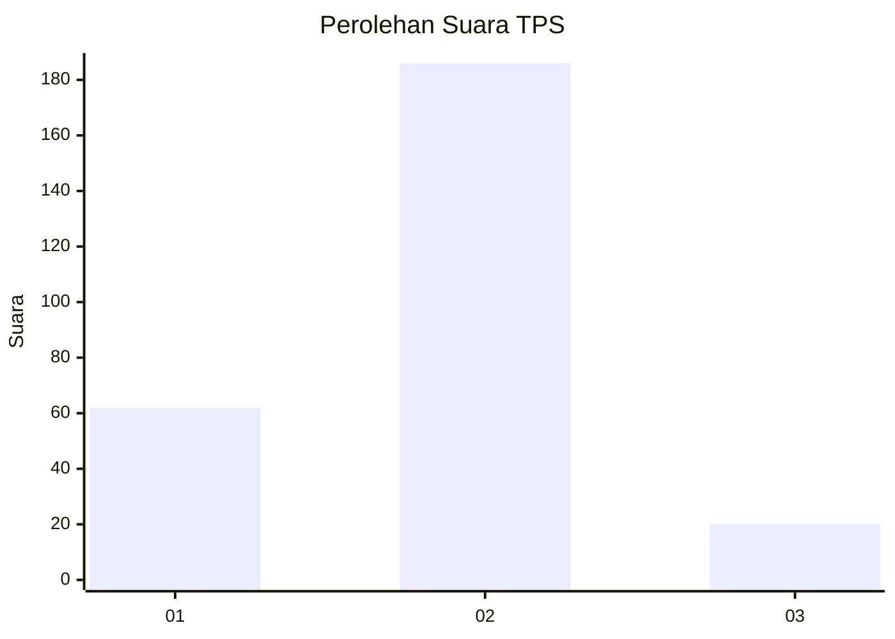
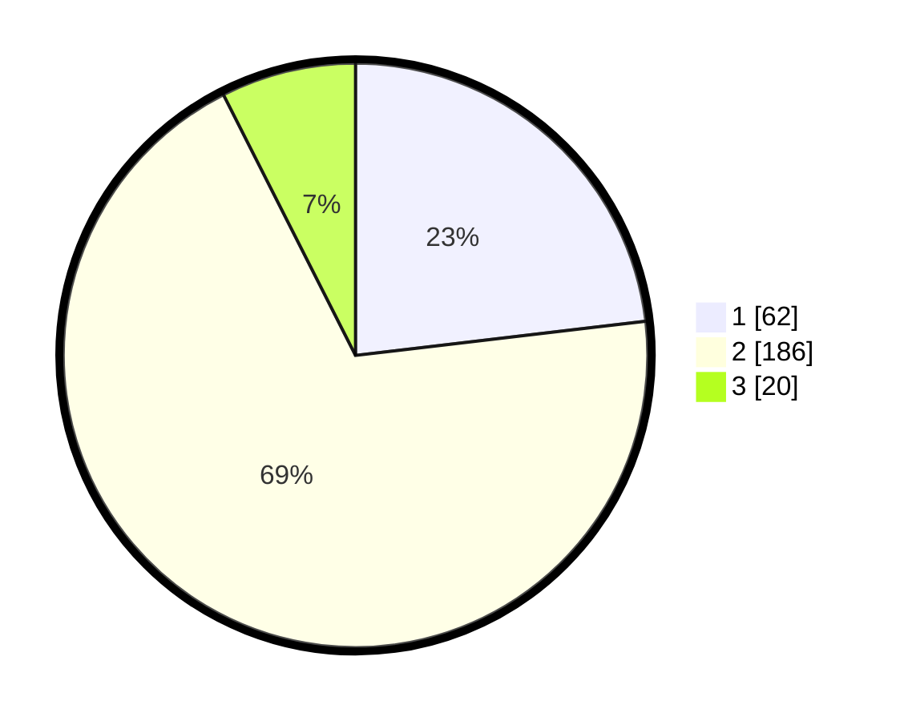

# Hasil

## Grafik

## Tabel

| No. | Nama Paslon    | Suara | Suara (raw) | Persentase |
|:--- |:-------------- | -----:| -----------:| ----------:|
| 1   | ANIES MUHAIMIN | 62    | [62][p-1]   | 23,13      |
| 2   | PRABOWO GIBRAN | 186   | [186][p-2]  | 69,40      |
| 3   | GANJAR MAHFUD  | 20    | [20][p-3]   | 7,46       |

[p-1]: https://github.com/gigit-pemilu/pemilu-2024-35-jawa-timur/blob/main/pilpres/hitung-suara/sub/35-jawa-timur/sub/28-pamekasan/sub/02-pademawu/sub/2021-tambung/sub/001-tps/sub/paslon-1.txt
[p-2]: https://github.com/gigit-pemilu/pemilu-2024-35-jawa-timur/blob/main/pilpres/hitung-suara/sub/35-jawa-timur/sub/28-pamekasan/sub/02-pademawu/sub/2021-tambung/sub/001-tps/sub/paslon-2.txt
[p-3]: https://github.com/gigit-pemilu/pemilu-2024-35-jawa-timur/blob/main/pilpres/hitung-suara/sub/35-jawa-timur/sub/28-pamekasan/sub/02-pademawu/sub/2021-tambung/sub/001-tps/sub/paslon-3.txt

## Foto C Plano

https://sirekap-obj-formc.kpu.go.id/605d/pemilu/ppwp/35/28/02/20/21/3528022021001-20240215-011612--201a28b9-423d-4f08-aeb8-4bb294c7197a.jpg

https://sirekap-obj-formc.kpu.go.id/605d/pemilu/ppwp/35/28/02/20/21/3528022021001-20240215-011915--0f083ad0-ff72-401f-9808-955906d83a99.jpg

https://sirekap-obj-formc.kpu.go.id/605d/pemilu/ppwp/35/28/02/20/21/3528022021001-20240215-012132--ba3899aa-6273-46a6-a69f-515aef32195c.jpg

## Metadata

| Key        | Value               |
| ---------- | ------------------- |
| Time Stamp | 2024-02-15 19:00:26 |

