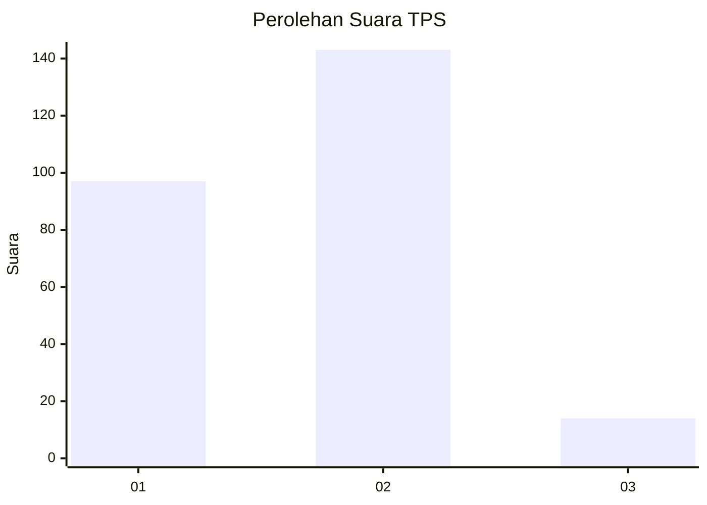
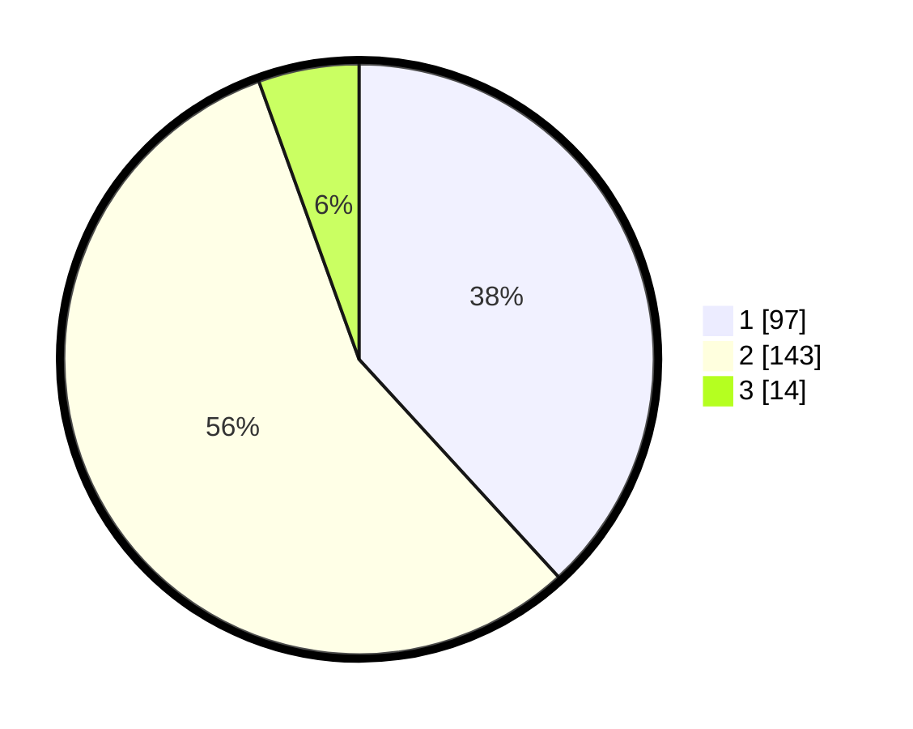

# Hasil

## Grafik

## Tabel

| No. | Nama Paslon    | Suara | Suara (raw) | Persentase |
|:--- |:-------------- | -----:| -----------:| ----------:|
| 1   | ANIES MUHAIMIN | 97    | [97][p-1]   | 38,19      |
| 2   | PRABOWO GIBRAN | 143   | [143][p-2]  | 56,30      |
| 3   | GANJAR MAHFUD  | 14    | [14][p-3]   | 5,51       |

[p-1]: https://github.com/gigit-pemilu/pemilu-2024/blob/main/pilpres/hitung-suara/sub/35-jawa-timur/sub/28-pamekasan/sub/02-pademawu/sub/2021-tambung/sub/004-tps/sub/paslon-1.txt
[p-2]: https://github.com/gigit-pemilu/pemilu-2024/blob/main/pilpres/hitung-suara/sub/35-jawa-timur/sub/28-pamekasan/sub/02-pademawu/sub/2021-tambung/sub/004-tps/sub/paslon-2.txt
[p-3]: https://github.com/gigit-pemilu/pemilu-2024/blob/main/pilpres/hitung-suara/sub/35-jawa-timur/sub/28-pamekasan/sub/02-pademawu/sub/2021-tambung/sub/004-tps/sub/paslon-3.txt

## Foto C Plano

https://sirekap-obj-formc.kpu.go.id/b6ae/pemilu/ppwp/35/28/02/20/21/3528022021004-20240215-071620--add88697-f860-405c-a6c9-7321ed265718.jpg

https://sirekap-obj-formc.kpu.go.id/b6ae/pemilu/ppwp/35/28/02/20/21/3528022021004-20240215-005346--64b8996e-5d59-454e-9208-b5f4e3280a27.jpg

https://sirekap-obj-formc.kpu.go.id/b6ae/pemilu/ppwp/35/28/02/20/21/3528022021004-20240215-071851--78bd214b-b11d-4dc5-9832-bdb1c43aa262.jpg

## Metadata

| Key        | Value               |
| ---------- | ------------------- |
| Time Stamp | 2024-02-15 19:00:26 |

