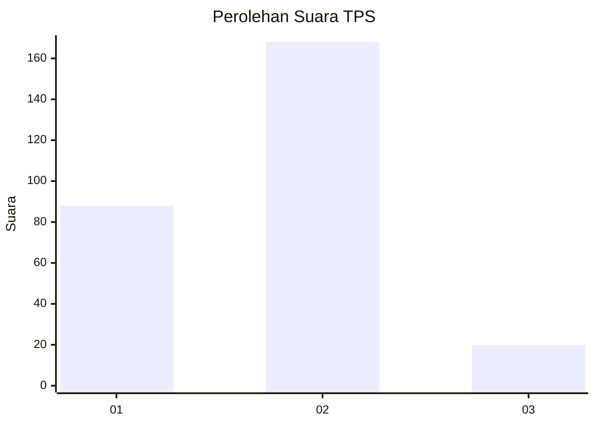
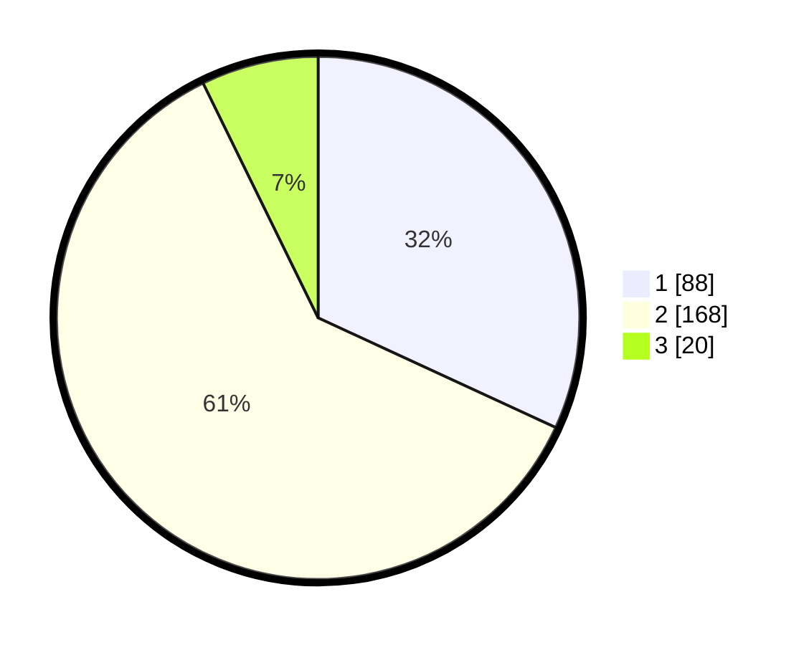

# Hasil

## Grafik

## Tabel

| No. | Nama Paslon    | Suara | Suara (raw) | Persentase |
|:--- |:-------------- | -----:| -----------:| ----------:|
| 1   | ANIES MUHAIMIN | 88    | [88][p-1]   | 31,88      |
| 2   | PRABOWO GIBRAN | 168   | [168][p-2]  | 60,87      |
| 3   | GANJAR MAHFUD  | 20    | [20][p-3]   | 7,25       |

[p-1]: https://github.com/gigit-pemilu/pemilu-2024-35-jawa-timur/blob/main/pilpres/hitung-suara/sub/35-jawa-timur/sub/28-pamekasan/sub/02-pademawu/sub/2021-tambung/sub/006-tps/sub/paslon-1.txt
[p-2]: https://github.com/gigit-pemilu/pemilu-2024-35-jawa-timur/blob/main/pilpres/hitung-suara/sub/35-jawa-timur/sub/28-pamekasan/sub/02-pademawu/sub/2021-tambung/sub/006-tps/sub/paslon-2.txt
[p-3]: https://github.com/gigit-pemilu/pemilu-2024-35-jawa-timur/blob/main/pilpres/hitung-suara/sub/35-jawa-timur/sub/28-pamekasan/sub/02-pademawu/sub/2021-tambung/sub/006-tps/sub/paslon-3.txt

## Foto C Plano

https://sirekap-obj-formc.kpu.go.id/d03d/pemilu/ppwp/35/28/02/20/21/3528022021006-20240215-083050--07a025d7-07f4-4b7d-9f82-39cff89555ff.jpg

https://sirekap-obj-formc.kpu.go.id/d03d/pemilu/ppwp/35/28/02/20/21/3528022021006-20240215-083130--bff28f51-914a-43f7-9785-aec6a7ee22b2.jpg

https://sirekap-obj-formc.kpu.go.id/d03d/pemilu/ppwp/35/28/02/20/21/3528022021006-20240215-083238--d81e17e0-03a2-41d5-83bd-747989eb1acc.jpg

## Metadata

| Key        | Value               |
| ---------- | ------------------- |
| Time Stamp | 2024-02-15 21:01:18 |

