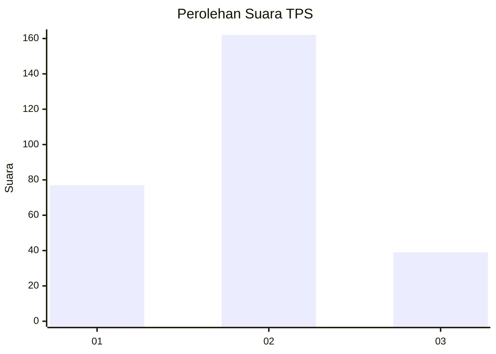
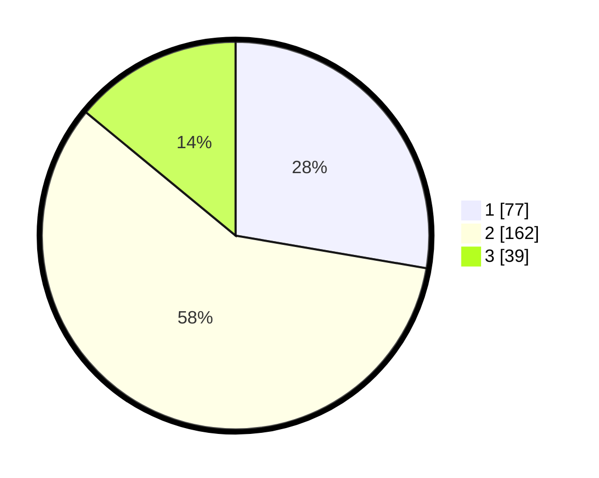

# Hasil

## Grafik

## Tabel

| No. | Nama Paslon    | Suara | Suara (raw) | Persentase |
|:--- |:-------------- | -----:| -----------:| ----------:|
| 1   | ANIES MUHAIMIN | 77    | [77][p-1]   | 27,70      |
| 2   | PRABOWO GIBRAN | 162   | [162][p-2]  | 58,27      |
| 3   | GANJAR MAHFUD  | 39    | [39][p-3]   | 14,03      |

[p-1]: https://github.com/gigit-pemilu/pemilu-2024-35-jawa-timur/blob/main/pilpres/hitung-suara/sub/35-jawa-timur/sub/28-pamekasan/sub/02-pademawu/sub/2022-buddagan/sub/003-tps/sub/paslon-1.txt
[p-2]: https://github.com/gigit-pemilu/pemilu-2024-35-jawa-timur/blob/main/pilpres/hitung-suara/sub/35-jawa-timur/sub/28-pamekasan/sub/02-pademawu/sub/2022-buddagan/sub/003-tps/sub/paslon-2.txt
[p-3]: https://github.com/gigit-pemilu/pemilu-2024-35-jawa-timur/blob/main/pilpres/hitung-suara/sub/35-jawa-timur/sub/28-pamekasan/sub/02-pademawu/sub/2022-buddagan/sub/003-tps/sub/paslon-3.txt

## Foto C Plano

https://sirekap-obj-formc.kpu.go.id/3c1e/pemilu/ppwp/35/28/02/20/22/3528022022003-20240215-094134--54b13ffc-aa85-4764-85a8-c71974fbe897.jpg

https://sirekap-obj-formc.kpu.go.id/3c1e/pemilu/ppwp/35/28/02/20/22/3528022022003-20240215-094328--402e2d1b-1f43-4881-bc40-dd8e75f5002c.jpg

https://sirekap-obj-formc.kpu.go.id/3c1e/pemilu/ppwp/35/28/02/20/22/3528022022003-20240215-094508--caf5df9e-3aa0-4fcf-9e95-a7d58a1d2ae5.jpg

## Metadata

| Key        | Value               |
| ---------- | ------------------- |
| Time Stamp | 2024-02-15 21:01:18 |

