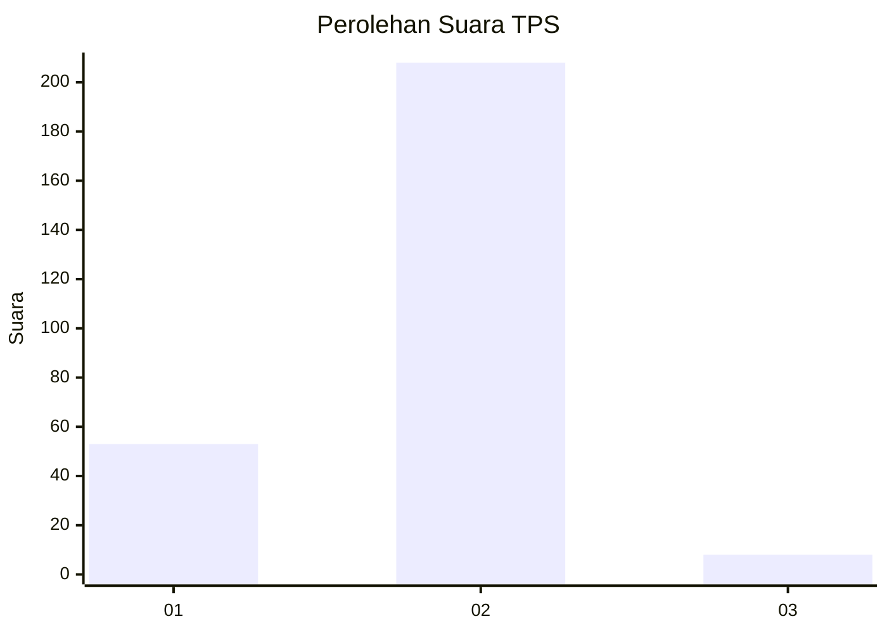
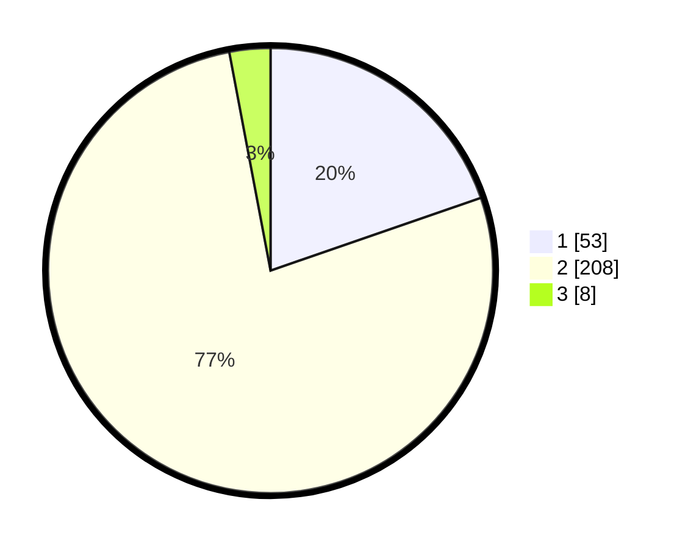

# Hasil

## Grafik

## Tabel

| No. | Nama Paslon    | Suara | Suara (raw) | Persentase |
|:--- |:-------------- | -----:| -----------:| ----------:|
| 1   | ANIES MUHAIMIN | 53    | [53][p-1]   | 19,70      |
| 2   | PRABOWO GIBRAN | 208   | [208][p-2]  | 77,32      |
| 3   | GANJAR MAHFUD  | 8     | [8][p-3]    | 2,97       |

[p-1]: https://github.com/gigit-pemilu/pemilu-2024/blob/main/pilpres/hitung-suara/sub/35-jawa-timur/sub/28-pamekasan/sub/02-pademawu/sub/2022-buddagan/sub/005-tps/sub/paslon-1.txt
[p-2]: https://github.com/gigit-pemilu/pemilu-2024/blob/main/pilpres/hitung-suara/sub/35-jawa-timur/sub/28-pamekasan/sub/02-pademawu/sub/2022-buddagan/sub/005-tps/sub/paslon-2.txt
[p-3]: https://github.com/gigit-pemilu/pemilu-2024/blob/main/pilpres/hitung-suara/sub/35-jawa-timur/sub/28-pamekasan/sub/02-pademawu/sub/2022-buddagan/sub/005-tps/sub/paslon-3.txt

## Foto C Plano

https://sirekap-obj-formc.kpu.go.id/cea0/pemilu/ppwp/35/28/02/20/22/3528022022005-20240214-194520--c7825d3d-caee-4a7b-952e-13cf101d0a0e.jpg

https://sirekap-obj-formc.kpu.go.id/cea0/pemilu/ppwp/35/28/02/20/22/3528022022005-20240214-194646--c0930a93-e853-44d3-a6f8-fca0ce09df50.jpg

https://sirekap-obj-formc.kpu.go.id/cea0/pemilu/ppwp/35/28/02/20/22/3528022022005-20240214-194820--1a95b5fe-fb26-4e8d-8495-fba9e662277c.jpg

## Metadata

| Key        | Value               |
| ---------- | ------------------- |
| Time Stamp | 2024-02-15 21:01:18 |

